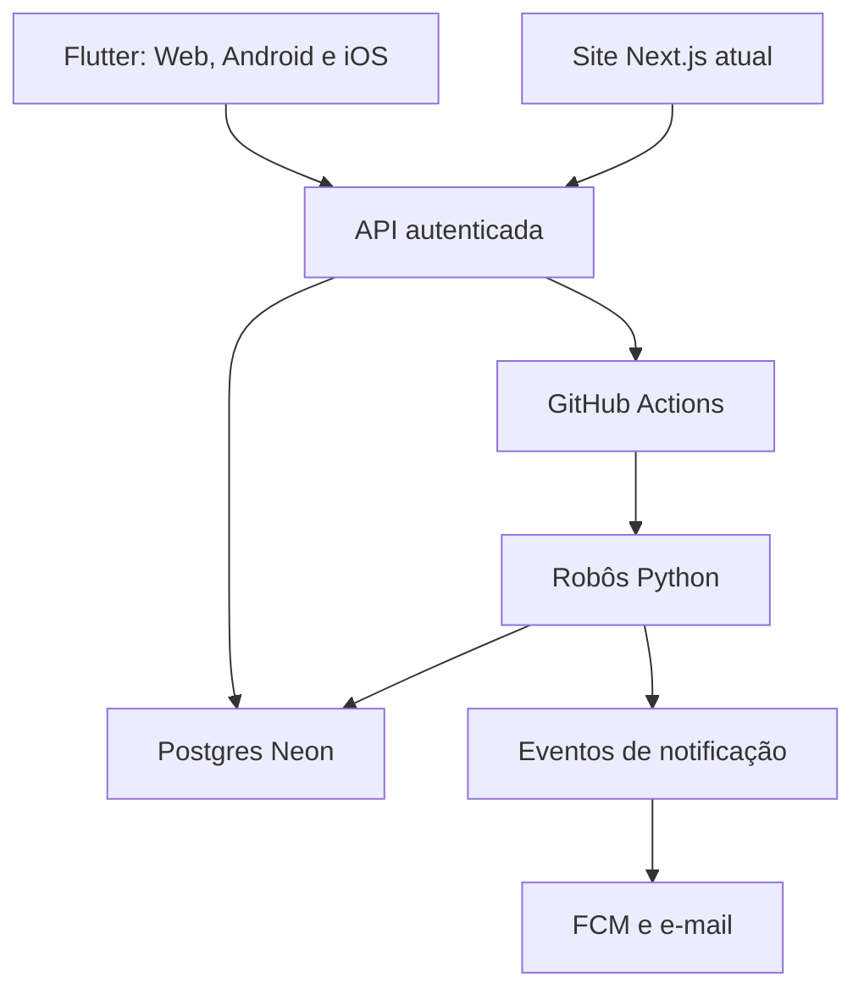

# Plano do `app-robo` — Flutter Web, Android e iOS

**Status:** Fases 0 a 5 implementadas; banco e API da Fase 5 publicados em produção, com smoke físico do APK portátil pendente em outro Android

**Data-base:** 22 de agosto de 2026

**Repositório:** `lacerdaRodrigo/robo-livelo`  
**Referência observada na elaboração:** `main` na versão `1.30.2` (`46146c7`)  
**Pasta reservada para a futura implementação:** `app-robo/`

> Este documento registra o plano do piloto. A criação deste arquivo não autoriza criar telas, inicializar o Flutter, alterar banco, API, workflows, notificações ou substituir o site atual. Cada fase de implementação depende de pedido explícito do responsável pelo projeto.

> **Direção de produto confirmada em 20 de agosto de 2026:** o Flutter será a
> única interface do produto ao final da transição. A interface Next.js não
> receberá novas funcionalidades; `site/` fica temporariamente apenas como
> fallback e como hospedeiro da API v1 até um corte de backend explicitamente
> autorizado.

---

## 1. Decisões já aprovadas

1. O novo cliente será desenvolvido em **Flutter**.
2. O mesmo código Flutter atenderá **Web, Android e iOS**, com adaptação responsiva por plataforma e tamanho de tela.
3. O futuro painel Flutter será o único painel de administração do produto.
4. O site atual em `site/` **não será removido nem interrompido durante a construção**, mas sua interface não receberá novas funcionalidades.
5. O novo projeto ficará isolado em `app-robo/`.
6. Os robôs Python, o Postgres no Neon e os workflows atuais serão reutilizados. Não haverá cópia dos robôs dentro do Flutter.
7. Durante a transição, site atual e Flutter poderão consultar os mesmos dados e solicitar os mesmos robôs por uma API autenticada.
8. O piloto será fechado: inicialmente uma pessoa, com possibilidade de convidar poucas pessoas depois.
9. O produto terá notificações push automáticas e relatórios por e-mail.
10. Segurança, testes unitários e testes de componentes serão requisitos de primeira classe.
11. A identidade visual seguirá a direção **financeiro confiável**: azul-marinho, verde para ganho e visual sóbrio.
12. Toda nova funcionalidade visível, tela ou jornada será criada primeiro nos protótipos Web e Mobile de `design-app/`; o código real só começa depois da aprovação visual do responsável e da atualização dos contratos afetados.

---

## 2. Objetivo

Transformar o Radar de Benefícios atual em um produto multiplataforma sem duplicar regras de negócio, banco ou robôs.

O Flutter deverá permitir consultar e, conforme a permissão, administrar:

- promoções e regras da Livelo;
- cashback dos Sites parceiros do Shopping Inter;
- lojas do Inter escolhidas para acompanhamento;
- produtos do Compre direto no Inter;
- preço atual, desconto, cashback e valor após cashback;
- histórico de 30 dias já previsto para produtos do Inter;
- favoritos, metas e preferências pessoais;
- execuções, filas, resultados e falhas dos robôs;
- alertas push e relatórios por e-mail;
- usuários convidados, aparelhos e sessões, apenas para o administrador.

O piloto deve provar que um único cliente Flutter pode atender Web, Android e iOS sem colocar o sistema atual em risco.

---

## 3. Estado atual que precisa ser preservado

Este plano foi construído a partir do código e da documentação existentes, e não substitui os PRDs atuais.

### 3.1 Componentes existentes

| Componente | Estado observado | Decisão para o piloto |
|---|---|---|
| Robôs | Python 3.11, domínio puro e adaptadores de I/O | Reutilizar sem copiar para o Flutter |
| Banco | Postgres no Neon | Continuar como fonte compartilhada de dados |
| Site | Next.js 16, React 19, TypeScript, publicado pela Vercel | Manter apenas como fallback e hospedeiro transitório da API durante a transição |
| Livelo | Workflow `.github/workflows/robo.yml` | Manter isolado; horários atuais e disparo manual |
| Inter — Sites parceiros | Workflow `.github/workflows/inter.yml` | Manter isolado da Livelo e de produtos |
| Inter — Compre direto | Workflow `.github/workflows/produtos-inter.yml` | Manter matriz dinâmica e `max-parallel: 2` |
| Testes | Pytest/Ruff no robô e Vitest/TypeScript/build no site | Acrescentar Flutter sem enfraquecer os gates atuais |
| E-mail atual | Gmail via `smtplib`, conforme os documentos atuais | Não desligar antes da nova solução estar validada |
| Autenticação atual | Senha administrativa única e cookie assinado | Manter no site legado; criar autenticação por usuário para o Flutter |

### 3.2 Contratos que continuam obrigatórios

- O núcleo dos robôs não faz I/O; o mundo entra por portas/adaptadores.
- Dinheiro, cashback e pontuação não passam por `float`; usar `Decimal`/`NUMERIC` e representar valores com segurança nos contratos JSON.
- Textos obtidos de fontes externas são hostis e nunca são interpretados como HTML.
- Nenhum segredo aparece em log, repositório, bundle web, APK ou IPA.
- Os robôs não autenticam na Livelo nem no Banco Inter.
- Não haverá CAPTCHA, rotação de proxy ou técnica de evasão de bloqueio.
- Se uma fonte bloquear ou pedir interrupção, a integração afetada para; as demais permanecem isoladas.
- O Flutter nunca consulta diretamente Livelo ou Inter. Ele lê os dados persistidos pela API do produto.
- O Flutter nunca acessa o Neon nem dispara o GitHub Actions diretamente com um token embarcado.
- Falha recente, ausência de dados, dado atrasado, coleta parcial e valor zero são estados diferentes.
- Uma ação administrativa sempre deve ser revalidada no servidor, mesmo que o botão esteja escondido no cliente.

---

## 4. Arquitetura-alvo



### 4.1 Princípios

- **Uma regra, uma fonte:** cálculo, seleção, disparo, autorização e persistência não serão reimplementados em dois clientes.
- **Flutter é cliente:** apresenta dados, coleta intenção e chama contratos HTTP.
- **Servidor decide:** autenticação, autorização, cooldown, idempotência e validação ocorrem novamente na API.
- **Robô coleta uma vez:** o resultado gravado no Neon atende site atual, Flutter e notificações.
- **Catálogo completo no servidor, recorte no cliente:** o robô grava tudo que a fonte expuser para cada loja selecionada; a API pesquisa no banco e entrega somente uma página por resposta.
- **Migração reversível:** nenhuma fase exige apagar o `site/`.
- **Compatibilidade primeiro:** novas tabelas e endpoints serão aditivos enquanto o site legado estiver em produção.

### 4.2 API recomendada para a primeira etapa

A recomendação inicial é expor uma API versionada no backend já publicado com o site, por exemplo `site/app/api/v1/`, reaproveitando o acesso existente ao Neon e o disparo atual em `site/lib/github.ts`. Isso evita contratar e operar um segundo servidor durante o piloto.

Essa recomendação será confirmada em um gate técnico antes do código. Se as limitações reais da hospedagem ou do runtime impedirem push, relatórios ou tarefas necessárias, será produzido um registro de decisão antes de escolher outro backend. Não será criada infraestrutura nova por suposição.

Contratos iniciais esperados, ainda sem assinatura definitiva:

- autenticação e sessão;
- perfil, papel e preferências;
- leitura de Livelo;
- leitura e seleção de lojas do Inter;
- leitura, busca e histórico de produtos;
- favoritos e metas;
- solicitação e consulta de execução dos robôs;
- registro/remoção de token de push;
- central de notificações e relatórios;
- auditoria administrativa.

### 4.3 Coleta completa, busca no banco e paginação da API

Existe uma diferença obrigatória entre **coletar**, **guardar** e **mostrar**:

| Camada | Responsabilidade aprovada |
|---|---|
| Robô | Percorrer todas as páginas que a fonte disponibilizar para cada loja selecionada, sem teto fixo de produtos, e deduplicar por loja + ID externo |
| Banco | Manter o último catálogo válido e gravar uma nova medição de cada produto ativo em toda coleta bem-sucedida, com a retenção de 30 dias definida no PRD V4 |
| API | Pesquisar e filtrar no Postgres, usando o último catálogo válido, e devolver somente uma página de resultados por resposta |
| Flutter | Exibir a página recebida, permitir continuar o garimpo e pedir outras páginas; nunca baixar o catálogo inteiro para pesquisar no aparelho |

Exemplo aprovado: se uma televisão custa R$ 5.000 em uma medição e R$ 4.000 na seguinte, o catálogo atual mostra R$ 4.000 e o histórico do mesmo produto — identificado por loja + ID externo — preserva as duas medições enquanto estiverem dentro dos 30 dias. Se uma busca por `tv` encontrar 200 ofertas, as 200 ficam alcançáveis pelo usuário, mas chegam ao Flutter em páginas, e não em uma única resposta.

Isso não promete o catálogo universal da varejista. O sistema guarda **tudo que a fonte realmente expôs ao robô** nas consultas permitidas e concluídas. Uma limitação ou janela da própria fonte deve ser mostrada com estado honesto, conforme o PRD V4.

#### 4.3.1 Contrato inicial da busca de produtos

Contrato fechado no inventário da Fase 1:

`GET /api/v1/inter/produtos?q=tv&page=1&por_pagina=20`

| Campo/regra | Limite inicial aprovado |
|---|---|
| `q` | Obrigatório para a busca do MVP; de 2 a 100 caracteres, permitindo termos como `tv` |
| `page` | Inteiro a partir de 1; padrão 1 |
| `por_pagina` | Padrão 20; máximo 50; não existe `all` nem outro modo sem paginação |
| Filtros | Executados no servidor; loja, marca, categoria e faixa de preço entram apenas com valores e formatos validados |
| Ordenação | Lista fixa aceita pela API; padrão estável por menor preço atual, depois nome e ID |
| Resultado | `itens`, `pagina`, `por_pagina`, `total_itens`, `total_paginas`, `tem_proxima`, horário e qualidade do catálogo |
| Histórico de um produto | Retenção de 30 dias; padrão 30 medições por página e máximo 100 |

Com 200 resultados e o padrão de 20, existem 10 páginas. O usuário pode percorrer todas, refinar por marca — Samsung, LG e outras que existirem no catálogo —, preço, categoria ou loja, sem perder resultados entre páginas. A API nunca corta silenciosamente o total encontrado.

A busca considera nome, marca e categoria persistidos. Sinônimos necessários para a experiência, como `tv`, `televisão` e `televisor`, serão um dicionário pequeno, versionado e coberto por testes; nenhum sinônimo será criado por adivinhação durante uma requisição.

Regras complementares:

- a caixa de busca nunca chama o Inter nem dispara coleta;
- uma coleta nova publica o catálogo por loja de forma atômica e preserva o último sucesso se falhar;
- produto ausente de uma coleta completa deixa de aparecer como oferta atual, mas seu histórico expira normalmente;
- todas as páginas usam a mesma busca, filtros e ordenação; não pode haver item perdido ou duplicado na navegação;
- o Flutter deve cancelar ou ignorar resposta de uma busca antiga quando a pessoa digitar outra;
- a paginação inicial usa número de página com `atualizado_em`/`qualidade`; índices e orçamento de resposta serão medidos contra o volume real, sem mudar os limites funcionais acima.

### 4.4 Disparo dos robôs

Os workflows atuais continuam sendo os executores oficiais:

- `robo.yml` para Livelo;
- `inter.yml` para cashback de Sites parceiros;
- `produtos-inter.yml` para produtos das lojas escolhidas.

A API poderá solicitar `workflow_dispatch`, mas deverá:

1. exigir usuário autenticado e papel `admin`;
2. aceitar somente workflows conhecidos em lista fixa;
3. nunca aceitar arquivo, branch, URL ou slug arbitrário vindo do cliente;
4. aplicar cooldown e chave de idempotência;
5. impedir rodadas equivalentes simultâneas;
6. registrar solicitante, data, origem, workflow e resultado;
7. devolver estado consultável em vez de manter a tela bloqueada;
8. reler lojas selecionadas do banco, como o fluxo V4 já faz.

### 4.5 Fila e concorrência

O aplicativo mostrará `aguardando`, `em execução`, `sucesso`, `parcial`, `degradada` ou `falha`, conforme o domínio permitir. Uma solicitação repetida não deve criar outra execução equivalente.

O plano preserva a regra da V4: tarefas de produtos são por loja, páginas são sequenciais e há no máximo duas lojas simultâneas no workflow atual.

---

## 5. Usuários, propriedade dos dados e acesso

### 5.1 Modelo de acesso

- Não haverá cadastro público.
- O administrador será o responsável pelo projeto.
- Novas pessoas só entram por convite e e-mail autorizado.
- Papéis iniciais:
  - `admin`: administra usuários, lojas, regras, execuções, relatórios e zona de perigo;
  - `usuario`: consulta dados e administra apenas favoritos, metas e preferências próprias.
- A API é a fonte da autorização; a interface apenas reflete permissões.

### 5.2 Dados globais e pessoais

| Dados globais | Dados pessoais por usuário |
|---|---|
| Catálogo Livelo | Favoritos |
| Catálogo de lojas Inter | Metas de preço/cashback |
| Produtos e medições | Preferências de push e e-mail |
| Estado das coletas | Horário silencioso |
| Cashback e preços | Aparelhos e sessões |
| Histórico técnico | Histórico de notificações destinadas ao usuário |

Esta separação evita repetir milhares de produtos para cada pessoa e impede que favoritos e preferências vazem entre usuários.

### 5.3 Autenticação aprovada

O piloto usa Firebase Authentication por e-mail/senha, sem cadastro público. O
responsável cria a conta no Firebase e mantém o convite ativo no Postgres.

O token emitido pelo Firebase é validado pela API com checagem de revogação.
Existir no provedor não basta: o e-mail também precisa estar verificado,
autorizado e com perfil ativo no banco do produto.

---

## 6. Segurança

### 6.1 Controles obrigatórios

- HTTPS em toda comunicação.
- Token de acesso curto e renovação conforme o provedor escolhido.
- Sessão revogável e opção de encerrar todas as sessões.
- Registro e remoção de aparelhos.
- Aviso de novo aparelho ou novo acesso quando tecnicamente disponível.
- Tokens sensíveis no armazenamento seguro da plataforma; nada sensível em preferências comuns.
- Firebase App Check planejado para Web, Android e iOS, sem tratá-lo como substituto da autenticação.
- Autorização por função e por proprietário do dado em cada endpoint.
- Rate limit por usuário, IP e operação sensível.
- Idempotência para ações repetíveis, especialmente disparos e notificações.
- Reautenticação ou confirmação reforçada para limpeza de domínio, revogação de usuários e outras ações destrutivas.
- Lista fixa de tabelas e transação atômica nas limpezas já definidas no PRD V5.
- Cabeçalhos de segurança, CORS restrito e validação explícita de origem no Web.
- Validação de esquema, tamanho, paginação e caracteres de todas as entradas.
- Logs estruturados com identificadores técnicos, nunca payload completo, credenciais ou dados desnecessários.
- Auditoria de login, convite, alteração de papel, disparo, exclusão, troca de preferências e envio de relatório.
- Auditoria técnica da API retida por 30 dias; a gravação seguinte remove eventos vencidos usando o índice por data, sem cron ou nova credencial.
- Dependências fixadas por lockfile e revisão automática de vulnerabilidades.
- Revisão orientada pelo OWASP MASVS para armazenamento, autenticação, rede, plataforma, código e privacidade.

### 6.2 Segredos

Segredos permitidos apenas no servidor ou em cofres das plataformas:

- `DATABASE_URL`;
- token de disparo do GitHub;
- credencial do provedor de e-mail;
- credencial de serviço para envio FCM;
- segredo de sessão/API;
- credenciais de assinatura e publicação.

Arquivos de configuração pública necessários ao SDK móvel não serão confundidos com credencial de serviço. Mesmo quando uma chave for pública por natureza, suas permissões e restrições deverão ser configuradas.

### 6.3 Privacidade e LGPD

Os PRDs atuais registram uso estritamente pessoal. Ao convidar outra pessoa, essa premissa muda. Antes do primeiro convite externo, o gate de privacidade exige:

- atualizar a análise de LGPD dos documentos atuais;
- publicar política de privacidade curta e clara;
- explicar quais dados são guardados e por quanto tempo;
- permitir revogar sessão, aparelho e notificações;
- permitir excluir os dados pessoais do usuário sem apagar os catálogos globais;
- limitar o conteúdo do push na tela bloqueada;
- não usar dados para publicidade ou finalidade não documentada.

---

## 7. Notificações push

### 7.1 Canal

Usar Firebase Cloud Messaging para Android, iOS e, se aprovado no gate do navegador, Web. O envio parte do servidor; o Flutter apenas solicita permissão, registra o token do aparelho e trata a abertura da notificação.

### 7.2 Eventos candidatos

- promoção Livelo cruza a regra do usuário;
- cashback de uma loja acompanhada cruza a meta definida;
- produto favorito alcança o preço ou valor após cashback desejado;
- queda relevante de preço;
- coleta solicitada termina;
- coleta falha ou fica degradada;
- dado acompanhado fica atrasado;
- novo aparelho ou evento de segurança.

Nenhum desses eventos será ativado por suposição. Cada regra precisa de requisito, dado disponível e teste antes de ser habilitada.

### 7.3 Anti-spam e confiabilidade

- Não reenviar o mesmo evento sem mudança relevante.
- Criar uma chave de idempotência por usuário, regra, entidade e estado observado.
- Respeitar horário silencioso e canal preferido.
- Permitir desligar categorias de notificação.
- Não incluir preço ou dado pessoal sensível na tela bloqueada quando o usuário escolher modo discreto.
- Ao tocar, abrir diretamente a entidade correspondente por deep link autenticado.
- Token inválido é removido; troca de usuário remove o vínculo local anterior.
- Falha no push não reverte uma coleta já publicada.

### 7.4 Caixa de saída de eventos

A implementação deve preferir uma caixa de saída persistente (`outbox`) gravada junto do resultado que origina a notificação. Um despachante envia FCM/e-mail e marca o evento como processado. Isso reduz perda e duplicação quando o processo termina entre gravar o preço e enviar a mensagem.

O schema e o executor da outbox serão decididos em migração própria; este documento não cria tabela.

---

## 8. Relatórios por e-mail

### 8.1 Entregas planejadas

- relatório diário automático;
- relatório manual solicitado pelo painel;
- relatório semanal como evolução posterior;
- aviso técnico de falha para o administrador.

O horário do relatório diário ainda será escolhido. Ele deve considerar o fim das últimas coletas do dia, especialmente o workflow de produtos, que começa depois dos demais.

### 8.2 Conteúdo do relatório

- melhores promoções Livelo;
- maiores cashbacks das lojas acompanhadas;
- produtos que atingiram metas;
- principais quedas de preço;
- quantidade de produtos e lojas atualizados;
- execuções com sucesso, degradação ou falha;
- dados atrasados;
- economia potencial, sempre rotulada como estimativa.

### 8.3 Provedor e transição

A proposta para o novo canal é Resend, sujeito a domínio verificado e validação do plano gratuito no momento da implementação. O Gmail atual não será desligado antes de o novo relatório ser entregue e conferido de verdade.

As lições de `docs/EMAIL.md` continuam válidas: e-mail deve ser verificado no cliente real, não somente no preview; HTML precisa ser compacto, textos externos escapados e imagens remotas controladas.

---

## 9. Funcionalidades do piloto

### 9.1 MVP

- login fechado;
- painel geral;
- consulta Livelo;
- consulta cashback Inter;
- seleção e descarte de lojas do Inter;
- seleção de lojas para coleta de produtos;
- pesquisa de produtos no catálogo persistido, por API paginada, sem baixar o catálogo inteiro no aparelho;
- preço, desconto, cashback e valor após cashback;
- histórico de 30 dias existente;
- favoritos e preferências pessoais;
- disparo administrativo dos robôs;
- status, duração, contagens e falhas;
- push configurável;
- relatório diário e manual;
- administração básica de convites, sessões e aparelhos;
- auditoria das ações administrativas.

### 9.2 Evoluções posteriores

- comparador entre lojas considerando preço, cashback e pontos quando houver uma regra documentada de conversão;
- metas de compra mais avançadas;
- priorização de favoritos na experiência, sem aumentar a pressão na fonte sem análise;
- relatório semanal;
- compartilhamento interno de oportunidade;
- centro de diagnóstico e exportação de logs sanitizados;
- tema escuro completo;
- central histórica de alertas.

### 9.3 Fora do piloto

- compra automática;
- carrinho, frete ou cálculo por CEP;
- autenticação na Livelo ou no Banco Inter;
- coleta disparada pela caixa de pesquisa do usuário;
- acesso direto do app a banco, Actions, Livelo ou Inter;
- cadastro público;
- monetização, publicidade ou abertura irrestrita;
- remoção do sistema atual antes do aceite final;
- unificação automática de produtos sem identificador confiável;
- afirmação de “melhor preço do mercado” com base apenas nas lojas monitoradas.

---

## 10. Experiência e design

### 10.1 Direção aprovada

**Financeiro confiável:** visual sóbrio, hierarquia forte, leitura rápida e destaque para valores que ajudam a decidir.

### 10.2 Paleta inicial

| Papel | Cor | Uso |
|---|---|---|
| Azul-marinho | `#102A43` | marca, menu, títulos e superfícies institucionais |
| Azul de ação | `#1769AA` | botões, links, foco e seleção |
| Verde de ganho | `#16803C` | cashback, economia, meta atingida e sucesso |
| Âmbar | `#B7791F` | atenção e dado envelhecendo |
| Vermelho | `#C53030` | erro e ação destrutiva |
| Fundo | `#F5F7FA` | fundo claro neutro |

Esses valores são tokens iniciais aprovados para o plano. Contraste deverá ser medido antes de congelar o tema em código.

### 10.3 Regras visuais

- Cards brancos, borda discreta, pouco efeito e espaçamento consistente.
- Preço atual escuro, grande e em negrito.
- **Após cashback em verde, grande e em negrito, com o mesmo peso visual do preço atual.**
- Economia pode aparecer como selo “Você economiza R$ X”, quando derivada de valores da mesma medição.
- Verde significa ganho/sucesso; não será usado para esconder funcionalidade nem para ação neutra.
- Vermelho fica reservado a erro e zona de perigo.
- Estado nunca será comunicado somente pela cor: usar texto e ícone.
- Números e datas usam formatação `pt-BR`, sem conversão monetária por `double`.
- Loading, vazio, atraso, falha, parcial e sem permissão terão estados próprios.
- Uma mutação não pode causar tela branca, salto para o topo ou perda silenciosa da página/filtro atual.
- Confirmações destrutivas devem dizer claramente o alvo e permitir cancelar.

### 10.4 Navegação adaptativa

No celular, a direção inicial é barra inferior com:

1. Início;
2. Livelo;
3. Inter;
4. Alertas;
5. Mais.

No Web, as mesmas áreas aparecem em menu lateral azul-marinho. Produtos, lojas e configurações ficam como destinos internos de Inter/Mais, sem sobrecarregar a navegação principal.

O layout não será apenas o site comprimido. Largura, densidade, alvo de toque e prioridade de conteúdo se adaptam ao dispositivo.

### 10.5 Dashboard

O painel inicial deve priorizar:

- promoções Livelo ativas;
- melhores cashbacks acompanhados;
- produtos monitorados;
- metas atingidas;
- última coleta e frescor por domínio;
- coletas em andamento;
- falhas que precisam de ação.

Os totais exibidos precisam ser reais e explicar o recorte: lojas encontradas, lojas escolhidas, produtos retornados ou produtos monitorados não são o mesmo número.

### 10.6 Acessibilidade

- contraste verificável;
- alvos de toque adequados;
- suporte a aumento de texto;
- foco visível e navegação por teclado no Web;
- rótulos semânticos para leitores de tela;
- orientação e tamanhos diferentes testados;
- animações reduzidas quando o sistema solicitar;
- mensagens claras em português, sem exigir vocabulário de PRD.

---

## 11. Estrutura futura do Flutter

Estrutura conceitual, a confirmar quando o projeto for inicializado:

```text
app-robo/
├── lib/
│   ├── app/                 # inicialização, rotas e tema
│   ├── core/                # contratos e utilidades realmente compartilhados
│   └── features/            # Livelo, Inter, produtos, alertas, conta
├── test/                    # unitários, widgets e goldens
│   ├── fixtures/
│   └── goldens/
├── integration_test/        # jornadas críticas
├── web/
├── android/
├── ios/
└── README.md
```

O gerenciador de estado, roteador, cliente HTTP, serialização e armazenamento seguro serão escolhidos somente na fase de bootstrap, comparando manutenção, suporte Web/mobile, testabilidade e documentação oficial. Este plano não fixa bibliotecas nem versões antes dessa validação.

---

## 12. Estratégia de testes

### 12.1 Princípio

O Flutter seguirá uma pirâmide com **muitos testes unitários e de widgets/componentes**, acompanhada por integração apenas nas jornadas críticas. O CI não tocará fontes reais, Neon de produção, GitHub real, FCM real ou e-mail real.

### 12.2 Camadas

| Camada | Cobertura planejada |
|---|---|
| Unitários Dart | formatação, busca, filtros, paginação, cashback, metas, anti-spam, permissões e estados |
| Widget/componentes | cards, valores, botões, modais, listas, paginação, loading, vazio, falha, responsividade e acessibilidade |
| Golden | cards e componentes críticos nos tamanhos aprovados; poucas telas-chave para evitar testes frágeis |
| Integração Flutter | login, consulta, acompanhar/descartar, disparar robô, consultar status, favorito e preferências |
| Contrato da API | request/response, erros, paginação, compatibilidade e idempotência |
| API | autenticação, autorização, validação, rate limit, cooldown e auditoria |
| Banco descartável | isolamento por usuário, transações, outbox, retenção e rollback |
| Robôs Python | preservar e ampliar Pytest/fakes/fixtures existentes |
| Segurança | acesso indevido, IDOR, payload hostil, repetição, token revogado e ausência de segredos |

### 12.3 Casos de regressão herdados dos commits recentes

- Acompanhar ou descartar loja não pode recarregar com tela branca.
- A ação deve preservar página, busca, ordenação e posição útil da navegação.
- Paginação deve mostrar dez itens quando esse for o contrato da tela e permitir chegar a todo o catálogo.
- O total deve distinguir vendedores/lojas de produtos retornados.
- Disparo de produtos com lojas selecionadas deve gerar as tarefas corretas.
- Rodada sem lojas deve terminar de modo controlado, sem execução enganosa.
- Preço “após cashback” deve ter destaque equivalente ao preço atual.
- Confirmação deve nascer de ação explícita e não reabrir em loop.
- Botão em processamento não deve criar disparo duplicado.
- Uma coleta com 3.310 produtos pode persistir todos eles, enquanto a resposta padrão da busca contém no máximo 20 itens.
- Uma busca com 200 resultados deve permitir percorrer dez páginas de 20 sem lacunas nem duplicações.
- Buscar `tv` deve encontrar os modelos compatíveis presentes no catálogo e permitir refinar por marca, categoria, loja e preço.
- Quando o preço muda de R$ 5.000 para R$ 4.000, o atual e as duas medições do histórico devem permanecer coerentes.

### 12.4 Gates do CI

- `flutter analyze` sem erro;
- formatação Dart verificada;
- testes unitários e de widgets;
- cobertura mínima de **90% nas regras de domínio, casos de uso e serviços críticos do Flutter**;
- testes golden aprovados deliberadamente;
- testes de integração críticos em ambiente controlado;
- build Flutter Web;
- build Android de validação;
- build iOS em runner compatível quando essa fase começar;
- Pytest com o gate atual de 90% e Ruff continuam verdes;
- TypeScript, Vitest e build do site legado continuam verdes enquanto ele existir;
- nenhum teste de CI acessa a rede real das fontes.

Todo bug corrigido deve receber teste de regressão antes do merge.

---

## 13. Observabilidade e operação

- Cada tela de domínio mostra quando os dados foram atualizados.
- O administrador vê última tentativa e último sucesso separadamente.
- Execução mostra duração, páginas, itens lidos, únicos, duplicados e qualidade quando disponíveis.
- Alertas internos distinguem falha do robô, falha de notificação e falha de relatório.
- IDs de correlação ligam solicitação da API, execução do workflow, gravação e envio.
- Métricas de volume protegem os planos gratuitos: usuários ativos, tokens, pushes, e-mails, armazenamento e tempo de Actions.
- Limites operacionais geram aviso antes de virar cobrança ou indisponibilidade.
- Logs exportados pelo painel serão sanitizados.
- Backup e restauração terão procedimento testado antes de qualquer limpeza em produção.

---

## 14. Custos e distribuição

O objetivo é operar o piloto dentro das faixas gratuitas, mas “grátis” não será tratado como garantia permanente. Limites e preços devem ser conferidos novamente no gate de publicação.

| Item | Direção do piloto | Observação |
|---|---|---|
| Flutter | Código aberto | Um código para Web, Android e iOS |
| FCM | Faixa sem custo | Push parte do servidor |
| Firebase Authentication | Faixa sem custo para poucos usuários | Não usar autenticação por telefone paga |
| Firebase App Check | Recurso sem custo na tabela consultada | Complementa, não substitui autenticação |
| Resend | Plano gratuito, se domínio e limites servirem | Gmail atual permanece até o aceite |
| Neon | Plano atual | Medir crescimento de histórico e eventos |
| GitHub Actions | Uso atual | Monitorar minutos e duração por loja |
| Vercel | Projeto atual | Confirmar capacidade da API antes de depender dela |
| Google Play | Publicação oficial | Taxa única de US$ 25 observada na documentação oficial |
| Apple App Store | Publicação oficial | Apple Developer Program de US$ 99 por ano |

Android pode ser testado por instalação direta antes da Play Store. iOS exige ferramentas e regras da Apple; distribuição oficial e TestFlight entram somente na fase própria.

---

## 15. Fases de execução

### Fases concluídas

| Fase | Entrega comprovada |
|---|---|
| 0 — Planejamento | Plano do piloto aprovado |
| 1 — Inventário e contratos | Inventário concluído; contratos vivos estão nas rotas API e em `site/lib/api.ts` |
| 2 — Bootstrap | Projeto Flutter, tema, ambientes, análise, testes e CI |
| 3 — API e autenticação | API v1, Firebase por convite, papéis, rate limit, auditoria e App Check observado no Android |

As fases encerradas não permanecem na fila de implementação. O contrato vivo
fica próximo da implementação da API, evitando documento histórico duplicado.

### Fase 4 — Piloto somente leitura

- [x] 4.1 — shell, estados reutilizáveis e leitura do status real da API;
- [x] 4.2A — navegação adaptativa, com barra inferior no Android e lateral em telas largas;
- [x] 4.2B — painel Livelo real no Android;
- [x] 4.3 — cashback Inter somente leitura, com gates locais e smoke físico no Samsung;
- [x] 4.4 — produtos, busca paginada e histórico, com gates locais e smoke físico no Samsung;
- [x] conclusão da Fase 4 Android — painéis somente leitura validados no aparelho.

#### Encerramento da Fase 4 Android

Os três painéis somente leitura — Livelo, cashback Inter e Produtos/histórico —
foram entregues como clientes autenticados da API v1. Valores de pontos, dinheiro
e cashback permanecem texto; busca, filtros, paginação, atraso, ausência, falha
e resposta antiga têm estados distintos. Os CT-263 a CT-293, a formatação, a
análise, 87 testes Flutter, cobertura crítica >= 90% e builds Web/APK passaram.

O smoke físico no Samsung SM-M135M confirmou login Firebase, App Check, acesso
à API, navegação adaptativa e as jornadas de leitura. O build do aparelho deve
receber `API_URL` e `ATIVAR_APP_CHECK=true`; sem a URL, `localhost` aponta para
o próprio celular. Mutações administrativas, links externos e evolução visual do
Next.js permanecem fora da Fase 4.

### Fase 5 — Administração compartilhada

**Status:** implementação e aceite local das etapas 5.0 a 5.3 concluídos em 22
de agosto de 2026. O primeiro teste destrutivo ocorreu no banco descartável
`radar_aceite_f5_codex_20260822`, nunca em produção; depois do aceite, esse
banco e sua massa artificial foram removidos. No mesmo dia, após autorização
específica, as migrações `011` e `012` foram aplicadas em produção e a API foi
publicada na Vercel. Não houve limpeza de produção, disparo real de workflow ou
mudança visual no site legado.

**Objetivo:** permitir que o administrador faça pelo Flutter as operações que
hoje existem no backend: lojas e regras da Livelo, favoritas dos Sites parceiros,
seleção de lojas de produtos, preferências e disparos controlados. A zona de
perigo entra por último, sob as regras de `PRD-V5.md`.

O Flutter continuará cliente da API v1: não falará com Neon, GitHub Actions,
Livelo ou Inter diretamente. Toda mutação exige autenticação Firebase, usuário
ativo, papel administrativo, validação no servidor, auditoria e proteção contra
repetição.

#### Entrega concluída localmente — administração segura (5.1)

- API v1 administrativa sem alteração de tela no Next.js:
  - `GET`/`POST /api/v1/livelo/lojas` para catálogo e cadastro de lojas;
  - `PATCH`/`DELETE /api/v1/livelo/lojas/{id}` para regra própria e remoção;
  - `GET`/`PATCH /api/v1/livelo/preferencias` para padrões globais e Clube;
  - `GET`/`PATCH /api/v1/inter/lojas` para catálogo e favoritas dos Sites
    parceiros;
  - `GET`/`PATCH /api/v1/inter/produtos/lojas` para catálogo e seleção de
    lojas do Compre direto.
- As mutações exigem administrador, App Check quando habilitado, limite de ação
  sensível e auditoria no servidor. Recebem somente estado ou dados de domínio,
  nunca URL, token ou workflow, e não iniciam coleta.
- Nome e apelidos Livelo são conferidos contra o catálogo canônico; cadastro,
  regra e apelidos entram atomicamente. Pontos, limiares e cashback continuam
  texto decimal, sem `number`/`double`.
- O Flutter oferece três abas em **Mais → Administração**: Livelo, Sites
  parceiros e Compre direto. Há busca com 350 ms, paginação manual,
  deduplicação, bloqueio de duplo toque, confirmação nominal de remoção e erro
  que preserva a lista. Livelo inclui preferências globais, cadastro com
  apelidos e exceções por loja.
- Depois do aceite descartável, a zona de perigo foi exposta somente para
  administrador em uma quarta aba. Livelo e Inter possuem páginas separadas,
  prévia das contagens, frase exata, botão bloqueado até a confirmação e nova
  validação/autorização no servidor. Abrir a tela nunca executa limpeza.

#### Entrega concluída localmente — disparos controlados (5.2)

- `POST /api/v1/administracao/disparos` aceita somente `livelo`, `inter` ou
  `produtos_inter`, exige administrador, App Check quando habilitado e uma
  `Idempotency-Key` opaca. O servidor escolhe o workflow; o app não recebe
  token, URL de GitHub ou qualquer outro detalhe de infraestrutura.
- `GET` na mesma rota expõe o cooldown e o estado da última solicitação, sem
  chamar workflow. Produtos é recusado antes do disparo se não houver loja
  selecionada.
- A migração `011_disparos_api_idempotentes.sql` cria a reserva persistente:
  uma unicidade parcial permite somente uma solicitação ativa por domínio e
  chave repetida recebe o resultado da mesma intenção. A falha de rede conserva
  a reserva por cinco minutos, preferindo atrasar a próxima tentativa a criar
  duas coletas.
- No Flutter, administradores veem **Atualizar agora** nos painéis Livelo,
  Sites parceiros e Produtos. O botão mostra cooldown, bloqueia duplo toque e
  só informa que o pedido foi aceito — a coleta real só termina quando o robô
  gravar novos dados.
- Os casos de contrato administrativo foram registrados como CT-294 a CT-298,
  cobrindo seleção, favoritas, idempotência/cooldown, decimais textuais,
  preferências, regras Livelo e limpeza descartável.

#### Rollout de produção da Fase 5

- As migrações `011_disparos_api_idempotentes.sql` e
  `012_oferta_direta_inter_atual.sql` foram aplicadas no banco de produção
  `neondb` em 22 de agosto de 2026. A reserva começou vazia, os quatro índices
  esperados da `011` foram confirmados e a tabela coberta pela `012` manteve as
  20 colunas esperadas.
- A API foi publicada no projeto Vercel existente, deployment
  `dpl_AeNZvYSAr6VHkQA892K5ZqSjmB3C`, e promovida para
  `https://robo-livelo.vercel.app`. O build Next.js confirmou todas as novas
  rotas administrativas.
- O smoke HTTP confirmou `/api/v1/status` saudável. As seis famílias de rotas
  administrativas testadas sem credencial responderam `401`, comprovando que
  estão publicadas e continuam protegidas.
- O padrão do Flutter passou a ser a URL pública; desenvolvimento local ainda
  pode sobrescrever `API_URL`. Um APK release portátil foi gerado com a mesma
  URL e `ATIVAR_APP_CHECK=false`, pois outro aparelho usando provider debug
  exigiria cadastrar um token próprio. A API continua com autenticação Firebase
  obrigatória e `EXIGIR_APP_CHECK=false` durante este piloto.
- A primeira tentativa em outro Android exibiu a mensagem genérica de falha de
  acesso sem produzir chamada a `/api/v1/perfil` na Vercel nem nova auditoria
  no Neon. Como o APK anterior e uma compilação local antiga compartilhavam o
  mesmo nome e o mesmo `versionCode=1`, o artefato portátil foi corrigido para
  `versionName=1.0.1` e `versionCode=2`, forçando o Android a reconhecer a
  atualização.
- O APK corrigido
  `build/app/outputs/flutter-apk/radar-beneficios-fase5-v1.0.1-build2.apk` tem
  52,7 MB, URL pública confirmada no binário, assinatura APK v2 válida e
  SHA-256
  `24b5e5be869a133f4a001e53aa50f07688a768243019a9620ef7ef6196e1cdb4`.
- A instalação por atualização e a abertura autenticada passaram no Samsung
  SM-M135M conectado; o sistema confirmou a versão `1.0.1 (2)` e o Flutter não
  registrou exceção na inicialização.

**Pendente operacional:** instalar o APK corrigido em outro Android e executar o smoke
autenticado das leituras e da Administração. Não executar a zona de perigo em
produção durante o smoke. App Check volta a ser obrigatório no artefato de
distribuição depois do rollout por Play Integrity.

#### Validação local consolidada da Fase 5 segura

- Dart formatado e `flutter analyze` sem apontamentos.
- `flutter test --coverage`: 106 testes aprovados; cobertura de 96,8% na API,
  95,6% nos modelos, 100% no controlador administrativo e 92,7% na zona de
  perigo.
- `flutter build web` e `flutter build apk --debug` aprovados; nenhum artefato
  foi publicado ou instalado.
- `tsc --noEmit` aprovado; 78 testes Vitest regulares aprovados e o aceite
  destrutivo manual passou separadamente. Nenhuma tela do site legado foi
  alterada.
- Ruff aprovado; 211 testes Pytest aprovados com 94,16% de cobertura.
- `git diff --check` aprovado. Testes regulares usaram fakes e não acessaram
  GitHub, Livelo ou Inter reais; somente o aceite 5.3 acessou o Neon para criar
  e remover o banco isolado e consultar metadados de schema, sem ler linhas de
  produção.

#### Aceite destrutivo concluído — 5.3

- Um banco isolado foi criado dentro do projeto Neon usando nome protegido por
  prefixo `radar_aceite_f5_`; produção foi usada apenas para criar e remover
  esse banco, sem leitura ou alteração de linhas do produto.
- A reconstrução do zero revelou que `oferta_direta_inter_atual` existia em
  produção e no contrato de limpeza, mas não nas migrações. A migração
  idempotente `012_oferta_direta_inter_atual.sql` agora elimina essa divergência.
- As 12 migrações foram aplicadas do zero e 23 tabelas públicas foram criadas.
- Uma linha representativa foi inserida em cada tabela afetada de Livelo,
  Inter Sites parceiros, Inter Compre direto, autenticação, limites, auditoria
  e idempotência.
- O teste forçou falha depois do início da limpeza Livelo e bloqueio por chave
  externa no reset Inter; ambos preservaram o estado anterior, confirmando
  rollback.
- As limpezas bem-sucedidas afetaram somente o domínio escolhido, restauraram
  as três preferências Livelo, preservaram login/auditoria/limites e puderam ser
  repetidas em banco vazio. Novos disparos Livelo, Inter e Produtos voltaram a
  ser aceitos no banco.
- O teste manual contém uma trava que recusa qualquer `DATABASE_URL` cujo banco
  não comece com `radar_aceite_f5_`. Depois do passe, o banco descartável foi
  removido definitivamente.

#### 5.0 — contrato administrativo e fronteira de segurança

1. Inventariar as funções de servidor existentes e classificar leitura,
   mutação, autorização, auditoria e idempotência.
2. Definir endpoints API v1 autenticados, com corpos mínimos, erros estáveis e
   números monetários/de pontos preservados como texto.
3. Exigir token Firebase, usuário ativo e papel administrativo no servidor para
   cada leitura administrativa e mutação.
4. Definir idempotência para disparos e ações reenviáveis pelo celular; o
   servidor continua sendo a autoridade para cooldown e autorização.
5. Criar testes de contrato com fakes, sem banco, GitHub ou fontes reais.

**Saída:** contrato revisado antes de existir botão administrativo no app.

#### 5.1 — administração segura, sem disparar robôs

1. Livelo: listar, cadastrar/remover favoritas e editar padrões/exceções já
   existentes.
2. Inter Sites parceiros: buscar, acompanhar e remover favoritas.
3. Inter Compre direto: buscar, selecionar e remover lojas de coleta.
4. Preservar busca, página, filtros e posição útil após cada ação.
5. Mostrar carregamento, sucesso, falha, retry, conflito e acesso negado como
   estados distintos.

**Saída:** catálogo e preferências existentes são administráveis no Flutter,
sem executar coleta.

#### 5.2 — disparos controlados e acompanhamento

1. Expor cooldown e última tentativa por domínio.
2. Solicitar Livelo, Inter Sites parceiros ou Produtos somente pela API.
3. Bloquear duplo toque no cliente; o servidor garante idempotência e cooldown.
4. Informar com honestidade: aceito, ainda em espera, sem seleção necessária,
   acesso negado ou falha.

**Saída:** o app solicita uma coleta sem duplicá-la nem afirmar sucesso antes
da resposta do servidor.

#### 5.3 — zona de perigo

1. Primeiro validar o fluxo da V5 em banco descartável, com dados de Livelo,
   Inter e autenticação representativos.
2. Só então expor no Flutter os resumos por domínio e páginas separadas de
   confirmação.
3. Exigir `APAGAR LIVELO` ou `RESETAR INTER`, validados no servidor; domínio
   nunca será aceito livremente da interface.
4. Confirmar transação única, rollback, repetição em banco vazio e preservação
   de login, tema, flags e domínio não escolhido.
5. Não executar limpeza de produção sem autorização explícita, mesmo que a
   interface esteja pronta.

**Saída:** função verificável em ambiente descartável, sem autorizar apagar
dados reais.

#### Limites e decisões abertas

- A interface legada em Next.js não recebe evolução visual nem funcional.
  Caso a API v1 administrativa exija código no hospedeiro atual, será somente
  camada de API e precisa de autorização específica antes de começar.
- Metas não entram nesta fase: não há modelo, regra de cálculo nem contrato de
  backend aprovado para elas.
- Push, e-mail, relatórios e horário silencioso pertencem à Fase 6.
- O ambiente descartável e o responsável pelo primeiro aceite destrutivo devem
  ser definidos antes da etapa 5.3.

#### Testes e aceite da Fase 5

| Bloco | Casos mínimos |
|---|---|
| Contrato | token/papel, payload inválido, autorização negada, conflito, idempotência e cooldown |
| Controladores | inicial, sucesso, falha, retry, duplo toque, resposta antiga e preservação de filtros |
| Widgets | leitura, mutação, sem permissão, carregamento, erro, sucesso, retrato/paisagem e tela larga |
| Zona de perigo | frases correta/errada/vazia/trocada, domínio vazio, rollback e isolamento Livelo/Inter/autenticação |
| Banco descartável | uma linha por tabela afetada, transação e repetição conforme `PRD-V5.md` §8.2 |

Gates: formatação Dart, `flutter analyze`, testes Flutter com cobertura mínima
de 90% nas regras/controladores/serviços críticos, builds Web e APK; Pytest e
Ruff continuam verdes. O site só entra nos gates quando houver alteração na API;
sua interface não será alterada.

**Saída da fase:** Flutter administra o backend com as proteções necessárias;
a interface Next.js permanece apenas como fallback transitório, sem evolução
funcional.

### Fase 6 — Push e relatórios

- registro de aparelhos;
- outbox e idempotência;
- FCM;
- preferências e horário silencioso;
- relatório diário/manual;
- validação real em Android, iPhone e cliente de e-mail.

**Saída:** alertas confiáveis, sem repetição e sem derrubar coleta em falha de canal.

### Fase 7 — Segurança e piloto fechado

- testes OWASP selecionados;
- revisão de segredos e permissões;
- política de privacidade antes de convidar terceiros;
- backup/restauração;
- teste inicial somente com o administrador;
- expansão para duas ou três pessoas por convite.

### Fase 8 — Corte controlado

- comparar funções do Flutter com o painel atual;
- smoke Web, Android e iOS;
- confirmar estabilidade de notificações e relatórios;
- publicar Flutter Web como painel principal;
- manter o site atual apenas pelo período técnico aprovado para o corte;
- retirar apenas a interface administrativa legada quando houver decisão explícita.

Nenhuma fase autoriza apagar `site/`. A aposentadoria definitiva será uma decisão separada.

---

## 16. Critérios de sucesso do piloto

1. Web, Android e iOS usam o mesmo projeto Flutter.
2. O site atual continua disponível durante a construção.
3. Os três robôs atuais seguem isolados e atendem os dois clientes na transição.
4. Nenhum segredo está presente no cliente ou nos logs.
5. Usuário comum não executa ações de administrador.
6. Dados pessoais não vazam entre usuários.
7. Push repetido é bloqueado por idempotência.
8. Relatório não é enviado em duplicidade.
9. Falha no FCM/e-mail não apaga nem reverte coleta válida.
10. Preço e valor após cashback pertencem à mesma medição e recebem a hierarquia visual aprovada.
11. Paginação, filtro e posição não são perdidos por uma mutação.
12. Estados vazios, atrasados, parciais, degradados e de erro são honestos.
13. Testes novos e suítes antigas passam no CI.
14. Cobertura crítica do Flutter atinge pelo menos 90%.
15. Custos permanecem dentro dos limites aprovados ou o sistema avisa antes da expansão.
16. Todas as ofertas expostas por uma coleta válida são persistidas, sem teto artificial de 3.000 ou 3.310 produtos.
17. O Flutter recebe no máximo 50 produtos por resposta e consegue alcançar todos os resultados de uma busca por páginas, sem corte silencioso.

---

## 17. Gates que ainda exigem decisão

Estes itens não serão inventados durante a implementação:

- domínio/remetente do novo relatório por e-mail;
- horário do relatório diário;
- retenção das notificações;
- data e roteiro para desligar a interface Next.js e, se necessário, mover a API
  v1 para outro hospedeiro;
- quando pagar e publicar na Google Play e na App Store;
- regra matemática para comparar pontos Livelo com cashback em dinheiro.

Já estão fechados: nome **Radar de Benefícios**, identificadores
`br.com.radarbeneficios.app`, Firebase por convite, API v1 transitória no
Next.js/Vercel, fundação Flutter, paginação numerada e auditoria técnica por 30 dias.

Cada decisão deverá registrar evidência, impacto, testes e atualização deste plano/PRDs relacionados.

### 17.1 Melhorias recomendadas para discutir no momento certo

Os itens abaixo ficam registrados como **opções recomendadas, não como autorização para implementar agora**. Antes de iniciar cada um, o assistente deve explicar em linguagem simples: o que é, por que ajuda, em qual fase entra, possível custo, risco de não fazer e alternativa mais simples. O responsável decide então se aprova, adia ou descarta.

Uma opção pode virar pré-condição de segurança apenas quando a funcionalidade relacionada for realmente ativada. Exemplo: o relatório por Resend é opcional; se for escolhido para enviar a convidados, verificar um domínio deixa de ser opcional para essa entrega.

| Opção para conversa futura | Por que pode valer a pena | Quando discutir |
|---|---|---|
| Separar seleção operacional de loja e acompanhamento pessoal | Impede que o favorito de um convidado aumente automaticamente o trabalho dos robôs | Fases 1 e 5 |
| Definir consumidor da outbox com retry e fila de falhas | Evita perder ou repetir push/e-mail e não depende de uma função web ficar viva por muito tempo | Antes da Fase 6 |
| Política de compatibilidade entre versão do app e da API | Um celular pode ficar semanas sem atualizar; a API não deve quebrar o aplicativo antigo de surpresa | Fases 1 e 3 |
| Ambientes separados para desenvolvimento, piloto e produção | Teste de login, push, e-mail ou banco não atinge dados reais por engano | Fase 2 |
| Revisar as regras de alerta dos PRDs V3/V4 | Hoje esses documentos não enviam e-mail nem decidem se um preço é bom; qualquer nova regra precisa de limiar, repetição e teste | Antes da Fase 6 |
| Orçamentos de tempo/tamanho da API, índices, lista virtual e cache | Mantém a busca rápida quando o número de lojas e produtos crescer | Fases 1 e 4 |
| Cache somente de leitura, com horário visível | Ajuda em internet ruim sem permitir administração offline ou mostrar dado velho como atual | Depois da Fase 4 |
| Diagnóstico de falhas do app sem dados sensíveis | Facilita descobrir travamentos e relacioná-los à versão do app/API | Fases 2 e 7 |
| Metas de recuperação de backup (RPO/RTO) | Define quanto dado e tempo de indisponibilidade seriam aceitáveis após uma falha | Fase 7 |
| Testes nativos de permissão e recebimento de push | Testes Flutter não controlam sozinhos todos os diálogos e comportamentos do Android/iOS | Fase 6 |
| Persistência segura específica do Flutter Web | Navegador não oferece o mesmo cofre nativo de Android/iOS; exige sessão curta, CSP e estratégia suportada | Fase 3 |
| Validar App Check também na API | Enviar o token pelo app só ajuda se o servidor conferir sua validade | Fase 3 |
| Domínio verificado para o Resend | O domínio de teste atende apenas o dono da conta; convidados exigem remetente próprio validado | Fase 6 |
| Aviso de não afiliação com Livelo e Inter | Reduz confusão de marca nas telas de ajuda e nas listagens das lojas de aplicativos | Fase 8 |
| Requisitos reais de Google Play, TestFlight e aparelho físico | Contas novas e push nativo podem exigir testes, participantes, configuração APNs e dispositivos reais | Antes da publicação |
| Atualização recomendada/obrigatória e feature flags | Permite liberar ou interromper uma função com segurança sem quebrar todos os clientes | Fases 3 e 8 |

### 17.2 Medições que permanecem abertas na paginação

O contrato está fechado: número de página, 20 itens por padrão, 50 no máximo e
`atualizado_em`/`qualidade` quando o domínio fornecer. Permanecem como trabalho
técnico de cada conjunto de dados:

- índices de busca adequados ao volume real no Neon;
- orçamento de tamanho e tempo de resposta medido, sem escolher número arbitrário agora;
- teste de estabilidade entre páginas durante a publicação de uma coleta nova;
- comportamento visual adequado a cada jornada; Livelo 4.2B usará carregamento progressivo;
- validação dos filtros aprovados de marca, categoria, loja e preço na jornada de produtos.

---

## 18. Referências internas

- [`../AGENTS.md`](../AGENTS.md) — instruções de entrada reconhecidas pelo Codex para trabalhar neste repositório.
- [`../CLAUDE.md`](../CLAUDE.md) — regras de arquitetura, segurança e trabalho dos agentes.
- [`../README.md`](../README.md) — visão geral e operação atual.
- [`../docs/PRD.md`](../docs/PRD.md) — fonte principal de requisitos Livelo.
- [`../docs/PRD-V2.md`](../docs/PRD-V2.md) — site, Neon, autenticação e regras de alerta.
- [`../docs/PRD-V3.md`](../docs/PRD-V3.md) — cashback dos Sites parceiros do Inter.
- [`../docs/PRD-V4.md`](../docs/PRD-V4.md) — produtos, paginação, histórico e isolamento por loja.
- [`../docs/PRD-V5.md`](../docs/PRD-V5.md) — limpeza administrativa e zona de perigo.
- [`../docs/PENDENCIAS.md`](../docs/PENDENCIAS.md) — estado real, gates e pendências.
- [`../docs/TESTES.md`](../docs/TESTES.md) — catálogo de testes existente.
- [`../docs/EMAIL.md`](../docs/EMAIL.md) — design e limitações reais do e-mail.
- [`../docs/ARQUITETURA.md`](../docs/ARQUITETURA.md) — histórico das decisões de arquitetura.
- [`../site/README.md`](../site/README.md) — rotas, sessão, Vercel e comportamento do site.
- [`../site/app/design-system.css`](../site/app/design-system.css) — referência visual atual, sem obrigar cópia literal.
- [`../.github/workflows/robo.yml`](../.github/workflows/robo.yml) — Livelo.
- [`../.github/workflows/inter.yml`](../.github/workflows/inter.yml) — cashback Inter.
- [`../.github/workflows/produtos-inter.yml`](../.github/workflows/produtos-inter.yml) — produtos Inter.
- [`../.github/workflows/testes.yml`](../.github/workflows/testes.yml) — quality gates atuais.

### 18.1 Commits recentes usados como lição de regressão

- [`e921769`](https://github.com/lacerdaRodrigo/robo-livelo/commit/e92176928f02de4088921e2d98e07af38d033b19) — preservar paginação e permitir descartar lojas.
- [`3fd0257`](https://github.com/lacerdaRodrigo/robo-livelo/commit/3fd0257f55f35ac787d5d6dbe37becfecaa92904) — valor após cashback com o mesmo destaque do preço atual.
- [`1e66e14`](https://github.com/lacerdaRodrigo/robo-livelo/commit/1e66e148f0028fb6d4cc6a1947fc7a78b19b17d0) — disparar atualização de produtos das lojas selecionadas.
- [`e12225e`](https://github.com/lacerdaRodrigo/robo-livelo/commit/e12225e4a22ab60fd14e4d5ab1ec29fc68813550) — exibir total de lojas encontradas.
- [`dc633de`](https://github.com/lacerdaRodrigo/robo-livelo/commit/dc633def22922494d9f390cc86d80af047082c25) — refletir seleção sem aguardar novo snapshot.

---

## 19. Referências oficiais na Web

Estas referências devem ser reconsultadas nas fases correspondentes; preços, limites e requisitos de loja podem mudar.

### Flutter

- [Plataformas suportadas e integração](https://docs.flutter.dev/platform-integration)
- [Flutter Web](https://docs.flutter.dev/platform-integration/web)
- [Design adaptativo e responsivo](https://docs.flutter.dev/ui/adaptive-responsive)
- [Visão geral de testes](https://docs.flutter.dev/testing/overview)
- [Testes de integração](https://docs.flutter.dev/testing/integration-tests)
- [Segurança no Flutter](https://docs.flutter.dev/security)

### Firebase

- [Firebase Authentication para Flutter](https://firebase.google.com/docs/auth/flutter/start)
- [Firebase Cloud Messaging para Flutter](https://firebase.google.com/docs/cloud-messaging/flutter/get-started)
- [Receber mensagens no Flutter](https://firebase.google.com/docs/cloud-messaging/flutter/receive-messages)
- [Firebase App Check no Flutter](https://firebase.google.com/docs/app-check/flutter/default-providers)
- [Preços e limites do Firebase](https://firebase.google.com/pricing)

### GitHub Actions

- [Executar workflow manualmente](https://docs.github.com/actions/managing-workflow-runs/manually-running-a-workflow)
- [API REST de workflows](https://docs.github.com/rest/actions/workflows)
- [Sintaxe de workflows](https://docs.github.com/actions/using-workflows/workflow-syntax-for-github-actions)

### E-mail e segurança

- [Resend — enviar e-mail](https://resend.com/docs/api-reference/emails/send-email)
- [Resend — preços](https://resend.com/pricing)
- [OWASP MASVS](https://mas.owasp.org/MASVS/)

### Distribuição

- [Apple Developer Program](https://developer.apple.com/programs/enroll/)
- [Google Play Console — cadastro](https://support.google.com/googleplay/android-developer/answer/6112435)

---

## 20. Regra para continuar

A Fase 5 está implementada e seu backend foi publicado. O próximo gate é o
smoke físico do APK portátil em outro Android: login, Livelo, Inter, Produtos,
Administração e solicitação controlada de atualização. A zona de perigo não será
executada em produção nesse roteiro. Depois do aceite físico, a Fase 6 recebe um
plano próprio antes de push, outbox ou relatórios. O Flutter continua cliente da
API; o site não recebe evolução visual e permanece apenas como fallback e
hospedeiro transitório até o corte ser autorizado separadamente.
