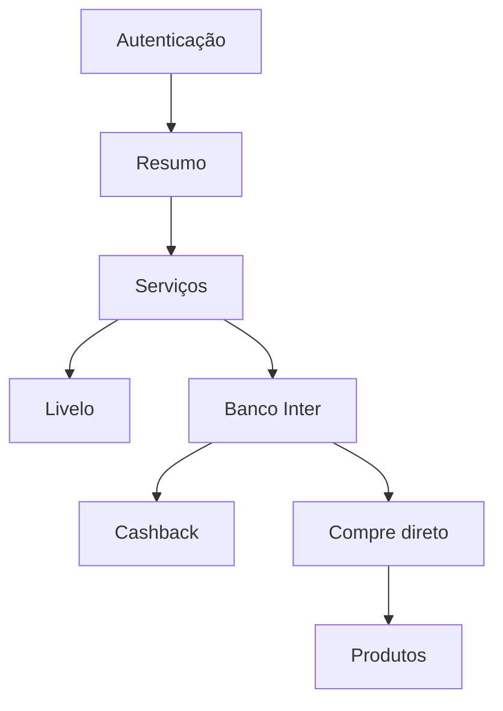

# Sistema de design mobile — Radar de Benefícios V11

## 1. Objetivo

Este documento define a interface mobile do Radar de Benefícios: identidade visual, estrutura de navegação, componentes, estados, regras de composição e ligação com os contratos reais do backend.

O arquivo visual de referência é:

- `design-app/prototipo-mobile-redesign-novo-11.html`

A implementação deve preservar três princípios:

1. Mostrar somente funcionalidades e dados disponíveis no backend.
2. Identificar claramente a origem de cada informação.
3. Manter a interface legível quando novas fontes e robôs forem implementados.

## 2. Escopo funcional

O produto reúne os seguintes domínios:

- autenticação e perfil;
- resumo operacional da conta;
- catálogo de serviços;
- catálogo Livelo, acompanhamento, campanha e histórico;
- Cashback do Banco Inter, acompanhamento e condições;
- seleção de lojas do Compre direto;
- busca de produtos coletados;
- histórico de preço;
- operações administrativas autorizadas.

Nenhum widget deve sugerir coleta ao vivo durante busca, navegação ou filtragem. Essas ações consultam o último retrato persistido. Atualizações são solicitadas somente pelos fluxos administrativos existentes.

## 3. Arquitetura de navegação

A navegação principal possui três destinos fixos:

| Destino | Responsabilidade |
|---|---|
| Resumo | Estado geral, situação de cada robô e atalhos principais |
| Serviços | Catálogo pesquisável de fontes disponíveis |
| Produtos | Busca no catálogo salvo das lojas selecionadas no Compre direto |

Livelo e Banco Inter são páginas internas de Serviços. Administração é acessada pelo perfil e não ocupa espaço na navegação inferior.

### Fluxos principais

## 4. Tokens de cor

As cores são tokens semânticos. Um componente deve consumir o token correspondente ao significado, nunca repetir um hexadecimal isolado.

### Tema claro

| Token | Valor | Uso obrigatório |
|---|---:|---|
| `radar-canvas` | `#F4EEE5` | Fundo geral do aplicativo |
| `radar-paper` | `#FFFDF8` | Cards, campos, botões neutros e folhas modais |
| `radar-paper-soft` | `#FAF5ED` | Superfícies internas, divisões e conteúdo secundário |
| `radar-ink` | `#291A2F` | Texto principal, títulos e ícones neutros |
| `radar-muted` | `#756B76` | Descrições, rótulos auxiliares e metadados |
| `radar-line` | `#E4D8CA` | Bordas, separadores e contornos |
| `radar-action` | `#E76043` | Ação primária, botão principal e destaque interativo |
| `radar-action-strong` | `#BA3B26` | Links, ações textuais e texto de ação sobre fundo claro |
| `radar-action-soft` | `#FEE4DC` | Fundo de ação suave e estado selecionável |
| `radar-plum` | `#4C2E59` | Marca, navegação ativa e superfícies institucionais |
| `radar-on-plum` | `#FFFFFF` | Texto e ícones sobre `radar-plum` |
| `radar-plum-soft` | `#EEE3F2` | Monogramas, campanha e superfícies de apoio da marca |
| `radar-positive` | `#28745A` | Cashback, ganho, sucesso e dado preservado válido |
| `radar-positive-soft` | `#DCEEE4` | Fundo de cashback, sucesso e acompanhamento ativo |
| `radar-warning` | `#8A5D12` | Coleta parcial, atraso e atenção operacional |
| `radar-warning-soft` | `#FBEBBF` | Fundo de avisos contextuais |
| `radar-danger` | `#AF3544` | Erro e ação destrutiva |

### Tema escuro

| Token | Valor | Uso obrigatório |
|---|---:|---|
| `radar-canvas` | `#1D191E` | Fundo geral |
| `radar-paper` | `#292329` | Cards e superfícies principais |
| `radar-paper-soft` | `#332B32` | Superfícies internas |
| `radar-ink` | `#FAF6EF` | Texto principal |
| `radar-muted` | `#C2B6C0` | Texto secundário |
| `radar-line` | `#493C47` | Bordas e separadores |
| `radar-action` | `#FF896B` | Ação primária |
| `radar-action-strong` | `#FFB099` | Links e ações textuais |
| `radar-action-soft` | `#4B2C2A` | Superfície de ação suave |
| `radar-plum` | `#D8B9DF` | Marca e navegação ativa |
| `radar-on-plum` | `#291A2F` | Texto e ícones sobre `radar-plum` |
| `radar-plum-soft` | `#46364B` | Superfície institucional suave |
| `radar-positive` | `#84D0AA` | Ganho e sucesso |
| `radar-positive-soft` | `#263F35` | Superfície de ganho e sucesso |
| `radar-warning` | `#F3CB72` | Atenção |
| `radar-warning-soft` | `#44391F` | Superfície de atenção |
| `radar-danger` | `#FF9AA7` | Erro e ação destrutiva |

### Regras semânticas

- Verde comunica benefício financeiro, dado válido ou sucesso. Não deve indicar navegação.
- Amarelo comunica atenção recuperável. Não deve substituir erro definitivo.
- Vermelho comunica falha ou ação destrutiva.
- Coral comunica ação.
- Roxo comunica marca, hierarquia e destino ativo.
- Ausência de percentual não é `0%`: usar texto neutro, como **Percentual não informado**.
- Um aviso deve permanecer dentro do card do serviço afetado.

## 5. Tipografia

Família: `Aptos`, `Segoe UI Variable`, `Segoe UI`, `system-ui`, `sans-serif`.

| Papel | Tamanho de referência | Peso | Uso |
|---|---:|---:|---|
| Título de autenticação | 42 px | 750 | Mensagem principal de entrada |
| Título de página | 32 px | 760 | Nome da área atual |
| Título de destaque | 21–23 px | 800 | Cashback e painéis de foco |
| Título de seção | 18 px | 700–800 | Agrupamentos da página |
| Título de card | 13–15 px | 800 | Loja, produto ou serviço |
| Corpo | 12–15 px | 400–600 | Texto explicativo |
| Rótulo | 9–11 px | 700–850 | Estado, categoria e metadado |
| Nota auxiliar | 8–10 px | 400–700 | Informação operacional |

Títulos usam espaçamento de letras negativo para uma aparência compacta. Eyebrows usam caixa alta e espaçamento positivo para indicar contexto sem competir com o título.

## 6. Forma, espaçamento e elevação

- Largura mobile de referência: até `430 px`.
- Largura mínima suportada: `320 px`.
- Margem horizontal de página: `18 px`.
- Área mínima de toque: `38 px`; ações principais usam `46–52 px`.
- Espaçamento recorrente: `6`, `8`, `10`, `12`, `14`, `18`, `24` e `28 px`.
- Cards principais: raio entre `20` e `26 px`.
- Campos e botões: raio entre `12` e `17 px`.
- Chips: raio total de `999 px`.
- A assimetria do canto inferior esquerdo reforça a identidade do radar sem prejudicar leitura.
- `radar-shadow` é reservado ao contêiner principal e painéis de maior hierarquia.
- `radar-shadow-soft` é aplicado em cards, campos e botões elevados.

## 7. Componentes fundamentais

### `PrototypeShell`

Classe visual: `.prototype-shell`.

Anatomia:

1. largura limitada a 430 px;
2. fundo `radar-canvas`;
3. conteúdo de autenticação ou aplicativo;
4. navegação e folhas posicionadas dentro do mesmo contexto visual.

Em telas maiores, recebe borda, raio externo e margem vertical. Em mobile ocupa toda a viewport.

### `Page`

Classes: `.page`, `.page.active`.

Cada destino é uma seção independente identificada por `data-page`. Apenas uma página permanece ativa. A troca atualiza também o estado do dock e posiciona a rolagem no topo.

### `PageHeading`

Classes: `.page-heading`, `.eyebrow`, `.page-title`, `.page-lead`, `.heading-row`.

Ordem:

1. eyebrow contextual;
2. título;
3. ação opcional alinhada ao título;
4. descrição curta.

A descrição deve explicar a tarefa da tela, não repetir seu nome.

### Botões

| Componente | Classe | Função |
|---|---|---|
| `PrimaryButton` | `.primary` | Confirmar ou abrir destino principal |
| `SecondaryButton` | `.secondary` | Ação complementar |
| `QuietButton` | `.quiet` | Ação textual de baixa hierarquia |
| `TextAction` | `.text-action` | Ação curta ao lado de título |
| `IconButton` | `.icon-button` | Ação representada por ícone com nome acessível |
| `BackButton` | `.back-button` | Retorno ao nível imediatamente superior |

Botões desabilitados devem permanecer legíveis, remover a elevação e não responder ao toque.

### `Field`

Classe: `.field`.

Composição: rótulo acima de `input` ou `select`, altura mínima de 50 px, superfície `radar-paper`, borda `radar-line` e foco visível com `radar-action`.

### `SearchBox`

Classes: `.search-box`, `.search-only`.

Composição:

1. ícone de busca;
2. rótulo invisível para tecnologia assistiva;
3. campo de texto;
4. ação opcional no lado direito.

A busca filtra o retrato já salvo e não solicita nova coleta.

### `CatalogTabs`

Classes: `.catalog-tabs`, `.catalog-tab`, `.active`.

Cada aba possui rótulo e contador e sempre mantém `aria-selected=true` no estado ativo. O controle segmentado padrão usa `radar-plum` com conteúdo em `radar-on-plum`. Na página do Banco Inter, somente a troca de área usa a variante plana com indicador inferior; os filtros Todas/Acompanhadas continuam usando o mesmo controle segmentado compartilhado com a Livelo. É usado para:

- Todas/Acompanhando na Livelo;
- Cashback/Compre direto no Banco Inter;
- Todas/Acompanhadas no Cashback;
- Todas/Selecionadas no Compre direto.

### `CollectionBar`

Classes: `.collection-bar`, `.collection-copy`, `.filter-trigger`.

Mostra quantidade encontrada, contexto do filtro e a ação de refino. O botão ganha `.has-filter` quando há filtro diferente do padrão.

### `Pagination`

Classe: `.pagination`.

Botões quadrados de 40 px, página ativa em `radar-plum` e ação seguinte com nome acessível.

### `EmptyState`

Classes: `.empty`, `.show`.

Usa borda tracejada, texto neutro e mensagem contextual. A mensagem muda quando o usuário está vendo apenas lojas acompanhadas.

## 8. Autenticação e perfil

### `AuthView`

Classes: `.auth-view`, `.auth-mark`, `.auth-copy`, `.auth-form`, `.auth-foot`.

Anatomia:

1. marca;
2. proposta de valor;
3. e-mail e senha;
4. botão Entrar;
5. recuperação de senha;
6. explicação dos mecanismos de acesso.

O fluxo representa Firebase Auth, e-mail verificado e recuperação de senha. A interface não deve simular acesso sem autenticação na implementação real.

### `ProfileSheet`

Classes: `.profile-hero`, `.avatar`, `.sheet-actions`, `.switch`.

Oferece aparência, administração autorizada e saída. A troca de tema usa os mesmos tokens semânticos.

## 9. Barra superior e navegação inferior

### `AppBar`

Classes: `.app-bar`, `.mini-brand`, `.sync-line`, `.sync-dot`, `.app-actions`.

É fixa no topo, usa fundo translúcido e blur. O estado **API protegida** usa verde somente como confirmação de acesso válido, não como garantia de atualização de todos os robôs.

### `BottomDock`

Classes: `.dock`, `.dock-button`, `.active`.

Possui três destinos: Resumo, Serviços e Produtos. O item ativo recebe fundo `radar-plum`. Livelo e Banco Inter mantêm Serviços selecionado porque pertencem a esse domínio de navegação.

## 10. Tela Resumo

### `HomeDomainCard`

Classes: `.home-domain-card`, `.domain-card-top`, `.domain-identity`, `.domain-status`, `.domain-stats`, `.domain-alert`, `.domain-enter`.

Anatomia:

1. monograma, nome e descrição do robô;
2. estado do robô;
3. métricas com rótulo e valor;
4. aviso contextual opcional;
5. ação para abrir a área correspondente.

A Home não exibe um card de estado geral. Estado, horário e aviso permanecem
no card do serviço de origem. As métricas formam uma lista com divisores
visíveis, incluindo a separação entre **Lojas acompanhadas** e **Último
sucesso** na Livelo.

O estado `atualizando` pode permanecer no selo quando vier da API, mas não deve
gerar sozinho a afirmação de que há uma coleta em andamento. Avisos textuais
ficam reservados a falha, parcial, degradação, atraso, ausência de dados ou
indisponibilidade confirmados.

Quando existirem muitos robôs, a Home exibe no máximo três ou quatro cards. Robôs com atenção vêm primeiro. A ação **Ver todos os robôs** encaminha para Serviços. A Home nunca lista lojas internas nem produtos individualmente.

### `HomeQuickActions`

Classe: `.home-quick-actions`.

Atalhos para buscar produtos e abrir todos os serviços. O primeiro botão possui maior hierarquia visual.

## 11. Tela Serviços

### `ServiceCard`

Classes: `.service-card`, `.service-head`, `.service-kind`, `.service-capabilities`, `.service-enter`.

Anatomia:

1. monograma e tipo;
2. nome do serviço;
3. descrição funcional;
4. capacidades existentes;
5. ação de entrada.

A pesquisa utiliza `data-service` com termos associados. Um serviço só aparece quando existe contrato funcional correspondente.

## 12. Livelo

A página da Livelo começa diretamente pelas ferramentas do catálogo. Não usa
card de destaque, hero ou resumo com **Última coleta concluída**, melhor loja ou
métricas agregadas. Horários e estados continuam disponíveis nos locais
contextuais definidos pelo produto, sem ocupar o topo do catálogo.

Os cards das lojas permanecem ricos em informação e não devem ser simplificados
ao remover o resumo da página.

A ação **Atualizar** fica no cabeçalho. Abaixo dele, a ordem é busca, abas
**Todas/Acompanhando**, barra de resultados e cards das lojas. Atualizar não é
uma aba do catálogo.

### `LiveloCatalogToolbar`

Combina `SearchBox`, abas Todas/Acompanhando, contador, contexto e filtro. Categoria e ordenação são apresentados em uma folha inferior.

### `LiveloStoreCard`

Classes compartilhadas: `.result-card`, `.card-top`, `.store-identity`, `.store-monogram`, `.benefit-value`, `.card-facts`, `.fact`, `.card-foot`.

Anatomia:

1. iniciais, nome e categoria;
2. pontuação atual em destaque;
3. pontuação base, Clube ou tipo de campanha;
4. condição da campanha quando fornecida;
5. acompanhar e detalhes.

Campos esperados do contrato incluem nome, categorias, pontos atuais, pontos base, pontos Clube, moeda, prefixo, promoção, campanha, descrição, início, fim, link e acompanhamento.

### `CampaignPanel`

Classes: `.campaign-panel`, `.campaign-link`.

Regras:

- renderizar somente quando `descricao_campanha` possuir texto útil;
- mostrar o texto entregue pelo backend sem criar condição complementar;
- exibir o link de regras somente quando `link` for HTTPS válido;
- abrir o link externamente com proteção `noopener` e `noreferrer`;
- ocultar o bloco inteiro quando a descrição estiver ausente;
- validade, quando presente, usa o tom de atenção.

### `FollowButton` Livelo

Classe: `.follow-button`.

Estados:

- **Acompanhar**: fundo de ação suave;
- **Acompanhando**: fundo positivo suave;
- **Salvando**: interação bloqueada e feedback de progresso na implementação nativa.

### `LiveloHistory`

O histórico é somente leitura, limitado às medições fornecidas pelo endpoint. Abrir o histórico não inicia coleta.

## 13. Banco Inter — Cashback

### `InterModeTabs`

Alterna entre Cashback e Compre direto, mantendo os estados internos de cada área. Nesta tela, a navegação de primeiro nível usa abas planas com indicador inferior, sem repetir a aparência de controle segmentado usada pelos filtros de catálogo.

### `CashbackViewTabs`

Usa Todas/Acompanhadas no controle segmentado compartilhado, logo abaixo da busca. A opção Acompanhadas aplica o filtro já disponível no backend e atualiza:

- contador;
- texto de contexto;
- resultados da busca;
- estado vazio.

### `CashbackCard`

Classes: `.cashback-card`, `.cashback-kicker`, `.cashback-highlight`, `.cashback-breakdown`, `.cashback-line`.

Anatomia:

1. iniciais, nome e identificação de Site parceiro;
2. selo **Melhor cashback**;
3. benefício principal em uma superfície verde de alta visibilidade;
4. comparação entre correntista e não-correntista, quando ambos existirem;
5. acompanhar/desacompanhar;
6. detalhes das condições.

Regras de dado:

- o título principal usa `cashback_principal_texto`;
- ordenação pode usar `cashback_principal_valor` sem alterar o texto apresentado;
- a segunda linha usa `cashback_secundario_texto` quando disponível;
- descrições principal e secundária aparecem somente quando fornecidas;
- ausência de percentual usa `.neutral` e texto explícito;
- valor financeiro continua textual na interface para preservar a semântica do backend.

### `CashbackFollowButton`

Usa `aria-pressed` para refletir o estado `favorita`.

| Estado | Texto | Aparência |
|---|---|---|
| Não acompanhada | Acompanhar | Ação suave |
| Acompanhada | Acompanhando | Positivo suave |
| Alterando | Salvando | Desabilitado com progresso |
| Falha | Estado restaurado | Toast de erro |

Ao remover uma loja enquanto Acompanhadas está ativo, o card sai da lista e o contador diminui. Ao adicionar, o contador aumenta imediatamente após confirmação.

## 14. Banco Inter — Compre direto

### `DirectStoreCard`

Classes: `.direct-summary`, `.select-direct`, `.active`.

Anatomia:

1. loja;
2. disponibilidade ou cashback resumido;
3. estado do último catálogo;
4. estado de seleção;
5. botão Selecionar loja/Selecionada para coleta.

Selecionar não abre Produtos e não inicia coleta imediatamente. A seleção é persistida para a próxima atualização administrativa.

A tela não exibe um aviso introdutório antes da busca. A própria anatomia dos cartões e a ação `Atualizar produtos` comunicam seleção e coleta sem ocupar espaço permanente no topo.

### `UpdateProductsButton`

Classe: `.update-products`.

Solicita o fluxo administrativo existente. O estado visual deve diferenciar pedido aceito de coleta concluída.

## 15. Produtos

### `ProductSource`

Classe: `.product-source`.

Informa que os resultados pertencem às lojas escolhidas no Compre direto e permite retornar à seleção.

### `ProductFilterSheet`

Campos existentes: marca, categoria, loja, preço mínimo e preço máximo. Valores monetários inválidos exibem mensagem e não aplicam o filtro.

### Navegação contextual de categorias

Antes da busca, Produtos apresenta áreas de intenção. Ao tocar uma área, uma
folha inferior apresenta uma lista de subáreas e, quando necessário, outra lista
antes do recorte final — por exemplo, Casa e cozinha → Eletrodomésticos →
Refrigeração e lavanderia → Geladeiras/Freezers/Lavadoras e secadoras. Ao escolher o recorte,
o campo de busca permanece em foco e a busca passa a ocorrer naquele recorte.
Cada folha exibe uma seta de voltar no cabeçalho; voltar retorna à lista
anterior sem aplicar um filtro. A ação de fechar continua disponível
separadamente.
Os recortes editoriais de maior volume incluem cozinhas e jantar, quarto e
camas, aparelhos para cabelo, depilação, higiene feminina, limpeza e passar,
climatização, saúde e primeiros socorros e festas e decoração. Eles são portas
de busca contextual, não categorias novas persistidas no produto.
**Buscar em todo o catálogo** remove o recorte. Área e subárea são portas de
entrada, não novas categorias de produto: a API as resolve para categorias externas exatas e o
resultado continua paginado, local e filtrável por loja e preço. Categorias
novas ou não mapeadas continuam alcançáveis por busca global e em **Outros /
novas categorias**; nunca desaparecem por falta de agrupamento.

### `ProductStoreGroup`

Classes: `.product-store-group`, `.product-store-head`, `.store-offer-count`.

Agrupa ofertas pela loja de origem. Isso impede que produtos equivalentes pareçam vir da mesma coleta.

### `ProductCard`

Classes: `.product-card-main`, `.product-tags`, `.product-name`, `.cashback-badge`, `.product-price-row`, `.product-price`, `.net`, `.product-meta`, `.product-actions`.

Anatomia:

1. marca e categoria;
2. nome do produto;
3. cashback resumido;
4. preço atual;
5. valor após cashback, somente quando calculável pelo contrato;
6. metadados como parcelamento e estoque;
7. histórico e abertura no Inter.

O card preserva a distinção entre preço observado, desconto, cashback e valor líquido. Não realiza nova consulta ao Inter durante a digitação.

## 16. Administração

### `AdminRow`

Classes: `.admin-list`, `.admin-row`, `.source-icon`.

Cada linha possui ícone, nome, descrição e seta. Áreas documentadas:

- preferências Livelo;
- seleções do Inter;
- solicitação de atualizações.

O destino deve permanecer condicionado ao papel retornado pelo perfil autenticado.

## 17. Folhas inferiores e feedback

### `BottomSheet`

Classes: `.scrim`, `.sheet`, `.sheet-grab`, `.sheet-head`, `.sheet-close`.

Usada para filtros, detalhes, perfil, histórico e administração. Abre sobre um scrim, bloqueia a rolagem do conteúdo e fecha por botão, toque externo ou tecla Escape.

### `MetricList`

Classes: `.metric-list`, `.metric-line`.

Apresenta pares rótulo/valor. Valores ficam alinhados à direita e nunca perdem o rótulo que explica sua origem.

### `DetailBlock`

Classe: `.detail-block`.

Agrupa texto explicativo ou condições adicionais com título opcional e separador superior.

### `Toast`

Classes: `.toast`, `.show`.

Mensagem temporária para confirmação ou falha. Não substitui estado persistente do componente.

### `CatalogNotice`

Classe: `.catalog-notice`.

Aviso operacional próximo do catálogo afetado. Usa amarelo para atenção e verde somente quando o último retrato válido continua utilizável.

## 18. Contratos e endpoints

| Área | Endpoint existente | Uso na interface |
|---|---|---|
| Resumo | `GET /api/resumo` | Estado geral, horários, contagens e atividade |
| Perfil | `GET /api/perfil` | Identidade e autorização |
| Livelo | `GET /api/livelo/catalogo` | Busca, filtros, ordenação e paginação |
| Acompanhar Livelo | `PATCH /api/livelo/catalogo/{id_externo}/acompanhamento` | Acompanhar ou remover loja |
| Histórico Livelo | `GET /api/livelo/catalogo/{id_externo}/historico` | Últimas medições salvas |
| Cashback Inter | `GET /api/inter/cashback` | Cashback, busca, ordem e paginação |
| Cashback acompanhadas | `GET /api/inter/cashback?acompanhadas=true` | Lista das favoritas |
| Favorita Inter | `PATCH /api/inter/lojas` | Alterar `favorita` por ID |
| Lojas Compre direto | `GET /api/inter/produtos/lojas` | Catálogo de lojas selecionáveis |
| Seleção Compre direto | `PATCH /api/inter/produtos/lojas` | Alterar seleção de coleta |
| Produtos | `GET /api/inter/produtos` | Busca no catálogo persistido |
| Histórico de produto | `GET /api/inter/produtos/historico` | Medições, mínimo e máximo |

Toda chamada exige a autenticação prevista pelo cliente. Controles administrativos só ficam habilitados quando o perfil possui autorização.

## 19. Estados de carregamento e qualidade

Cada área deve prever:

| Estado | Representação |
|---|---|
| Inicial | Estrutura da página e carregamento local |
| Carregando | Progresso sem apagar o último conteúdo válido |
| Sucesso | Dados do retrato e horário correspondente |
| Parcial | Aviso contextual e último resultado válido preservado |
| Vazio | Empty state específico do filtro |
| Erro recuperável | Mensagem e ação de tentar novamente |
| Alteração pendente | Botão bloqueado e texto Salvando |
| Sem dado | Texto neutro, nunca valor numérico inventado |

Uma falha de um robô não deve transformar todos os serviços em erro. Cada card mantém estado independente.

## 20. Acessibilidade

- Todos os ícones acionáveis possuem `aria-label` ou texto visível.
- Abas usam `role=tab`, `aria-selected` e rótulo do conjunto.
- Botões de acompanhamento usam `aria-pressed`.
- Foco por teclado recebe contorno de 3 px.
- Texto invisível usa `.sr-only` sem remover informação da árvore de acessibilidade.
- A interface respeita `prefers-reduced-motion`.
- Cor nunca é o único indicador: estados sempre incluem texto.
- Controles mantêm área mínima de toque compatível com uso mobile.
- A ordem visual acompanha a ordem de leitura do documento.

## 21. Responsividade

- Entre 320 e 430 px, a interface ocupa toda a largura disponível.
- A partir de 431 px, o shell recebe moldura e permanece centralizado.
- Linhas de dados usam `flex` ou `grid` com conteúdo textual flexível.
- Nomes longos usam elipse apenas quando o contexto já identifica o item.
- Valores de benefício podem ocupar duas linhas sem sobrepor ações.
- Chips usam rolagem horizontal quando necessário.
- O dock respeita `safe-area-inset-bottom`.
- A barra superior respeita `safe-area-inset-top`.

## 22. Correspondência sugerida para Flutter

| Componente visual | Widget recomendado |
|---|---|
| `PrototypeShell` | `Scaffold` + `SafeArea` |
| `AppBar` | `SliverAppBar` ou cabeçalho persistente |
| `BottomDock` | `NavigationBar` customizada |
| `PageHeading` | `Column` com estilos do tema |
| `HomeDomainCard` | `InkWell` + `Card` + linhas de métrica |
| `SearchBox` | `TextField` com prefix/suffix icon |
| `CatalogTabs` | `SegmentedButton` ou controle segmentado customizado |
| `ResultCard` | `Card` com `Column` |
| `CampaignPanel` | `Container` condicional + `url_launcher` |
| `CashbackCard` | `Card` + destaque positivo + linhas comparativas |
| `FollowButton` | `FilledButton.tonal`/`OutlinedButton` com estado pendente |
| `BottomSheet` | `showModalBottomSheet` |
| `Toast` | `SnackBar` pelo mensageiro do Scaffold |
| `EmptyState` | Widget semântico reutilizável |

Os nomes concretos podem seguir a convenção do projeto, mas anatomia, tokens, semântica e estados devem permanecer equivalentes.

## 23. Critérios de aceite visual

- [ ] Fundo, cards e superfícies internas são distinguíveis nos dois temas.
- [ ] Todo número da Home identifica o robô de origem.
- [ ] Avisos aparecem dentro do serviço afetado.
- [ ] A lista de Serviços é pesquisável e expansível.
- [ ] Livelo mostra condição somente quando o backend a fornece.
- [ ] O link Livelo só aparece para URL HTTPS válida.
- [ ] Cashback principal é o dado dominante no card Inter.
- [ ] Correntista e não-correntista são distinguíveis.
- [ ] Todas/Acompanhadas funciona no Cashback.
- [ ] Acompanhar atualiza estado, contador e filtro.
- [ ] Compre direto seleciona lojas sem abrir Produtos automaticamente.
- [ ] Produtos são agrupados pela loja de origem.
- [ ] Ausência de dado nunca vira zero.
- [ ] Navegação, filtros, sheets e estados vazios são operáveis por teclado.
- [ ] Movimento reduzido é respeitado.
- [ ] Nenhuma navegação ou busca dispara robô automaticamente.

## 24. Manutenção

Ao adicionar um novo robô:

1. implementar e validar o contrato no backend;
2. criar o card na tela Serviços;
3. adicionar seu resumo com estado independente;
4. reutilizar tokens e componentes deste documento;
5. mostrar no máximo três ou quatro robôs na Home;
6. não adicionar campos que o contrato não entrega;
7. documentar novos estados e interações neste arquivo.
