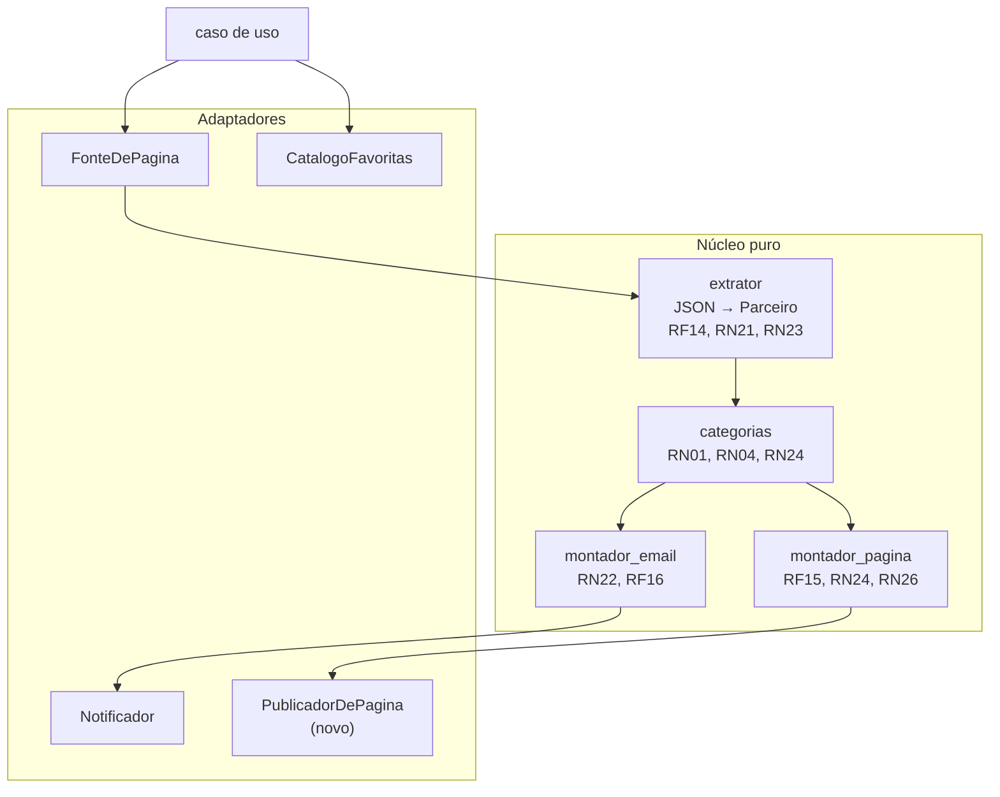

# PRD V2 — Robô de Pontuação Turbinada (Livelo)

**Versão:** v2.0 (planejamento)
**Status:** planejado, não implementado. A V1.0 continua em produção e não é interrompida.

Este documento é o **delta sobre o [`PRD.md`](PRD.md)**, que segue valendo como fonte da verdade de tudo que não for redefinido aqui. Onde houver conflito, este documento vence — e cada conflito está marcado explicitamente.

---

## 1. Contexto

A V1.0 entregou o caminho fim a fim: lê 254 parceiros, filtra 132 favoritas, envia e-mail 3x ao dia. Rodou em produção e funciona.

Três coisas apareceram depois:

**A validade da promoção estava ao alcance da mão.** A V1 excluiu esse dado acreditando que custaria ~40 requisições extras. Falso: a página embute um payload JSON com `dateStart` e `dateEnd` por parceiro. Na medição de 2026-08-09, **31 das 40 promoções terminavam naquele mesmo dia** — sem essa informação, o e-mail diz "Sam's Club com 84 pontos" e não diz se restam 6 horas ou 3 semanas.

**O e-mail é um formato apertado para o catálogo que cresceu.** Com 132 lojas, o e-mail responde bem "o que está turbinado agora?" mas não responde "quanto a Renner dá mesmo?". Essa segunda pergunta hoje obriga a abrir a página da Livelo, o que fere O1 diretamente.

**Três e-mails por dia produzem fadiga.** RF10 manda em toda execução, inclusive nos dias vazios. A V1 aceitou esse custo porque era o único jeito de manter O3 de pé: sem e-mail nenhum, "não tem promoção" e "o robô morreu" ficariam indistinguíveis, e C01 desabilita o cron em silêncio.

### 1.1 A dependência entre os três

O terceiro item **não pode ser resolvido sozinho**. Ele só se torna seguro por causa do segundo:

> A página carrega um carimbo de última atualização. Com ela publicada, o silêncio do e-mail deixa de ser ambíguo — basta abrir a página para saber se o robô continua vivo. **O front é o que autoriza o e-mail condicional.**

Implementar o e-mail condicional sem a página seria reabrir o buraco que a V1 fechou de propósito.

---

## 2. Objetivos novos

| ID | Objetivo |
|---|---|
| **O5** | Responder "quanto essa loja dá hoje?" sem abrir o site da Livelo — completa O1, que a V1 só atendeu pela metade |
| **O6** | Saber quanto tempo resta para aproveitar uma promoção |
| **O7** | Receber e-mail apenas quando houver algo a fazer |

O4 (portfólio) ganha reforço: uma página pública funcionando é mais demonstrável que um repositório.

---

## 3. Escopo

### 3.1 Dentro

- Extração a partir do **payload JSON** da página, em vez do texto renderizado dos cards.
- Data de início e fim da promoção, com destaque para o que termina hoje.
- Distinção entre promoção de pontuação base e promoção exclusiva do Clube Livelo.
- Página estática publicada no GitHub Pages, com as 132 favoritas e suas pontuações atuais.
- E-mail enviado somente quando houver promoção nas favoritas.

### 3.2 Fora

- Framework de front-end, build de JavaScript, `package.json`. A página é HTML estático gerado pelo mesmo Python.
- Banco de dados e histórico entre execuções. **A decisão de 1.4 do PRD segue valendo.**
- Multiusuário, login, cadastro.
- Hospedar logotipos ou imagens dos parceiros — ver 9.2.

### 3.3 O que este documento revoga do PRD V1

| Onde | O que muda |
|---|---|
| §1.4 "Fora do escopo: front-end" | **Revogado.** Passa a existir uma página estática. O canal de saída deixa de ser único |
| §1.4 "Fora do escopo: data de validade" | **Revogado.** A justificativa era falsa |
| §11.3 "Fora do roadmap: front-end" | **Revogado** pelo mesmo motivo |
| **RF10** (enviar sempre) | **Substituído** por RF16 — ver Seção 5 |
| **MS5** (sinal de vida pelo e-mail) | **Substituído** por MS6 — ver Seção 4 |
| §9.4 "nunca escreve no repositório" | **Mantido.** O deploy do Pages não commita — ver 7.3 |

---

## 4. Métricas

| ID | Métrica | Alvo | Fonte |
|---|---|---|---|
| **MS6** | Sinal de vida pela página | O carimbo de atualização da página nunca passa de 24h de atraso | A própria página |
| **MS7** | Utilidade da validade | Nenhuma promoção perdida por desconhecer o prazo | Autoavaliação |
| **MS8** | Redução de ruído | Menos de 1 e-mail por dia em média, em 30 dias | Caixa de entrada |

**MS5 é substituído por MS6.** O sinal de vida migra do e-mail para a página, que é atualizada em toda execução mesmo quando não há promoção.

> **Limitação honesta:** MS6 depende de você abrir a página. Se ficar semanas sem abrir e o cron morrer por C01, a descoberta demora. O e-mail diário garantia isso de forma passiva; a página exige um gesto. É o preço de O7, e está sendo pago conscientemente.

---

## 5. Requisitos novos

### 5.1 Funcionais

| ID | Requisito |
|---|---|
| **RF14** | Extrair os dados dos parceiros a partir do payload JSON embutido na página, incluindo `parity`, `parityClub`, `parityBau`, `dateStart`, `dateEnd` e `activeCampaign` |
| **RF15** | Gerar uma página HTML estática com todas as lojas favoritas, suas pontuações atuais e as promoções em destaque |
| **RF16** | Enviar e-mail **somente quando houver ao menos uma promoção** nas lojas favoritas. **Substitui RF10** |
| **RF17** | Publicar a página no GitHub Pages a cada execução |
| **RF18** | Exibir, em cada promoção, quanto tempo resta até o fim, com destaque para o que termina no mesmo dia |
| **RF19** | Registrar na página o instante da última atualização, em horário de Brasília |

### 5.2 Não-funcionais

| ID | Requisito | Alvo verificável |
|---|---|---|
| **RNF13** | A página não adiciona dependência de runtime | Nenhum pacote novo além do que a V1 já usa |
| **RNF14** | A página funciona sem JavaScript | Conteúdo legível com scripts desabilitados |
| **RNF15** | A página não carrega recurso de terceiros | Zero requisição a domínio externo ao abrir |
| **RNF16** | A página é legível no celular | Layout de coluna única abaixo de 600px |
| **RNF17** | O deploy não escreve no repositório | O workflow mantém `contents: read` |

### 5.3 Restrições novas

| ID | Restrição | Impacto |
|---|---|---|
| **C06** | O payload JSON é interno da Livelo e pode mudar de forma sem aviso — não é uma API pública com contrato | Mesma fragilidade de C04, agora concentrada em outro ponto. RN13 continua sendo a rede de proteção |
| **C07** | O GitHub Pages tem limite de 1 GB de site e ~10 builds por hora | Folga enorme: a página tem dezenas de KB e são 3 deploys por dia |

---

## 6. Regras de negócio novas

| ID | Regra |
|---|---|
| **RN21** | Promoção com `dateEnd` já passado **não é promoção**. O payload pode conter campanha encerrada ainda não removida da página |
| **RN22** | Promoção que termina no mesmo dia da execução recebe destaque visual próprio, na página e no e-mail |
| **RN23** | `activeCampaign` distingue promoção de pontuação base de promoção exclusiva do Clube Livelo. Quem não é assinante não deve ser alertado por promoção que não pode aproveitar |
| **RN24** | A página exibe **todas** as favoritas, em promoção ou não. É o que permite consultar a pontuação base sem abrir a Livelo (O5) |
| **RN25** | A página nunca carrega imagem, fonte ou script de domínio externo. Logotipo de parceiro não é hospedado nem apontado por link direto — ver 9.2 |
| **RN26** | O carimbo de atualização é obrigatório e sempre visível. Sem ele a página não cumpre MS6 |

### 6.1 Sobre RN23 e o Clube

A V1 tratou como promoção qualquer parceiro com a etiqueta "Promoção", e isso produziu ruído real: `O Boticário` apareceu com base 3 → 3 pontos, ou seja, sem aumento nenhum na base — o boost estava só no tier Clube, de 3 para 10.

Passa a existir a configuração `ASSINANTE_CLUBE`, padrão `false`:

- Não assinante: promoção exclusiva do Clube **não** dispara e-mail, mas continua visível na página, marcada como Clube.
- Assinante: promoção do Clube conta normalmente.

---

## 7. Arquitetura

### 7.1 O que muda

A regra de ouro não muda: núcleo puro, mundo por contrato. A V2 acrescenta **uma porta e um módulo de núcleo**.

| Peça | Tipo | Papel |
|---|---|---|
| `extrator.py` | Núcleo, **reescrito** | Passa a ler o payload JSON em vez do texto dos cards |
| `montador_pagina.py` | Núcleo, **novo** | Agrupamento → HTML da página. Espelha `montador_email.py` |
| `PublicadorDePagina` | **Porta nova** | Entrega a página gerada. Implementação V2: gravar em `site/` |
| `montador_email.py` | Núcleo, ajustado | Ganha validade e marcação de Clube |
| `principal.py` | Orquestração, ajustada | Decide envio por RF16 e chama o publicador |

### 7.2 Por que reescrever o extrator é ganho, não risco

Ler o payload é **mais estável** que raspar o card renderizado:

| Hoje (V1) | V2 |
|---|---|
| Regex sobre texto: `"Até 4 pontos por R$ 1 Eram 1 ponto"` | Campos numéricos: `parity`, `parityBau`, `parityClub` |
| Promoção inferida da presença de uma etiqueta | Campo booleano `promotion` e `activeCampaign` |
| Validade indisponível | `dateStart` e `dateEnd` |
| Quebra se mudarem texto, classe ou estrutura visual | Quebra se mudarem o formato dos dados |

Isso ataca **C04**, que é o maior risco do projeto. A troca é protegida pelos 71 testes existentes: o contrato `extrair_parceiros(html) -> list[Parceiro]` não muda, só a implementação por dentro.

### 7.3 Deploy sem escrever no repositório

O deploy usa a action oficial de Pages, que publica um artefato — **não faz commit**. As permissões necessárias são `pages: write` e `id-token: write`, ambas concedidas apenas ao job de deploy.

`permissions: contents: read` continua valendo (§9.4 do PRD V1), e o repositório não acumula commits automáticos. Era exatamente a objeção que derrubou a ideia de histórico via commit na V1, e aqui ela não se aplica.

---

## 8. Modelo de dados

`Parceiro` ganha quatro campos, todos opcionais para não quebrar o que existe:

| Campo | Tipo | Regra |
|---|---|---|
| `pontos_base` | `Decimal \| None` | `parityBau` — a pontuação normal, fora de promoção |
| `inicio_promocao` | `datetime \| None` | `dateStart` |
| `fim_promocao` | `datetime \| None` | `dateEnd`, base de RN21 e RN22 |
| `campanha` | `str \| None` | `activeCampaign`, base de RN23 |

Estrutura nova:

| Estrutura | Descrição |
|---|---|
| `Pagina` | `titulo`, `html`, `atualizado_em`. Espelha `Mensagem` |

Configuração nova: `ASSINANTE_CLUBE`, padrão `false`.

---

## 9. Segurança, privacidade e legal

### 9.1 A página é pública

Publicada em repositório público, é acessível a quem tiver a URL. O conteúdo é pontuação pública da Livelo, **não há dado pessoal** — nenhum e-mail, nenhum identificador. O que a página revela é a lista de lojas favoritas, ou seja, preferência de compra. Avaliado e aceito.

**RN18 continua valendo:** o endereço de e-mail nunca aparece na página, como nunca apareceu no log.

### 9.2 Logotipos de parceiros

O payload traz a URL do logotipo de cada parceiro no CDN da Livelo. **Não serão usados**, por duas razões independentes:

1. Apontar direto para o CDN de terceiro consome banda alheia sem autorização e quebra RNF15.
2. Copiar os arquivos para o repositório significa redistribuir marca de terceiro, o que muda a análise da Seção 10.3 do PRD V1, hoje apoiada em "não redistribuo nada".

A página identifica cada loja por nome e cor de categoria, como o e-mail já faz.

### 9.3 Termos de uso

A Seção 10.1 do PRD V1 continua valendo integralmente, **com uma diferença que precisa ser dita**: a V1 consumia os dados em privado, no próprio e-mail. A V2 os **republica em página pública**.

Isso enfraquece o argumento de "uso exclusivamente pessoal" que sustenta a análise legal atual. Mitigações adotadas:

- A página mostra apenas as 132 favoritas, não os 254 parceiros — é uma seleção pessoal, não um espelho do site deles.
- Nenhum logotipo, nenhuma imagem, nenhum texto de regulamento copiado.
- Aviso de não afiliação e link para a Livelo em cada loja (RN08).
- Nenhuma monetização, nenhum anúncio.

**Se a Livelo se manifestar, a página sai do ar.** Mesma linha ética da Seção 10.1: nenhuma evasão, nenhuma insistência.

---

## 10. Testes

Novos casos, seguindo o bloco CT-080 em diante. A estratégia da Seção 8 do PRD V1 não muda: núcleo puro em unitário, orquestração com fakes, nenhum teste tocando rede.

| Regra | Caso |
|---|---|
| RF14 | Payload real da página vira `Parceiro` com todos os campos |
| RF14 | Payload sem `dateEnd`, ou com data malformada, não derruba a extração |
| RN21 | Promoção com `dateEnd` no passado não conta como promoção |
| RN22 | Promoção que termina hoje recebe a marcação de destaque |
| RN23 | Com `ASSINANTE_CLUBE=false`, promoção exclusiva do Clube não dispara e-mail mas aparece na página |
| RN23 | Com `ASSINANTE_CLUBE=true`, a mesma promoção dispara e-mail |
| RF16 | Sem promoção, o notificador **não** é chamado |
| RF16 | Sem promoção, a página **é** publicada mesmo assim |
| RN24 | A página lista as 132, não só as em promoção |
| RN25 | A página não contém nenhuma URL de domínio externo |
| RN26 | A página contém o carimbo de atualização |
| RNF14 | O conteúdo é legível sem executar JavaScript |
| RNF17 | O workflow do robô não declara `contents: write` |

A fixture ganha o payload JSON real, recortado, ao lado do HTML que já existe.

---

## 11. Fases

Cada fase entrega valor sozinha e pode parar ali sem deixar o projeto pela metade.

| Fase | Entrega | Por que nesta ordem |
|---|---|---|
| **V2.0** | Extrator lendo o payload, com validade e campanha no modelo. E-mail ganha validade e marcação de Clube | É a base dos outros dois. Sozinha já melhora o e-mail de hoje, sem front nenhum |
| **V2.1** | Página gerada e publicada no Pages, com todas as favoritas e o carimbo | Precisa dos dados da V2.0. Entrega O5 e prepara o terreno do e-mail condicional |
| **V2.2** | E-mail condicional (RF16) e `ASSINANTE_CLUBE` | **Só depois da V2.1 estar no ar e verificada.** Antes disso, cortar o e-mail diário reabre o buraco do O3 |

> A ordem não é negociável na V2.2: implementá-la antes da página no ar significa ficar sem sinal de vida nenhum.

---

## 12. Riscos

| Risco | Mitigação |
|---|---|
| O formato do payload muda (C06) | RN13 continua: poucos parceiros extraídos derruba a execução com erro ruidoso |
| A página vira o canal principal e o e-mail perde relevância | Aceito. Se acontecer, o e-mail condicional já é a resposta certa |
| Deixar de abrir a página e não perceber que o robô morreu | Limitação declarada em MS6. Se virar problema real, o candidato é um e-mail semanal de resumo, mesmo sem promoção |
| A exposição pública dos dados atrair atenção da Livelo | 9.3: a página sai do ar na primeira manifestação |
