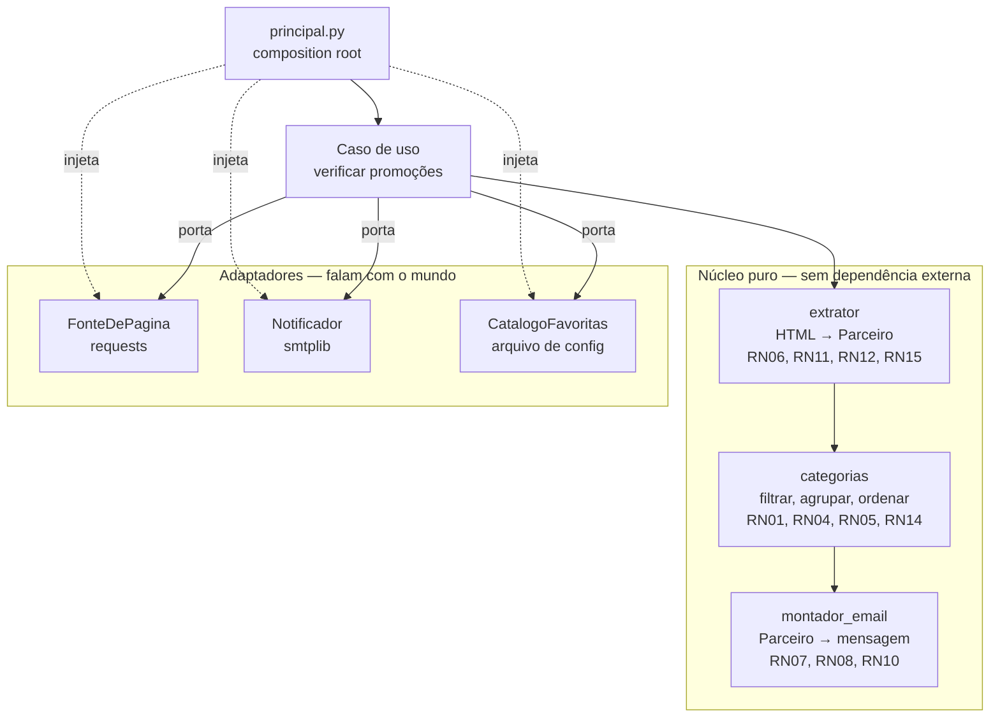
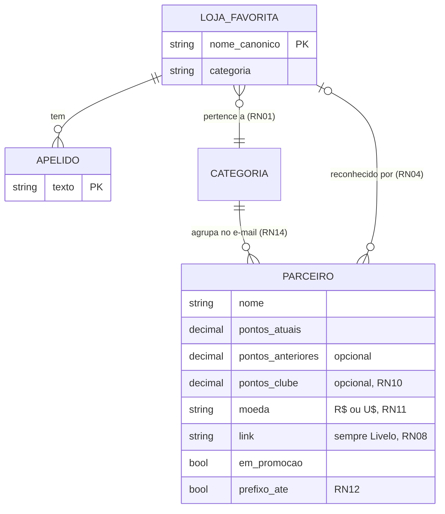
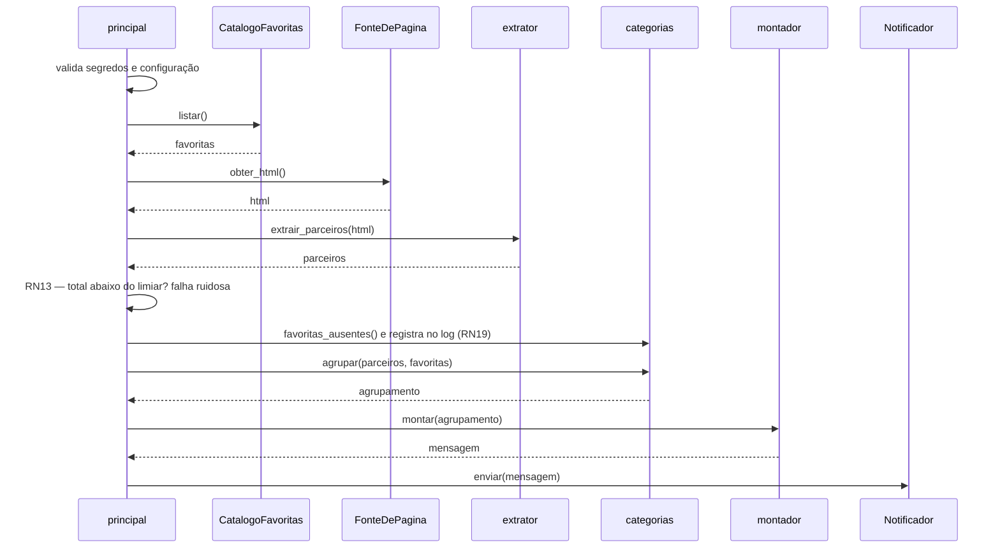

# PRD — Robô de Pontuação Turbinada (Livelo)

**Versão:** v1.1
**Status:** V1.0 implementada. Fatia vertical rodando fim a fim, 71 testes verdes, 94% de cobertura. Falta apenas configurar os segredos no GitHub para a primeira execução agendada.

Este documento é a **fonte da verdade** do projeto. README e arquivo de contexto do agente apontam pra cá e não repetem seu conteúdo.

---

## 1. Visão e Escopo

### 1.1 Visão

Robô pessoal que vigia a página pública de parceiros da Livelo e me avisa por e-mail, 3x ao dia, quais das *minhas* lojas estão com pontuação turbinada — sem servidor, sem custo e sem meu computador ligado.

### 1.2 Problema

Promoção de pontuação turbinada na Livelo é efêmera, não tem aviso prévio e a página lista mais de 200 parceiros. Checar na mão 3x ao dia é inviável. Não checar significa comprar sem o boost numa loja onde eu ia comprar de qualquer jeito.

### 1.3 Objetivos

| ID | Objetivo |
|---|---|
| **O1** | Nunca precisar abrir a página da Livelo pra saber se tem promoção nas minhas lojas. |
| **O2** | Custo zero de operação e nenhuma infraestrutura sob minha responsabilidade. |
| **O3** | Falha nunca é silenciosa: "não tem promoção hoje" e "o robô quebrou" precisam ser distinguíveis. |
| **O4** | Servir de peça de portfólio: repositório público com testes, CI e documentação. |

### 1.4 Fora do escopo (V1)

- Front-end, dashboard ou aplicativo. O **canal único de saída é e-mail**.
- Banco de dados e qualquer serviço hospedado além do GitHub.
- Histórico entre execuções, comparação de execuções e gráfico de tendência.
  *(O robô é stateless: cada execução mostra tudo que está ativo naquele momento, mesmo que repita o e-mail do dia anterior. A arquitetura deixa um contrato de repositório no-op como ponto de extensão — ver Seção 4.)*
- Data de validade da promoção. **A justificativa original desta exclusão era falsa** e está registrada em 11.2: acreditava-se que exigiria ~40 requisições extras, mas a página já traz `dateStart` e `dateEnd` no mesmo payload. Segue fora da V1.0 apenas porque a V1.0 já estava fechada quando isso foi descoberto.
- Login na conta Livelo, compra automática ou clique automático. **O robô nunca autentica** — lê apenas página pública.
- Multiusuário, cadastro ou preferências por usuário.
- Outros programas de pontos (Esfera, Latam Pass etc.). Somente Livelo.
- Outro canal de notificação (Telegram, push, WhatsApp).

### 1.5 Público-alvo

| Público | Necessidade | Como consome |
|---|---|---|
| **Primário** — eu, usuário único | Saber quando minhas lojas estão turbinadas | Recebe o e-mail. Destinatário único. |
| **Secundário** — leitor do repositório (dev, recrutador) | Avaliar a qualidade de engenharia do projeto | Lê README e este PRD. Não roda o robô. |

### 1.6 Glossário

| Termo | Significado |
|---|---|
| **Parceiro / Loja** | Empresa listada na página de parceiros da Livelo. |
| **Pontos base** | Pontuação normal concedida por R$ 1 gasto. |
| **Pontuação turbinada (boost)** | Pontuação temporária acima da base. |
| **Clube Livelo** | Assinatura paga da Livelo; alguns parceiros dão valor extra a quem é assinante. |
| **Loja favorita** | Subconjunto de parceiros que eu escolhi monitorar. |
| **Categoria** | Agrupamento das lojas favoritas (Beleza, Moda, Eletro etc.). |
| **Execução (run)** | Uma rodada completa do robô: buscar, filtrar, montar e enviar. |
| **Alerta de quebra** | Erro proposital disparado quando a extração devolve um número anormalmente baixo de parceiros, sinalizando que o site mudou. |

### 1.7 Métrica de sucesso

Sem banco de dados e sem front-end, a medição usa apenas o que o GitHub já oferece de graça.

| ID | Métrica | Alvo | Fonte |
|---|---|---|---|
| **MS1** | Confiabilidade | ≥ 95% das execuções agendadas terminam sem falha, em janela de 30 dias | Aba Actions do repositório |
| **MS2** | Fidelidade | Zero divergência entre o e-mail e o site, no smoke test manual | Conferência manual |
| **MS3** | Falha visível | Falha injetada de propósito gera notificação do GitHub | Teste único, feito na V1 |
| **MS4** | Utilidade | Eu paro de abrir a página da Livelo manualmente | Autoavaliação mensal (qualitativo) |
| **MS5** | Sinal de vida | Nenhum dia sem e-mail. A ausência de e-mail passa a significar uma coisa só: o robô parou | Caixa de entrada |

MS5 existe por causa de C01. O GitHub desabilita workflows agendados após 60 dias sem atividade no repositório, e essa morte não gera notificação alguma. Como RF10 envia em toda execução, o silêncio deixa de ser ambíguo — é o que sustenta O3 nesse cenário.

> **Limitação honesta:** MS1 depende do log do GitHub Actions, que expira. Sem persistência, não existe métrica histórica além da janela de retenção do Actions.

---

## 2. Requisitos

### 2.1 Requisitos funcionais

| ID | Requisito |
|---|---|
| **RF01** | Buscar a página pública de parceiros da Livelo, fazendo **1 única requisição HTTP por execução**. |
| **RF02** | Extrair, de cada parceiro listado: nome, pontos atuais, pontos anteriores, pontos do Clube Livelo, moeda, link do parceiro e indicador de promoção ativa. |
| **RF03** | Manter apenas os parceiros que constam na lista de lojas favoritas. |
| **RF04** | Descartar as lojas favoritas que não estão em promoção no momento da execução. |
| **RF05** | Agrupar as lojas restantes por categoria. |
| **RF06** | Ordenar as categorias por nome e, dentro de cada categoria, as lojas por pontuação decrescente. |
| **RF07** | Montar o e-mail em HTML, acompanhado de uma versão em texto simples equivalente. |
| **RF08** | Refletir no assunto do e-mail a quantidade de promoções encontradas. |
| **RF09** | Enviar o e-mail por SMTP para um destinatário único. |
| **RF10** | Enviar o e-mail em **toda** execução, inclusive quando não houver nenhuma promoção. O assunto distingue os dois casos. |
| **RF11** | Repetir a requisição em caso de falha transitória, respeitando um limite de tentativas. |
| **RF12** | Disparar o alerta de quebra quando o total de parceiros extraídos ficar abaixo do limiar configurado. |
| **RF13** | Executar de forma agendada 3x ao dia e também sob disparo manual. |

### 2.2 Requisitos não-funcionais

| ID | Requisito | Alvo verificável |
|---|---|---|
| **RNF01** | Custo zero de operação | Somente free tier do GitHub Actions, em repositório público |
| **RNF02** | Cortesia de rede | No máximo 3 requisições por dia ao site; timeout explícito; User-Agent honesto |
| **RNF03** | Execução rápida | Menos de 60 segundos por execução |
| **RNF04** | Stateless e idempotente | Nenhuma escrita de estado; duas execuções seguidas produzem o mesmo resultado |
| **RNF05** | Segredo fora do código **e fora do log** | Nenhum valor sensível impresso — o log do Actions é público |
| **RNF06** | Falha sempre visível | Qualquer erro encerra o processo com código de saída diferente de zero |
| **RNF07** | Portabilidade | O mesmo código roda localmente e no Actions; só variáveis de ambiente mudam |
| **RNF08** | Teste sem efeito colateral | Nenhum teste automatizado acessa a rede ou o SMTP real |
| **RNF09** | Manutenibilidade | Trocar uma loja favorita não exige editar lógica |
| **RNF10** | Quality gate | Lint e testes verdes são obrigatórios a cada push |
| **RNF11** | Idioma | Código, testes e documentação em português do Brasil |
| **RNF12** | Runtime | Python 3.11 ou superior |

### 2.3 Restrições

Limitações reais do ambiente escolhido. Não são negociáveis — o projeto convive com elas.

| ID | Restrição | Impacto |
|---|---|---|
| **C01** | O GitHub desabilita workflows agendados após 60 dias sem atividade no repositório | O robô para de rodar em silêncio; exige mitigação explícita no roadmap |
| **C02** | O cron do GitHub Actions não garante horário exato — depende da fila | Os horários de 09h/14h/20h são aproximados; atraso de minutos é comportamento normal |
| **C03** | O Gmail exige verificação em 2 etapas e senha de aplicativo | Setup manual obrigatório; a senha pode ser revogada a qualquer momento pelo Google |
| **C04** | A Livelo pode alterar o HTML ou adotar proteção anti-bot sem aviso | O extrator é frágil por natureza — é exatamente o que RF12 existe para detectar |
| **C05** | O Gmail corta mensagens acima de ~102 KB, escondendo o resto atrás de um link | Limita o tamanho do corpo do e-mail. Medido: 6 KB no cenário real e 27 KB no pior caso, com todas as favoritas em promoção. Folga de quase 4x |

### 2.4 Parâmetros de configuração

Valores definidos como padrão do projeto, todos ajustáveis por variável de ambiente (nenhum fixo no código):

| Parâmetro | Padrão | Relacionado a |
|---|---|---|
| Limiar do alerta de quebra | 150 parceiros | RF12, C04 |
| Tentativas de requisição | 3, com espera crescente entre elas | RF11, RNF02 |
| Timeout de requisição | definido explicitamente, nunca infinito | RNF02, RNF03 |
| Tamanho máximo da resposta | 5 MB | RNF03, §9.2 |

Os dois primeiros valores vêm de medição real, não de estimativa. Na conferência de 2026-08-09 a página trazia **247 parceiros** e pesava **1,4 MB**. O limiar de 150 dispara se o total cair abaixo de ~60% do observado; o valor de 50 previsto no planejamento original era frouxo demais — uma queda para 60 parceiros indicaria site quebrado e passaria sem alerta.

---

## 3. Regras de Negócio

Regras numeradas e referenciadas pelo restante do documento. Qualquer mudança aqui obriga varredura nas Seções 5 a 8.

### 3.1 Classificação e identificação de lojas

| ID | Regra |
|---|---|
| **RN01** | A pontuação turbinada é concedida pela **loja**, não pelo produto. Cada loja pertence a exatamente **uma** categoria fixa. |
| **RN02** | **Piso de boost zero:** qualquer aumento de pontuação conta, mesmo de 1 para 2 pontos. Não existe valor mínimo. |
| **RN03** | A comparação de nomes é feita sobre o nome **normalizado**: sem acentuação, em caixa única e sem espaços nas bordas. |
| **RN04** | O reconhecimento de uma loja favorita é por **correspondência exata** contra o nome canônico ou contra um dos apelidos cadastrados para ela. Correspondência parcial por substring é **proibida** — é o que garante que "Ponto" jamais capture "Pontofrio". |
| **RN05** | Parceiro que não consta na lista de favoritas é ignorado **silenciosamente**. Não é erro nem gera aviso. |
| **RN06** | Parceiro repetido na página conta **uma única vez** no resultado. |
| **RN09** | A Amazon nunca entra na lista de favoritas: não é parceira de acúmulo da Livelo. |
| **RN15** | O nome do parceiro é lido do atributo `alt` da imagem. Na ausência do `alt`, usa-se o texto do link como alternativa, e a extração **nunca quebra** por causa disso. |
| **RN16** | Uma categoria nova só se justifica quando reúne 2 ou mais lojas. É o motivo do descarte da categoria "Papelaria". |
| **RN19** | Toda execução registra no **log** quais lojas favoritas cadastradas não foram encontradas na página. É o contrapeso de RN04: um apelido novo criado pela Livelo faria a loja sumir do e-mail em silêncio, e este registro torna a ausência visível sem exigir persistência. Vai para o log, nunca para o e-mail. |

### 3.2 Conteúdo e apresentação

| ID | Regra |
|---|---|
| **RN08** | O link do e-mail aponta sempre para a página do parceiro **dentro da Livelo**, nunca para o site da loja. É por esse caminho que a pontuação é validada pelo programa. |
| **RN20** | O e-mail exibe o **nome canônico do catálogo**, não o nome que a Livelo mostra na página. O nome do site já cumpriu seu papel no reconhecimento (RN04). Sem esta regra o e-mail traria "CEA", "Booking com" e "O Boticario" sem acento, que são as grafias da Livelo e não as do leitor. |
| **RN10** | O valor exclusivo do Clube Livelo só aparece quando existir. Sem valor, nenhum bloco vazio é renderizado. |
| **RN11** | A moeda pode ser R$ ou U$ — parceiros de viagem usam dólar. O valor **nunca é convertido**: é exibido na moeda em que veio. |
| **RN12** | Os prefixos "Até X pontos" e "Eram X pontos" têm o número extraído sem que o sentido se perca na exibição. |
| **RN14** | Categoria sem nenhuma loja em promoção não aparece no e-mail. |

### 3.3 Segurança, privacidade e sinalização de falha

| ID | Regra |
|---|---|
| **RN07** | **Todo texto vindo do site é hostil.** Nome de loja e qualquer conteúdo extraído são escapados antes de entrar no HTML do e-mail. Nenhum dado externo é interpolado sem tratamento. |
| **RN13** | **Ausência de promoção não é erro; ausência de parceiros é.** É a regra que sustenta O3: sem ela, "não tem promoção hoje" e "o site mudou" seriam indistinguíveis. |
| **RN17** | Destinatário único, sempre. **Nunca CC nem BCC.** |
| **RN18** | O e-mail não carrega nenhum dado pessoal além do próprio endereço de destino. |

---

## 4. Arquitetura

### 4.1 Princípio

O núcleo **não faz entrada e saída**. Nada de rede, disco, variável de ambiente ou SMTP. Tudo que fala com o mundo externo entra por contrato, e trocar qualquer adaptador não toca a lógica.

A fronteira é I/O, não "dependência externa". O núcleo pode usar `beautifulsoup4`, que é biblioteca de transformação pura: recebe texto, devolve estrutura, não abre conexão nem arquivo. Proibir uma biblioteca só por ser de terceiro protegeria o rótulo em vez do princípio — e o Plano B do Playwright troca o *baixador* da página, nunca o *interpretador* do HTML.

A divisão que importa: **baixar** a página é sujo, **interpretar** o HTML é puro. Receber uma string de HTML e devolver objetos não depende de rede. É essa fronteira que torna o Plano B (Playwright) uma troca de uma peça só, e é a mesma fronteira que a estratégia de testes já assume ao usar fixtures de HTML sem rede.

### 4.2 Portas

Três contratos, definidos apenas onde a troca é realmente provável.

| Porta | Responsabilidade | Por que existe | Implementação V1 |
|---|---|---|---|
| `FonteDePagina` | Devolver o HTML cru da página de parceiros | Torna barata a troca prevista em C04: o Plano B com Playwright substitui só esta peça | `requests` |
| `Notificador` | Entregar a mensagem montada | Isola o canal de saída da lógica que decide o conteúdo | SMTP via Gmail |
| `CatalogoFavoritas` | Fornecer lojas favoritas, apelidos e categorias | Atende RNF09: a mudança mais frequente do projeto deixa de exigir edição de código | Arquivo de configuração |

**Ponto de extensão documentado, não implementado:** persistência de execuções (`RepositorioExecucao`). Histórico está fora do escopo da V1 (Seção 1.4) e criar uma interface no-op para funcionalidade inexistente seria construir o futuro em vez de deixar a porta barata. Quando houver necessidade, o caso de uso ganha uma dependência a mais e nenhuma regra de negócio muda.

### 4.3 Desenho



### 4.4 Estrutura de arquivos

Estrutura plana, com um arquivo dedicado aos contratos. O projeto deve ficar abaixo de 500 linhas de código — hierarquia de pastas custaria mais do que entrega.

```
robo-livelo/
├── .github/
│   ├── workflows/
│   │   ├── robo.yml
│   │   └── testes.yml
│   └── dependabot.yml
├── config/
│   └── lojas_favoritas.toml    # RNF09 — dado de negócio fora do código ✔
├── src/robo_livelo/
│   ├── __init__.py
│   ├── modelos.py              # núcleo puro: Parceiro, LojaFavorita, Mensagem
│   ├── portas.py               # os 3 contratos e as exceções do domínio
│   ├── extrator.py             # núcleo puro: HTML → Parceiro
│   ├── categorias.py           # núcleo puro: filtrar, agrupar, ordenar
│   ├── montador_email.py       # núcleo puro: Parceiro → mensagem
│   ├── adaptadores.py          # requests, smtplib, leitura de config
│   └── principal.py            # composition root + caso de uso
├── testes/
├── docs/
│   ├── PRD.md                  # fonte da verdade (este documento) ✔
│   ├── TESTES.md               # catálogo de casos ✔
│   └── ARQUITETURA.md          # histórico, substituído por este PRD ✔
├── pyproject.toml
├── .env.example                ✔
├── .gitignore                  ✔
├── CLAUDE.md                   # contexto para agentes de IA ✔
├── LICENSE                     ✔
└── README.md                   ✔
```

Itens marcados com ✔ já existem. O restante é criado na V1.0.

> **Limitação assumida:** com estrutura plana, a fronteira entre núcleo e adaptador é sustentada por convenção e revisão, não pela árvore de pastas. Nada impede tecnicamente um `import requests` dentro de `categorias.py`. A contrapartida está na Seção 9, onde o quality gate verifica essa fronteira.

---

## 5. Modelo de Dados

Não existe banco de dados (Seção 1.4). O modelo se divide em dois: as estruturas que vivem em memória durante uma execução e o arquivo de configuração, que é o único dado de negócio persistido — versionado no git.

### 5.1 Diagrama



### 5.2 Estruturas em memória

| Estrutura | Origem | Descrição |
|---|---|---|
| `Parceiro` | Saída do extrator | Um parceiro lido da página, já normalizado. Imutável. |
| `LojaFavorita` | Saída do catálogo | Nome canônico, apelidos e categoria, lidos da configuração. |
| Agrupamento por categoria | Saída das regras | Categorias mapeadas para suas lojas em promoção, já ordenadas (RF06). Categorias vazias não entram (RN14). |
| `Mensagem` | Saída do montador | Assunto, corpo em HTML e corpo em texto simples (RF07, RF08). |

### 5.3 Configuração das lojas favoritas

Arquivo `config/lojas_favoritas.toml`, fonte da verdade das favoritas e dos apelidos exigidos por RN04.

```toml
[[loja]]
nome = "Casas Bahia"
apelidos = ["Casas Bahia Oficial"]
categoria = "Marketplace / Varejo Geral"
```

O formato TOML é lido pelo `tomllib`, nativo no Python 3.11 — a configuração externa **não adiciona nenhuma dependência** ao projeto.

O arquivo já existe, preenchido com **132 lojas** em 10 categorias, com os nomes conferidos contra a página real em 2026-08-09.

As categorias **Beleza, Marketplace / Varejo Geral, Moda e Eletro** contêm *todas* as lojas que a Livelo classifica nesses segmentos. Elas não foram escolhidas a dedo nem classificadas por palpite: a própria página embute a taxonomia oficial da Livelo e a lista de categorias de cada parceiro, e foi ela que definiu o agrupamento. As demais categorias seguem curadas manualmente.

Quando um parceiro pertence a várias categorias da Livelo, a atribuição segue a ordem Marketplace, Eletro, Beleza, Moda — necessária porque RN01 exige categoria única, e a Livelo permite várias.

Duas descobertas da conferência de nomes:

**RN04 deixou de ser hipótese.** A página lista pares que uma correspondência por substring confundiria de imediato: `Magalu` e `Consórcio Magalu`, `Hering` e `Hering Outlet`, `Carrefour Mercado` e `Carrefour Shopping`, `Petlove` e `Petlove Saúde`, `Localiza`, `Localiza Internacional` e `Localiza Meoo`. São parceiros distintos, com pontuação própria. A regra de match exato não é precaução teórica — sem ela o e-mail traria a loja errada.

**Apelidos são necessários desde o primeiro dia.** Dois casos reais já apareceram, ambos causados por pontuação, que RN03 não normaliza:

| Nome canônico | Como a Livelo exibe |
|---|---|
| Booking.com | `Booking com` — sem o ponto |
| C&A | `CEA` — sem o "&" |

O caso da C&A é o mais instrutivo, porque quase virou um erro no próprio planejamento: uma busca pela grafia "C&A" na página não encontra nada e leva à conclusão falsa de que a loja não é mais parceira. **Ao cadastrar uma loja, o nome exibido tem de ser lido da página, nunca suposto.**

### 5.4 Decisões de design do schema

| Decisão | Motivo |
|---|---|
| Pontuação em `Decimal`, não `float` | A Livelo exibe valores fracionados. Em `float`, um valor como 2,9 vira `2.9000000000000004` no corpo do e-mail. `Decimal` preserva exatamente o que veio e ordena corretamente para RF06. |
| `Parceiro` imutável (`frozen dataclass`) | O núcleo é puro: cada etapa devolve uma estrutura nova em vez de mutar a anterior. Torna o fluxo rastreável e os testes independentes de ordem. |
| Categoria como texto, sem entidade própria | Categoria é um rótulo vindo da configuração. Criar uma entidade para um rótulo seria peso sem ganho, e RN16 já limita a proliferação de categorias. |
| `pontos_anteriores` e `pontos_clube` opcionais | Nem todo parceiro tem promoção ou valor de Clube. A ausência é um estado válido do domínio, não um erro (RN10). |
| `prefixo_ate` como campo próprio | RN12 exige preservar o sentido de "Até X pontos" na exibição. Guardar só o número perderia essa informação. |
| Nenhuma estrutura carrega dado pessoal | O endereço de destino vive apenas na configuração de ambiente, nunca no modelo de domínio (RN18). |

---

## 6. Componentes Críticos

Nível de design: contratos e comportamento esperado. Nenhuma implementação.

### 6.1 Ordem de criticidade

| Ordem | Componente | Por quê |
|---|---|---|
| 1 | **Extrator** | Único componente cuja quebra é causada por terceiro (C04) e único capaz de falhar em silêncio |
| 2 | **Reconhecimento de loja** | RN04 é exato: um apelido novo faz a loja desaparecer sem erro |
| 3 | **Montador** | Onde dado externo encontra HTML — é o ponto de aplicação de RN07 |
| 4 | **Adaptador SMTP** | Falha aqui é ruidosa e imediata, portanto de baixo risco |

### 6.2 Contratos

```
# portas.py
FonteDePagina.obter_html() -> str          # levanta erro após esgotar tentativas (RF11)
Notificador.enviar(mensagem) -> None
CatalogoFavoritas.listar() -> list[LojaFavorita]

# extrator.py — núcleo puro, nunca toca rede
extrair_parceiros(html: str) -> list[Parceiro]        # RN06, RN11, RN12, RN15

# categorias.py — núcleo puro
reconhecer(nome, favoritas) -> LojaFavorita | None    # RN03, RN04, RN05
agrupar(parceiros, favoritas) -> dict[str, list]      # RN01, RN14, RF06
favoritas_ausentes(parceiros, favoritas) -> list[str] # RN19

# montador_email.py — núcleo puro
montar(agrupamento) -> Mensagem                       # RN07, RN08, RN10, RN12, RF08
```

### 6.3 Modos de falha do extrator

| Falha | Comportamento | Regra |
|---|---|---|
| Layout do site mudou | Poucos parceiros extraídos, alerta de quebra dispara | RN13, RF12 |
| Parceiro sem `alt` na imagem | Usa o texto do link como alternativa, não quebra | RN15 |
| Nome de loja não cadastrado | A loja não entra no e-mail, mas aparece no log da execução | RN19 |
| Valor não numérico em um parceiro | Descarta apenas aquele parceiro, registra no log e segue | ver 6.4 |
| Rede instável | Repete a requisição e, esgotadas as tentativas, falha de forma ruidosa | RF11, RNF06 |

### 6.4 Decisões de design

**O alerta de quebra pertence ao caso de uso, não ao extrator.**
O extrator converte HTML em objetos e nada mais. Decidir que "39 parceiros é pouco" é regra de negócio (RN13), não interpretação de HTML. Manter isso dentro do extrator o obrigaria a conhecer o limiar de configuração, quebrando sua pureza.
*Consequência de consistência:* o caso de teste CT-024 muda de arquivo — sai de `teste_extrator.py` e entra no teste de orquestração (ver Seção 8).

**Um parceiro malformado não derruba a execução.**
Parceiro cujo valor não pode ser interpretado é descartado e registrado no log. Se a malformação for generalizada — isto é, se o site mudou — o limiar do RF12 captura o problema de qualquer forma. Sem essa regra, um único nome fora do padrão impediria o envio do e-mail inteiro, violando O3 ao transformar um defeito pequeno em falha total.

---

## 7. Caso de Uso

Existe um único caso de uso, e ele é a fatia vertical da V1: **verificar promoções e notificar**.

### 7.1 Fluxo principal



Passo a passo:

1. Validar segredos e configuração.
2. Carregar as lojas favoritas pelo catálogo.
3. Obter o HTML da página, com repetição em falha transitória (RF11).
4. Extrair os parceiros (RF02).
5. Aplicar RN13: total abaixo do limiar encerra a execução com falha.
6. Registrar no log as favoritas não encontradas (RN19).
7. Agrupar: descartar não favoritas (RN05), descartar sem promoção (RF04), ordenar (RF06), remover categorias vazias (RN14).
8. Montar a mensagem, com assunto adequado ao caso — com ou sem promoções (RF07, RF08, RF10).
9. Enviar e registrar o resumo no log.

### 7.2 Fluxos alternativos

| Situação | Desfecho | Código de saída |
|---|---|---|
| Configuração ausente ou sem nenhuma loja | Falha ruidosa — sem favoritas o robô não tem propósito | ≠ 0 |
| Segredo faltando | Falha ruidosa antes de tocar a rede | ≠ 0 |
| Rede falha em todas as tentativas | Falha ruidosa | ≠ 0 |
| Total de parceiros abaixo do limiar | Falha ruidosa (RN13) | ≠ 0 |
| Nenhuma promoção encontrada | Envia e-mail com assunto próprio de "sem promoções" (RF10) | 0 |
| SMTP recusa a autenticação | Falha ruidosa com mensagem legível | ≠ 0 |

### 7.3 Decisão de ordem

**Segredos são validados na largada, antes da requisição HTTP.**
Falhar depois de baixar a página gastaria uma requisição sem propósito e violaria a cortesia de rede do RNF02. A validação é barata e o erro é o mesmo — só o custo muda.

---

## 8. Estratégia de Testes

O plano de casos detalhado vive em `TESTES.md`. Esta seção define a estratégia e registra as correções que as decisões deste PRD impõem àquele plano.

### 8.1 Pirâmide

| Nível | Alvo | Volume |
|---|---|---|
| Unitário | Núcleo puro: extrator, categorias, montador | Maioria dos casos |
| Componente | Caso de uso completo, com fakes das três portas | Um punhado |
| E2E automatizado | **Nenhum.** Exercitar o site real e o Gmail violaria RNF02 e RNF08 | Zero |
| Smoke manual | Conferência contra o site real, sob demanda | Um roteiro |

A arquitetura da Seção 4 muda a técnica: com as portas definidas, os testes injetam **fakes** em vez de aplicar `mock.patch` sobre `requests` e `smtplib`. O teste passa a exercitar o contrato do projeto, não o detalhe interno de uma biblioteca de terceiro — e sobrevive à troca prevista em C04.

### 8.2 Correções aplicadas ao plano existente

As quatro correções abaixo **já foram aplicadas** em `TESTES.md`. Ficam registradas aqui porque cada uma decorre de uma decisão deste PRD.

| # | Correção | Motivo |
|---|---|---|
| 1 | O total declarado passa de 47 para **39** casos | A soma real dos casos listados é 8 + 15 + 9 + 7. A numeração tem lacunas propositais (009, 025–029, 039) e o total foi calculado pelo intervalo, não pelos itens. Corrigir também no README. |
| 2 | **CT-005 inverte de sentido** | O caso afirma hoje que um sufixo novo casa por correspondência parcial. RN04 proíbe substring: o caso passa a exigir que o sufixo **não** case, a menos que esteja cadastrado como apelido. Mantê-lo como está blindaria exatamente o comportamento que foi proibido. |
| 3 | **CT-024 muda de arquivo** | O alerta de quebra é regra do caso de uso (6.4), não do extrator. Sai de `teste_extrator.py` e passa para o teste de orquestração. |
| 4 | **CT-043 e CT-044 são substituídos** | Os dois casos testam o comportamento condicional de `SEMPRE_ENVIAR`, parâmetro eliminado pela decisão de RF10. No lugar deles entra um caso único: sem promoções, o e-mail é enviado com o assunto de "sem promoções". |

### 8.3 Casos a acrescentar

Regras deste PRD que não tinham cobertura ganharam casos no bloco CT-060 em diante, preservando os identificadores existentes. Já estão em `TESTES.md`.

| Regra | Caso |
|---|---|
| RN04 | Apelido cadastrado é reconhecido; sufixo não cadastrado não é (CT-005) |
| RN07 | Nome contendo `<`, `&` ou aspas aparece escapado no HTML (CT-064) |
| RN08, §9.2 | Link fora do domínio da Livelo não entra no e-mail (CT-065) |
| RN14 | Categoria sem nenhuma loja em promoção não aparece no e-mail (CT-066) |
| RN19 | Favoritas ausentes vão para o log e nunca para o e-mail (CT-070) |
| RN17, RN18 | Envio ocorre com destinatário único, sem CC e sem BCC (CT-072) |
| RNF05 | Nenhum segredo aparece no log da execução (CT-073) |
| Seção 5.4 | Pontuação fracionada é exibida sem artefato de ponto flutuante (CT-067) |
| Seção 6.4 | Parceiro malformado é descartado e a execução prossegue (CT-071) |
| Seção 7.3 | Segredo faltando falha antes de qualquer requisição (CT-069) |
| Seção 5.3 | Configuração ausente, vazia, malformada ou com apelido repetido (CT-061 a CT-063) |
| Seção 9.3 | Núcleo puro não importa dependência externa (CT-074) |

Total resultante: **53 casos automatizados** e 2 verificações manuais.

### 8.4 Meta de cobertura

Mínimo de 90% no núcleo puro. Nenhuma meta para adaptadores: perseguir cobertura total em código cuja única função é chamar `smtplib` produz teste de fachada, que custa manutenção e não detecta defeito.

---

## 9. Segurança e Qualidade

### 9.1 Segredos

| Variável | Local | Produção | Sensível |
|---|---|---|---|
| `EMAIL_REMETENTE` | `.env`, fora do git | GitHub Secret | Sim |
| `SENHA_APP_GMAIL` | `.env`, fora do git | GitHub Secret | Sim |
| `EMAIL_DESTINO` | `.env`, fora do git | GitHub Secret | Sim — dado pessoal |
| `LIMIAR_PARCEIROS` | `.env` | Variável do workflow | Não |

O log do GitHub Actions em repositório público **é visível para qualquer pessoa**. RNF05 se traduz em três proibições concretas:

- Nunca imprimir a configuração completa, nem em depuração.
- Nunca ligar o modo de depuração do `smtplib`, que ecoa o diálogo de autenticação.
- Nunca deixar exceção de SMTP propagar mensagem contendo credencial — o erro é convertido em texto próprio antes de subir.

A senha de aplicativo do Gmail é revogável a qualquer momento pelo Google e serve apenas para envio (C03).

### 9.2 Tratamento de dado externo

Todo conteúdo vindo da página da Livelo é hostil até prova em contrário.

| Controle | Descrição | Regra |
|---|---|---|
| Escape na renderização | Nome de loja e demais textos extraídos são escapados antes de entrar no HTML | RN07 |
| **Validação de domínio do link** | O link só entra no e-mail se apontar para o domínio da Livelo. Sem essa checagem, uma alteração na página colocaria um link arbitrário dentro de um e-mail que eu confio e clico — a regra RN08 vira controle de segurança, não só de negócio | RN08 |
| **Limite de tamanho no download** | Resposta acima de 5 MB é tratada como falha. A página medida pesa 1,4 MB, então o teto dá folga de mais de 3x sem aceitar resposta absurda | RNF03 |
| Nenhuma execução de conteúdo | O HTML é apenas interpretado como texto. Nada de JavaScript, nada de navegador na V1 | Seção 4 |

### 9.3 Quality gate

Executado inteiramente dentro do GitHub Actions, sem serviço externo. O gate roda igual na máquina local e no CI — não existe verificação que só o servidor consegue fazer.

| Verificação | Falha o build quando |
|---|---|
| `pytest` | Qualquer teste quebra |
| Cobertura | Núcleo puro abaixo de 90% (Seção 8.4) |
| `ruff` | Lint ou formatação fora do padrão |
| **Teste de fronteira** | Um módulo do núcleo importa `requests`, `smtplib`, `tomllib`, `os` ou `pathlib` |
| Dependabot | — abre Pull Request para atualização de segurança |

### 9.3.1 Versionamento

A versão do projeto é calculada pelos commits, não escolhida à mão. O padrão Conventional Commits, que o repositório já seguia desde o primeiro commit, decide o incremento:

| Prefixo | Incremento |
|---|---|
| `fix:` | patch — 1.0.0 para 1.0.1 |
| `feat:` | minor — 1.0.0 para 1.1.0 |
| `feat!:` ou `BREAKING CHANGE` | major — 1.0.0 para 2.0.0 |
| `docs:`, `test:`, `chore:` | nenhum |

A ferramenta é o `python-semantic-release`, que mantém `pyproject.toml`, `__init__.py` e `CHANGELOG.md` em sincronia e cria a tag e o Release no GitHub. A versão aparece no rodapé de todo e-mail, para que um defeito relatado possa ser amarrado ao código que o gerou.

> **Tensão declarada:** criar tag e release exige `contents: write`, e §9.4 diz que o projeto não escreve no repositório. A regra continua valendo onde importa — o workflow do robô mantém `contents: read`. Quem ganha escrita é o workflow `versao.yml`, que só roda em push na `main`, só cria tag, changelog e release, e nunca é acionado pelo robô. São superfícies diferentes, e a do scraper continua sem poder escrever.

O **teste de fronteira** paga a dívida assumida na Seção 4.4. Como a estrutura é plana, a separação entre núcleo e adaptador não é imposta pela árvore de pastas; um teste percorre os imports dos módulos do núcleo e falha se encontrar dependência externa. Custa um arquivo de teste e nenhuma ferramenta nova.

> **Decisão registrada:** SonarCloud foi avaliado e descartado. O ganho seria o badge de qualidade para O4, mas o custo é uma conta de terceiro, mais um token e um gate impossível de rodar antes do push. Em um projeto de poucas centenas de linhas, a análise encontraria pouco além do que o `ruff` já cobre.

### 9.4 Superfície de ataque

O que o robô é proibido de fazer, por construção:

| Proibição | Como é garantida |
|---|---|
| Nunca autentica na Livelo | Não existe credencial da Livelo em lugar nenhum do projeto (Seção 1.4) |
| **Nunca escreve no repositório** | O workflow declara `permissions: contents: read`. Por padrão o token do Actions tem permissão de escrita; sem essa linha, uma dependência comprometida poderia commitar no repositório |
| Nunca recebe entrada de usuário | Não há interface de entrada — a única entrada externa é o HTML da página |
| Nunca envia para terceiros | Destinatário único e fixo, vindo de segredo (RN17) |

---

## 10. Legal, Ético e Privacidade

### 10.1 Termos de uso da Livelo

Verificação feita em **2026-08-09**:

| Verificação | Resultado |
|---|---|
| `robots.txt` do domínio | `User-agent: *` seguido de `Allow: /`. Nenhum `Disallow`, nenhum `Crawl-delay` |
| Rota `/juntar-pontos/todos-os-parceiros` | Explicitamente permitida pelo `Allow: /` |
| Página de termos de uso | Não encontrada. Os caminhos convencionais (`/termos-de-uso`, `/termos`, `/termos-e-condicoes`) retornam 404 |
| `/regulamentos` e `/regulamentos/programa-pontos-livelo` | Regem o programa de pontos — acúmulo, resgate, conta do participante. Busca por termos como "automatizado", "robô", "crawler", "scraping" e "extração de dados" não encontrou cláusula restringindo acesso automatizado ao site |
| `/politica-de-privacidade` | A única ocorrência de "automatizado" trata da coleta de registros de acesso feita pela própria Livelo, não de proibição a terceiros |

> **Limite honesto desta verificação:** busca por palavra-chave sobre texto renderizado não é análise jurídica. A ausência de cláusula encontrada não é o mesmo que permissão expressa. O que se pode afirmar com segurança é que o `robots.txt` — o mecanismo padrão pelo qual um site declara sua política para acesso automatizado — permite explicitamente esta rota.

O que se sabe pelo desenho do projeto:

| Aspecto | Situação |
|---|---|
| Risco de conta | Nulo. O robô nunca autentica (Seção 1.4), então não existe conta a ser suspensa |
| Risco real | Bloqueio de IP pela Livelo |
| Volume de acesso | 1 requisição por execução, 3 execuções por dia (RNF02) |
| Identificação | User-Agent honesto, sem disfarce |

**Linha ética: nenhuma evasão.**
Se a Livelo bloquear o acesso ou solicitar que o robô pare, o projeto para. Não haverá rotação de proxy, resolução de CAPTCHA, falsificação de tráfego humano ou qualquer técnica para contornar bloqueio deliberado.

O Plano B com Playwright existe para o caso de a página virar aplicação renderizada no cliente — **não** para driblar proteção anti-bot. A distinção importa porque a fronteira entre as duas situações é fácil de cruzar sem perceber, e o mesmo recurso técnico serve aos dois propósitos.

**Revisão:** repetir esta verificação sempre que o robô começar a receber respostas de erro, e antes de qualquer aumento de frequência.

### 10.2 Dados pessoais e LGPD

O único dado pessoal tratado é o endereço de e-mail, e o titular é o próprio autor do projeto.

A LGPD, em seu artigo 4º, inciso II, alínea "a", exclui de seu alcance o tratamento de dados realizado por pessoa natural para fins exclusivamente particulares e não econômicos. É exatamente o caso aqui. Registrar o motivo importa mais do que registrar a conclusão: **se o robô passar a enviar para o e-mail de outra pessoa, a LGPD passa a se aplicar** e esta seção precisa ser reescrita antes disso.

Práticas adotadas de qualquer forma:

- **Minimização:** nenhum dado além do necessário para enviar um e-mail.
- **Não retenção:** o robô é stateless, não guarda histórico de nada (Seção 1.4).
- **Não exposição:** o endereço nunca é impresso em log (Seção 9.1).
- Dados extraídos da Livelo são nomes de empresas e valores de pontuação — não são dados pessoais.

### 10.3 Licença e marca

| Item | Definição |
|---|---|
| Licença do código | MIT |
| Arquivo `LICENSE` | Criado na raiz. **Confirmar o nome do titular do copyright** |
| Dados extraídos | Não são redistribuídos. Vão apenas para o e-mail do autor. Publicá-los mudaria integralmente esta análise |
| Marca "Livelo" | Usada apenas de forma nominativa, para identificar o serviço monitorado. Nenhum logotipo no repositório |
| Afiliação | Nenhuma. O README declara explicitamente que o projeto não tem vínculo oficial com a Livelo |

### 10.4 Risco registrado

O repositório é público por decisão do objetivo O4, o que expõe publicamente um scraper que nomeia uma empresa. A alternativa privada caberia no free tier — o consumo estimado é de cerca de 90 minutos por mês contra 2.000 disponíveis. A decisão por repositório público está mantida; o trade-off fica registrado para revisão caso a situação de 10.1 mude.

---

## 11. Roadmap

### 11.1 Versões

| Versão | Conteúdo | Critério de saída |
|---|---|---|
| **V1.0** ✔ | Fatia vertical completa: todo o escopo da Seção 2, rodando no GitHub Actions com o quality gate verde | MS2 verificado contra a página real (247 parceiros, 9 promoções). MS3 pendente até a primeira execução no Actions |
| **V1.1** | Roteiro do smoke manual e regra de filtro no Gmail para os e-mails sem promoção (11.4) | MS1 e MS5 medidos ao longo de 30 dias |
| **V2** | Planejada em documento próprio: [`PRD-V2.md`](PRD-V2.md). Data de validade, página estática no GitHub Pages e e-mail condicional | Ver Seção 4 do PRD V2 |

A V1.0 é a fatia vertical no sentido estrito: um caminho fim a fim funcionando, da requisição HTTP até o e-mail entregue. Não há versão anterior a ela porque qualquer recorte menor não produz valor — meio caminho não manda e-mail nenhum.

### 11.2 Candidatos para V2

| Candidato | Gatilho | Observação |
|---|---|---|
| **Data de validade da promoção** | Alta prioridade | A página embute um payload JSON com `dateStart`, `dateEnd`, `parity`, `parityClub` e `parityBau` por parceiro. Na medição de 2026-08-09, **31 das 40 promoções terminavam naquele mesmo dia** — é a informação que transforma o e-mail em algo acionável. Custo real: zero requisição extra, apenas ler o payload em vez de raspar o card |
| Playwright no lugar de `requests` | **Somente se C04 disparar** | A porta `FonteDePagina` já existe para isso (Seção 4.2). Não é para contornar bloqueio (10.1) |
| Histórico de execuções | Vontade de comparar promoções entre dias | Exige a porta de persistência documentada em 4.2 |
| Segundo canal de notificação | Cansaço do e-mail | A porta `Notificador` já existe |
| SonarCloud | Necessidade do badge para O4 | Decisão de 9.3 revisada |
| Múltiplos destinatários | Alguém mais querer receber | **Obriga reescrever a Seção 10.2** — a LGPD passa a se aplicar |

### 11.3 Fora do roadmap

Registrado para não voltar como ideia nova: banco de dados, multiusuário com cadastro, outros programas de pontos, compra ou clique automático, e qualquer técnica de evasão de bloqueio.

> **Front-end saiu desta lista.** A V2 o traz de volta como página estática publicada no GitHub Pages, com a justificativa registrada na Seção 1 do [`PRD-V2.md`](PRD-V2.md). O motivo do veto original — infraestrutura sob responsabilidade própria, contra O2 — não se aplica a uma página estática servida pelo GitHub.

### 11.4 Nota sobre volume de e-mail

RF10 envia em toda execução, o que produz três e-mails por dia mesmo em dias sem nenhuma promoção. O risco conhecido é a fadiga de alerta: o e-mail que importa se perde entre os que não importam, o que corroeria O1.

A mitigação escolhida não altera a decisão: o assunto distingue os dois casos, permitindo uma regra de filtro no Gmail que arquiva automaticamente os e-mails sem promoção. Eles continuam chegando e continuam provando que o robô está vivo (MS5), sem disputar atenção com o que interessa.
