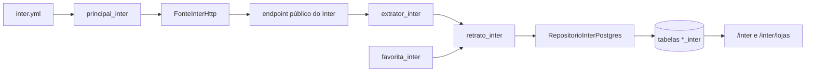

# PRD — Inter Cashback (Sites parceiros)

**Versão:** V3.0–V3.3
**Status:** implementado e validado no workspace em 2026-08-14. A migração `006` foi aplicada no Neon e a primeira sincronização real cadastrou 381 lojas; a publicação do código no GitHub/Vercel depende do envio destas mudanças ao repositório remoto.
**Levantamento da fonte:** 14 de agosto de 2026

> A V3 adiciona uma segunda fonte ao produto. A Livelo continua existindo e funcionando com seus próprios módulos, tabelas, workflow e páginas. O Shopping Inter entra como uma integração paralela: coleta o catálogo público, permite selecionar lojas e mostra cashback e condições da oferta.

Este documento é o **delta sobre o [`PRD-LIVELO.md`](PRD-LIVELO.md) e o [`PRD-LIVELO-V2.md`](PRD-LIVELO-V2.md)**. Tudo que não for redefinido aqui continua valendo. A V3 não revoga regras da Livelo: quando a regra for exclusiva do Inter, isso estará escrito explicitamente.

---

## 1. Contexto

O produto atual responde bem a uma pergunta da Livelo: “quantos pontos por real uma loja está dando agora?”. O Shopping Inter oferece uma pergunta equivalente em outra moeda de benefício: “quanto de cashback essa loja está dando agora, e em quais condições?”.

Hoje essa consulta exige abrir o Shopping Inter, localizar a área de lojas parceiras e procurar a loja novamente. A V3 repete a experiência que o projeto já entrega para a Livelo:

1. O robô lê todas as lojas disponíveis.
2. A pessoa procura e seleciona as lojas que quer acompanhar.
3. O site mostra as lojas selecionadas, ranqueadas pelo cashback atual.
4. Cada card explica as condições da promoção e leva ao endereço genérico do Shopping Inter.

### 1.1 Evidência levantada na fonte real

A página pública é:

`https://shopping.inter.co/site-parceiro/lojas`

O navegador da própria página consome este endpoint:

`https://marketplace-api.web.bancointer.com.br/site/affiliate/inter/v1/departments/ALL-STORES/stores?lang=pt-BR`

Na validação de 2026-08-14, a resposta foi um array JSON com **381 lojas**. Três amostras confirmam o comportamento necessário:

| Loja | `slug` | Oferta para Cliente Inter Shopping | Condição observada |
|---|---|---:|---|
| Magazine Luiza | `magazine-luiza` | Até 20% | 20% em um smartphone específico, 11% em itens vendidos e entregues pela Magalu e 2% nas demais condições |
| Riachuelo | `riachuelo` | 15% | 15% nas categorias indicadas e 4% nas demais condições |
| C&A | `ca` | Até 12% | O endpoint não trouxe descrição adicional nessa medição |

Isso prova dois pontos importantes:

- O maior número sozinho não explica a oferta. “20% na Magalu” pode valer para um único produto; a descrição é requisito, não acabamento visual.
- Algumas lojas não têm descrição. A ausência precisa aparecer honestamente, sem o sistema inventar uma condição.

Os valores são voláteis. Os exemplos documentam o formato e a decisão tomada em 2026-08-14; **não são promessa de cashback atual**.

### 1.2 Relação com a Livelo

Inter e Livelo têm conceitos parecidos, mas semânticas diferentes:

| Livelo | Shopping Inter |
|---|---|
| Pontos por real | Percentual de cashback ou texto de oferta |
| `Parceiro` | `LojaInter` |
| Pontuação base, atual e Clube | Oferta para Cliente Inter Shopping e oferta para não-correntista |
| Letra miúda em `legalTerms` | Condições em `redirectWarning` |
| Link individual validado | Link genérico para a página de lojas |
| Regra de alerta por multiplicador e piso | Ranking pelo cashback numérico atual |

Forçar os dois domínios na mesma estrutura produziria campos vazios e regras condicionais espalhadas. A V3 reutiliza infraestrutura genérica, mas mantém modelos e regras de negócio próprios.

---

## 2. Objetivos novos

| ID | Objetivo |
|---|---|
| **O8** | Responder “quanto de cashback esta loja oferece no Inter agora?” sem repetir a busca no Shopping Inter |
| **O9** | Explicar para qual produto, categoria, vendedor ou condição o maior cashback é válido |
| **O10** | Permitir escolher lojas reais do catálogo do Inter e manter uma lista pessoal separada da Livelo |
| **O11** | Adicionar uma nova fonte sem colocar o fluxo da Livelo em risco |

O4 (portfólio) também ganha valor: o projeto passa a demonstrar duas integrações externas com domínios diferentes e separação explícita de responsabilidades.

---

## 3. Escopo

### 3.1 Dentro

- Uma consulta lógica por execução ao endpoint que alimenta a página pública de lojas do Shopping Inter, com até três tentativas HTTP em falha transitória.
- Leitura e validação das 381 lojas observadas, sem depender do HTML visual.
- Catálogo local atualizado com todas as lojas válidas retornadas pela fonte.
- Busca por nome no site e seleção de lojas reais do catálogo.
- Lista de lojas favoritas do Inter, independente das favoritas da Livelo.
- Ranking das favoritas pelo cashback numérico destinado a Cliente Inter Shopping.
- Exibição da descrição completa disponível para a oferta.
- Exibição honesta de lojas sem descrição ou sem percentual numérico.
- Link genérico `https://shopping.inter.co/site-parceiro/lojas` em todos os cards.
- Área própria no site, banco separado por tabelas e workflow separado.
- Execução agendada e disparo manual protegido pela mesma sessão administrativa já existente.

### 3.2 Fora

- Autenticar no Banco Inter ou no Shopping Inter.
- Abrir conta, comprar, ativar oferta, calcular o cashback recebido ou acompanhar crédito na conta.
- Redirecionar automaticamente para a página individual da loja.
- Clicar em link de afiliado, aceitar cookies ou simular navegação humana.
- Enviar e-mail sobre cashback na primeira entrega da V3.
- Comparar automaticamente “pontos Livelo versus cashback Inter” em dinheiro.
- Criar conta por usuário, múltiplos perfis ou listas compartilhadas.
- Baixar ou republicar logotipos do Inter ou das lojas.
- Extrair ofertas de produtos vendidos diretamente pelo Inter fora da área de sites parceiros.
- Inferir validade da oferta: a fonte medida não fornece início ou fim confiável.

### 3.3 O que este documento altera

| Documento anterior | Situação na V3 |
|---|---|
| Produto descrito apenas como “Robô Livelo” | O nome público passa a ser **Radar de Benefícios**; nomes internos do repositório e pacote continuam iguais |
| Um único workflow de coleta | Mantido para Livelo e acrescentado um workflow exclusivo do Inter |
| Um único catálogo de favoritas | Mantido para Livelo e acrescentado um catálogo independente do Inter |
| RN04: correspondência exata por nome/apelido | Continua na Livelo. No Inter, a seleção usa o identificador estável retornado pelo catálogo (RN34) |
| RF16: e-mail condicional | Não se aplica ao Inter nesta versão |
| RN25: nenhum recurso externo na página | Continua valendo também para a área do Inter |

Nenhuma regra, coluna ou rota da Livelo é removida por este documento.

---

## 4. Métricas

| ID | Métrica | Alvo | Fonte |
|---|---|---|---|
| **MS9** | Cobertura da coleta | Pelo menos 100 lojas válidas por execução; referência medida: 381 | Log do workflow |
| **MS10** | Fidelidade da oferta | 100% dos cards exibem o texto e o número exatamente como vieram da mesma execução | Teste com fixture e inspeção do site |
| **MS11** | Cadastro determinístico | C&A e Riachuelo são localizadas e selecionadas sem cadastro manual de grafia | Roteiro de aceite |
| **MS12** | Separação | Falha do Inter não impede o workflow, o banco nem as páginas da Livelo | Testes de regressão e workflows |
| **MS13** | Frescor | O carimbo do Inter não passa de 24 horas sem indicar atraso | Página do Inter |

O limiar de 100 em MS9 não afirma que o catálogo sempre terá 381 lojas. Ele cria uma margem grande para mudanças normais no catálogo e ainda detecta resposta parcial, endpoint errado ou quebra do extrator.

---

## 5. Requisitos novos

### 5.1 Funcionais

| ID | Requisito |
|---|---|
| **RF20** | Obter o array de lojas do endpoint usado pela página pública do Shopping Inter, com timeout e número limitado de tentativas |
| **RF21** | Validar, normalizar e atualizar no banco o catálogo completo do Inter, preservando `id`, `slug`, nome, textos, valores numéricos, etiqueta e descrições disponíveis |
| **RF22** | Permitir buscar no catálogo por nome ou `slug` normalizados e selecionar/remover uma loja da lista pessoal do Inter sob autenticação |
| **RF23** | Exibir publicamente as favoritas do Inter usando o retrato válido mais recente, inclusive quando uma favorita não apareceu na última coleta |
| **RF24** | Ordenar as favoritas por maior `fullCashbackValue`, com opções de busca por nome e ordenação alfabética |
| **RF25** | Mostrar no card o texto de cashback, o valor numérico quando aplicável, a etiqueta promocional e a descrição completa de `redirectWarning` |
| **RF26** | Guardar também `partialCashback`, `partialCashbackValue` e `redirectWarningBasicAccount`, mas não misturá-los com a oferta principal |
| **RF27** | Usar em todos os cards o link genérico `https://shopping.inter.co/site-parceiro/lojas`, aberto somente por ação da pessoa |
| **RF28** | Criar páginas próprias para consulta e cadastro do Inter e incluí-las na navegação sem mudar o comportamento das rotas da Livelo |
| **RF29** | Registrar cada execução do Inter com momento, versão, total lido, total válido, favoritas encontradas e estado final |
| **RF30** | Executar o robô do Inter em workflow próprio, nos horários 09h, 14h e 20h de Brasília e por disparo manual |
| **RF31** | Mostrar falha, dado atrasado e loja ausente como estados distintos; nenhum deles pode aparecer como cashback zero |
| **RF32** | Exibir a oferta para não-correntista em uma seção secundária identificada, recolhida por padrão, quando ela existir |
| **RF33** | Consultar separadamente a última tentativa e a última execução válida, para mostrar falha recente sem substituir os cashbacks válidos anteriores |

### 5.2 Não-funcionais

| ID | Requisito | Alvo verificável |
|---|---|---|
| **RNF18** | Baixo impacto na fonte | Uma consulta de catálogo por execução, com até três requisições somente em falha transitória; nenhuma requisição por loja |
| **RNF19** | Núcleo puro | Normalização, ranking e montagem do retrato não importam biblioteca de rede, banco, arquivo ou ambiente |
| **RNF20** | Precisão decimal | Valores numéricos usam `Decimal` no Python, `NUMERIC` no Postgres e string no TypeScript até a apresentação |
| **RNF21** | Isolamento de falha | Workflow e ponto de entrada do Inter são independentes dos da Livelo |
| **RNF22** | Segurança de conteúdo | Todo texto externo é tratado como texto, nunca injetado como HTML |
| **RNF23** | Compatibilidade móvel e acessibilidade | Cartões legíveis abaixo de 600px, busca com rótulo, foco visível e estados não comunicados apenas por cor |
| **RNF24** | Sem recurso visual de terceiro | A página não baixa logo, imagem, fonte ou script do Inter ou das lojas |
| **RNF25** | Desempenho do catálogo | Busca e primeira renderização continuam utilizáveis com pelo menos 1.000 lojas |
| **RNF26** | Observabilidade | Log informa totais e motivo da falha, sem imprimir resposta completa nem dado sensível |
| **RNF27** | Regressão zero da Livelo | Suíte atual e workflow da Livelo continuam passando sem depender do Inter |

### 5.3 Restrições novas

| ID | Restrição | Impacto |
|---|---|---|
| **C10** | O endpoint é usado por uma página pública, mas não foi identificado como API pública com contrato estável | Pode mudar sem aviso; exige adaptador isolado, fixture e falha ruidosa |
| **C11** | Cashback e condições mudam sem data de validade exposta na resposta medida | O produto informa “consultado em”, nunca “válido até” |
| **C12** | `fullCashbackValue = 0` também pode significar “Ofertas disponíveis”, não ausência de benefício | Texto e valor precisam ser preservados separadamente |
| **C13** | `redirectWarning` pode estar vazio, conter instrução genérica ou várias faixas de cashback | A descrição não pode ser resumida automaticamente para uma única frase |
| **C14** | A semântica dos campos `full*` e `partial*` vem dos textos da própria resposta, não de documentação contratual encontrada | A interface usa os rótulos observados e evita promessas sobre elegibilidade |
| **C15** | O link solicitado é genérico e exige nova busca no Shopping Inter | Decisão consciente da V3; link individual fica fora até ser solicitado e validado |
| **C16** | O cron do GitHub Actions pode atrasar | O site mostra o momento real da coleta, não apenas o horário previsto |

---

## 6. Regras de negócio novas

| ID | Regra |
|---|---|
| **RN32** | A oferta principal do card é `fullCashback`/`fullCashbackValue`, rotulada “Cliente Inter Shopping” |
| **RN33** | A oferta `partialCashback` é secundária e rotulada com o texto da fonte para não-correntista; nunca entra no ranking principal |
| **RN34** | A favorita é ligada ao `id` da loja retornado pelo Inter. `slug` é a segunda chave estável; nome e `slug` servem para busca, não para decidir silenciosamente entre duas lojas |
| **RN35** | A busca ignora caixa e acentos para ajudar a pessoa a encontrar a loja, mas o cadastro só acontece após selecionar um resultado único do catálogo |
| **RN36** | O catálogo guarda todas as lojas válidas; a página pública mostra apenas as favoritas selecionadas |
| **RN37** | O ranking principal é `fullCashbackValue` decrescente. Empate resolve por nome em ordem alfabética |
| **RN38** | Loja com valor numérico zero ou ausente vem depois das ofertas numéricas e mantém o texto original, como “Ofertas disponíveis” |
| **RN39** | `redirectWarning` é exibido integralmente como texto, preservando quebras de linha úteis. Vazio vira “O Inter não informou condições adicionais nesta consulta” |
| **RN40** | `promotionTag`, quando existir, é etiqueta informativa. Ela não decide sozinha se existe cashback ou se a loja entra no ranking |
| **RN41** | Toda escrita de uma execução é transacional: catálogo e retrato novo aparecem juntos, ou o retrato anterior continua sendo o último válido |
| **RN42** | Loja ausente em uma rodada não é apagada. Fica inativa e a favorita mostra “não encontrada nesta consulta” |
| **RN43** | Uma execução com menos de 100 lojas válidas falha antes de substituir o catálogo ou o retrato anterior |
| **RN44** | Todos os cards apontam para o link genérico aprovado; nenhum campo externo vira URL clicável na V3 |
| **RN45** | Nenhuma imagem retornada em `imageUrl` é baixada, armazenada ou exibida |
| **RN46** | O horário exibido é o da execução concluída, convertido para Brasília, e pertence somente ao Inter |
| **RN47** | Leitura é pública; seleção e remoção de favoritas e disparo manual exigem a sessão administrativa já usada pela Livelo |
| **RN48** | Falha do Inter encerra seu processo com código diferente de zero e mantém o último retrato; não chama o processo da Livelo |
| **RN49** | O Inter não envia e-mail nesta entrega, mesmo quando o cashback é alto |
| **RN50** | Textos e percentuais de execuções diferentes nunca são combinados no mesmo card |
| **RN51** | Toda tentativa é registrada com estado `iniciada`, `sucesso` ou `falha`. Somente `sucesso` pode ser origem dos cards; falha guarda código controlado, nunca payload ou exceção bruta |
| **RN52** | A V3 não apaga automaticamente execuções nem snapshots. Retenção só será criada se as tabelas do Inter ultrapassarem 100 MB, mediante nova decisão documentada |

### 6.1 O significado dos campos

| Campo da fonte | Uso na V3 |
|---|---|
| `id` | Identificador primário externo da loja |
| `slug` | Identificador secundário e legível; ajuda a recuperar uma mudança de ID sem adivinhar por substring |
| `name` | Nome público exibido e indexado para busca |
| `fullCashback` | Texto principal exatamente como publicado, incluindo “Até” |
| `fullCashbackValue` | Número usado somente para ranking e formatação numérica auxiliar |
| `partialCashback` | Texto da condição secundária |
| `partialCashbackValue` | Número secundário; não participa do ranking principal |
| `promotionTag` | Etiqueta editorial, como “Ofertas especiais” |
| `redirectWarning` | Condições completas para Cliente Inter Shopping |
| `redirectWarningBasicAccount` | Condições completas da oferta secundária/não-correntista |
| `imageUrl` | Ignorado por RN45 |
| `highlight*` e `sequence*` | Ignorados: são decisões editoriais do Shopping Inter, não relevância para a lista pessoal |

O sistema não reconstrói `fullCashback` a partir do número. O texto “Até 2% de cashback” contém informação que o valor `2` sozinho perde. O número existe para ordenar; o texto existe para explicar.

### 6.2 Por que a descrição é parte do domínio

Na Magazine Luiza, a medição encontrou três faixas simultâneas: 20% para um smartphone específico, 11% em itens vendidos e entregues pela Magalu e 2% nas demais condições. Mostrar apenas “20%” induziria uma decisão errada.

Por isso:

- O texto completo aparece no card, com quebras de linha.
- O card não transforma “Até 20%” em “20% garantido”.
- Uma descrição vazia não é preenchida com texto de outra loja nem de outra execução.
- A etiqueta “Ofertas especiais” não substitui as condições.

### 6.3 Ranking

O ranking responde “qual das minhas lojas selecionadas tem o maior teto de cashback agora?”. Ele **não** responde “qual compra rende mais”, porque isso exigiria conhecer produto, preço, condição e elegibilidade.

Ordem padrão:

1. `fullCashbackValue` maior que zero, do maior para o menor.
2. Empate pelo nome.
3. Valores zero ou ausentes, pelo nome, depois das ofertas numéricas.
4. Lojas não encontradas na última consulta no final.

A interface oferece busca e ordem alfabética, mas não inventa um rótulo de “melhor negócio”.

### 6.4 Seleção e identidade da loja

A Livelo precisa casar favoritas com um texto extraído. No Inter, a V3 conhece antes o catálogo completo e recebe `id` e `slug`; desperdiçar essas chaves e voltar a depender só do nome seria regressão técnica.

Fluxo de C&A:

1. A pessoa digita “C&A” ou “ca”.
2. A busca encontra `name = C&A` e `slug = ca`.
3. A pessoa seleciona o único resultado correto.
4. `favorita_inter` guarda a referência à linha de `loja_inter`, ligada ao ID externo.
5. Nas execuções seguintes, o robô atualiza a mesma loja pelo ID; mudança de nome não quebra a favorita.

Busca é tolerante; vínculo nunca é fuzzy. A V3 não cria tabela nem formulário de apelidos para o Inter: o catálogo já fornece nome e `slug` suficientes para a seleção determinística.

### 6.5 Ausência, catálogo vazio e dado velho

São estados diferentes:

| Estado | O que o site diz | O que o robô faz |
|---|---|---|
| Nenhuma favorita selecionada | “Escolha uma loja do catálogo” | Continua atualizando o catálogo |
| Favorita ausente na resposta válida | “Não encontrada nesta consulta” | Mantém a favorita e marca a loja inativa |
| Resposta com menos de 100 válidas | “Última atualização falhou; mostrando dados de…” | Falha e preserva o retrato anterior |
| Nunca houve execução válida | “O Inter ainda não foi sincronizado” | Não exibe percentuais vazios como zero |

### 6.6 Por que não há e-mail nesta entrega

Na Livelo existe uma régua definida: pontuação atual contra base, multiplicador e piso. No Inter, a fonte medida traz a oferta atual, mas não uma base histórica nem validade. Mandar e-mail por “cashback alto” exigiria escolher um número arbitrário ou comparar histórico — duas regras que o usuário ainda não pediu.

A V3 entrega consulta e ranking. Um alerta futuro só entra com uma regra própria documentada e calibrada.

---

## 7. Arquitetura

### 7.1 Princípio

O princípio da V1 continua: **núcleo puro, mundo por contrato**. A separação ocorre também por domínio: Livelo e Inter podem compartilhar mecanismos, mas não modelos que significam coisas diferentes.

| Peça definida | Tipo | Papel |
|---|---|---|
| `modelos_inter.py` | Núcleo novo | `LojaInter`, `FavoritaInter`, `RetratoInter` e valores imutáveis |
| `extrator_inter.py` | Núcleo novo | JSON bruto → lojas normalizadas; nenhuma rede |
| `ranking_inter.py` | Núcleo novo | Ordem definida por RN37 e RN38 |
| `retrato_inter.py` | Núcleo novo | Junta catálogo, favoritas e momento da execução |
| `portas_inter.py` | Contratos novos | Fonte, catálogo de favoritas e repositório do Inter |
| `adaptadores_inter.py` | Adaptadores novos | HTTP fixo e Postgres das tabelas do Inter |
| `principal_inter.py` | Orquestração nova | Composition root e código de saída exclusivo |
| `backend/api/lib/banco-inter.ts` (antes `site/lib/banco-inter.ts`) | Servidor da API | Consultas e mutações das tabelas do Inter |
| `/inter` | Página pública | Favoritas, ranking, descrições e carimbo |
| `/inter/lojas` | Página protegida | Busca no catálogo e seleção/remoção |
| `.github/workflows/inter.yml` | Automação nova | Cron e disparo manual do Inter |

A estrutura continua plana, conforme PRD §4.4. Um pacote novo inteiro não é necessário para cinco módulos pequenos.

### 7.2 Fluxo



Uma execução faz uma chamada externa, valida toda a resposta em memória e só então abre a transação de escrita. A página nunca chama o Inter diretamente; lê o banco. Isso evita duplicar extração em TypeScript e mantém a fonte externa fora do caminho de cada visita.

### 7.3 Reuso permitido

| Reutiliza | Não reutiliza |
|---|---|
| Configuração de `DATABASE_URL` | `Parceiro` e `PontuacaoDeLoja` |
| Política de retry/timeout HTTP | Extrator da Livelo |
| Sessão e limite de login do site | Tabelas `loja`, `apelido`, `execucao`, `pontuacao` |
| Cliente do GitHub para dispatch, parametrizado por workflow | Workflow `robo.yml` |
| Formatação segura e componentes visuais genéricos | Régua de multiplicador/piso e regras do Clube Livelo |
| Padrão de repositório e transação | Notificador por e-mail |

Reutilizar não significa mover tudo antes da hora. Uma extração para módulo genérico só ocorre se os dois lados realmente precisarem do mesmo contrato e os testes provarem que a Livelo não mudou.

### 7.4 Falhas e ordem da execução

1. Validar configuração local (`DATABASE_URL`, limiar e URL fixa).
2. Registrar a tentativa como `iniciada`.
3. Fazer uma única requisição lógica, com no máximo três tentativas HTTP, timeout de 30 segundos por tentativa e espera de 2 e 4 segundos.
4. Recusar resposta acima de 5 MiB, decodificar JSON e validar estrutura, tipos e unicidade.
5. Rejeitar a execução se houver menos de 100 lojas válidas.
6. Montar catálogo e retrato em memória.
7. Em uma transação, atualizar catálogo, gravar cashback das favoritas e concluir a tentativa como `sucesso`.
8. Confirmar a transação e registrar somente totais no log.

Qualquer falha antes do passo 8 preserva a última execução válida e tenta marcar a tentativa como `falha` em uma operação curta e separada. Se o próprio banco estiver indisponível, o workflow continua sendo a fonte da falha; o site não inventa um registro que não conseguiu persistir. Diferentemente da Livelo, não existe e-mail prioritário para enviar antes do banco; no Inter, alimentar o site é o produto da execução.

### 7.5 Workflow e disparo manual

`inter.yml` usa o mesmo cron de Brasília do robô atual: `0 12,17,23 * * *`. Ele mantém `permissions: contents: read`, timeout próprio e somente os segredos de que precisa.

O botão “Atualizar Inter” dispara apenas `inter.yml`. O limite de cinco minutos é independente do botão da Livelo, por meio de `disparo_manual_inter`; um serviço não consome a janela do outro.

---

## 8. Modelo de dados

### 8.1 Estruturas em memória

```text
LojaInter
  id_externo: str
  slug: str
  nome: str
  cashback_principal_texto: str
  cashback_principal_valor: Decimal | None
  cashback_secundario_texto: str | None
  cashback_secundario_valor: Decimal | None
  etiqueta: str | None
  descricao_principal: str | None
  descricao_secundaria: str | None

RetratoInter
  momento: datetime
  lojas_lidas: int
  lojas_validas: int
  favoritas: tuple[LojaInter | FavoritaAusente, ...]
  versao: str
```

As estruturas são imutáveis. `Decimal` nunca é convertido em `float` para persistir ou apresentar.

### 8.2 Esquema definido

Migração nova: `migracoes/006_inter.sql`.

```text
loja_inter
  id, id_externo UNIQUE, slug UNIQUE, nome, nome_busca, slug_busca,
  cashback_principal_texto, cashback_principal_valor,
  cashback_secundario_texto, cashback_secundario_valor,
  etiqueta, descricao_principal, descricao_secundaria,
  ativa, vista_em, atualizada_em

favorita_inter
  loja_inter_id PRIMARY KEY, criada_em

execucao_inter
  id, iniciada_em, concluida_em, estado,
  lojas_lidas, lojas_validas, favoritas_encontradas,
  codigo_falha, versao

cashback_inter
  id, execucao_inter_id, loja_inter_id,
  nome, cashback_principal_texto, cashback_principal_valor,
  cashback_secundario_texto, cashback_secundario_valor,
  etiqueta, descricao_principal, descricao_secundaria, encontrada

disparo_manual_inter
  id, momento
```

### 8.3 Decisões do schema

- `loja_inter` é o catálogo atual das lojas conhecidas, não apenas favoritas. É o que alimenta a busca sem consultar o Inter durante a visita.
- `favorita_inter` representa a escolha local. Remover uma favorita não remove a loja do catálogo.
- `cashback_inter` guarda somente as favoritas daquela execução. Com dez favoritas e três execuções diárias, são cerca de 10.950 linhas por ano, volume pequeno e auditável.
- Os textos são copiados para `cashback_inter` porque o catálogo muda. Sem a cópia, um retrato antigo combinaria seu horário com o texto atual, violando RN50.
- `encontrada = false` mantém a favorita visível quando a fonte não a devolve.
- `id_externo` é texto/UUID sem assumir que o fornecedor nunca trocará o formato.
- `NUMERIC(8, 2)` comporta os percentuais medidos com duas casas. Valor inválido não é arredondado silenciosamente; a loja é rejeitada e contabilizada.
- `nome_busca` e `slug_busca` guardam a normalização definida em §15.3 e recebem índice; a busca não depende de extensão específica do Postgres.
- `execucao_inter.estado` aceita somente `iniciada`, `sucesso` ou `falha`; `codigo_falha` usa uma enumeração controlada pela aplicação.
- Não existe `apelido_inter`: a busca usa `nome` e `slug` normalizados, e a seleção persiste o ID externo.
- Não há exclusão automática de histórico na V3 (RN52).

### 8.4 Atualização do catálogo

A sincronização faz `UPSERT` por `id_externo`. Um `slug` já associado a outro ID é conflito ruidoso, não motivo para mesclar automaticamente. Lojas não vistas na execução válida são marcadas `ativa = false`; voltando depois, tornam-se ativas novamente sem perder a favorita.

---

## 9. Interface

### 9.1 Navegação

A navegação precisa distinguir os domínios sem obrigar a pessoa a conhecer versões internas:

- **Livelo** — painel atual de pontos.
- **Shopping Inter** — painel novo de cashback.
- **Lojas Livelo** — cadastro atual.
- **Lojas Inter** — busca e seleção no catálogo sincronizado.

O nome visível no cabeçalho e nos metadados passa a ser **Radar de Benefícios**. O repositório, o pacote Python, os módulos atuais e a versão semântica continuam usando `robo-livelo` para evitar uma renomeação técnica sem relação com a feature. Isso não autoriza usar marca ou logo do Banco Inter como identidade do produto.

### 9.2 Página `/inter`

Cada card contém:

1. Nome da loja.
2. Texto principal, preservando “Até”.
3. Rótulo “Cliente Inter Shopping”.
4. Etiqueta promocional, quando existir.
5. Condições completas ou mensagem explícita de ausência.
6. Oferta secundária recolhida, quando existir.
7. Momento da coleta.
8. Botão “Abrir Shopping Inter” com o link genérico.

O topo mostra total de favoritas, total de lojas lidas e maior cashback numérico entre as favoritas. Não chama o primeiro lugar de “melhor oferta”, conforme §6.3.

### 9.3 Página `/inter/lojas`

A página é protegida e consulta `loja_inter`:

- Campo de busca com resultados enquanto a pessoa digita.
- Nome, cashback principal e estado ativo no resultado.
- Botão “Acompanhar” para adicionar e “Remover” para retirar.
- C&A e Riachuelo devem aparecer usando o catálogo real, sem exigir que a pessoa conheça slug ou ID.
- Se ainda não houve sincronização, a página orienta a executar o robô; não oferece cadastro livre de nome inexistente.

Cadastro livre fica fora porque reintroduziria o problema de grafia que o catálogo real já resolve.

### 9.4 Estados de erro

- Banco indisponível: faixa de erro, sem resposta 500 muda.
- Última execução falhou: mantém dados anteriores e mostra a idade.
- Dados com mais de 24 horas: marca “dados atrasados”.
- Favorita inativa: card no final com “não encontrada”.
- Descrição vazia: mensagem neutra, nunca card quebrado.

---

## 10. Segurança, privacidade e legal

### 10.1 Fonte pública e comportamento responsável

A página e a chamada usada pelo navegador são acessíveis sem login. Isso reduz a sensibilidade técnica, mas não cria garantia de contrato ou permissão permanente.

Medidas obrigatórias:

- Uma requisição por execução, três execuções agendadas por dia.
- Timeout e retries limitados, sem loop agressivo.
- Nenhuma rotação de proxy, CAPTCHA, cookie de sessão ou disfarce de cliente.
- Nenhuma tentativa de descobrir endpoint privado ou contornar bloqueio.
- Primeira manifestação contrária ou bloqueio persistente: a integração é desligada para revisão.

### 10.2 Conteúdo externo

Nome, etiqueta e descrições são dados hostis para fins de renderização:

- React renderiza como texto; `dangerouslySetInnerHTML` é proibido para esses campos.
- Python remove caracteres de controle indevidos, mas preserva quebras de linha.
- Logs mostram contagens e identificador curto da loja com erro, nunca o payload completo.
- URLs de imagem são ignoradas.
- O único link clicável é a constante definida em RN44, nunca um valor vindo da resposta.

### 10.3 Autenticação e segredos

Leitura de favoritas é pública, como na Livelo. Alteração e disparo manual usam a sessão existente. `DATABASE_URL` e token do GitHub continuam somente no servidor. O robô do Inter não recebe credenciais de e-mail porque não envia e-mail.

O token de dispatch deve ter apenas o acesso necessário ao workflow do repositório. Nenhum segredo aparece no navegador ou log.

### 10.4 Republicação e marcas

A página pública mostra apenas a seleção pessoal, não replica as 381 lojas como um diretório aberto. Nenhum logotipo é utilizado. O rodapé informa que o projeto é independente, não afiliado ao Banco Inter nem às lojas, e que condições devem ser confirmadas no Shopping Inter antes da compra.

O texto de condições é necessário para não apresentar o percentual fora de contexto. Ainda assim, é conteúdo de terceiro e volátil. Se houver manifestação do titular, a área do Inter sai do ar para revisão; não haverá evasão.

### 10.5 Privacidade

Não são coletados conta bancária, CPF, histórico de compra, valor gasto nem cashback recebido. A lista de favoritas revela preferência de compra e é publicada na área de leitura, risco já aceito para a Livelo. E-mail e identificadores de sessão não aparecem nos cards.

---

## 11. Testes

Os casos abaixo começam em **CT-175**, depois do último caso catalogado antes da V3. Eles estão implementados e registrados em `docs/TESTES.md`.

### 11.1 Python

| Caso | Regra | Verificação |
|---|---|---|
| **CT-175** | RF20 | Fixture recortada com cinco formatos representativos vira cinco lojas sem tocar rede |
| **CT-176** | RN32 | `fullCashback` e `fullCashbackValue` viram texto e `Decimal` principal |
| **CT-177** | RN33 | Campos parciais são preservados separadamente |
| **CT-178** | C12, RN38 | “Ofertas disponíveis” com valor zero mantém o texto e vai depois dos percentuais positivos |
| **CT-179** | RN39 | Descrição com várias linhas é preservada; descrição vazia vira `None` |
| **CT-180** | RN34 | C&A é identificada por ID/slug, mesmo que o nome mude |
| **CT-181** | RN37 | Ranking decrescente e desempate alfabético |
| **CT-182** | RN43 | Menos de 100 lojas válidas levanta `SiteInterMudou` |
| **CT-183** | RF20 | JSON inválido, objeto em vez de array e timeout falham ruidosamente |
| **CT-184** | RN42 | Favorita ausente produz retrato “não encontrada”, sem ser removida |
| **CT-185** | RN41 | Erro de banco desfaz catálogo, execução e cashbacks da transação |
| **CT-186** | RN45 | Modelo e retrato não guardam `imageUrl` |
| **CT-187** | RNF18 | Orquestração chama a fonte uma única vez |
| **CT-188** | RNF19 | Módulos de núcleo do Inter não importam I/O |
| **CT-189** | RN48 | Falha do Inter não chama módulos, adaptadores ou tabelas da Livelo |

### 11.2 Site

| Caso | Regra | Verificação |
|---|---|---|
| **CT-190** | RN35 | Busca encontra “C&A” por `c&a` e `ca`, sem selecionar automaticamente resultado ambíguo |
| **CT-191** | RF24 | Ordenação principal segue o valor numérico e mantém zero no final |
| **CT-192** | RF25 | Card da Magalu mostra “Até 20%” e as três condições da mesma execução |
| **CT-193** | RN39 | Card sem descrição mostra a mensagem neutra |
| **CT-194** | RN44 | Todos os botões usam exatamente o link genérico permitido |
| **CT-195** | RNF22 | Texto contendo tags aparece escapado, nunca executado |
| **CT-196** | RF31 | Sem execução, execução falha, dado atrasado e loja ausente têm mensagens diferentes |
| **CT-197** | RN47 | Pessoa sem sessão não seleciona, remove nem dispara o Inter |
| **CT-198** | RNF24 | Página não carrega domínio de imagem do Inter |
| **CT-199** | RNF27 | Rotas e formatações atuais da Livelo continuam iguais |

### 11.3 Integração e aceite manual

- Rodar contra a fonte real somente em teste manual marcado, nunca na suíte padrão.
- Conferir contagem, C&A, Riachuelo e Magazine Luiza.
- Comparar texto e percentuais do site com a resposta capturada na mesma hora.
- Executar Livelo e Inter separadamente e confirmar duas execuções independentes.
- Abrir a página no celular e navegar apenas por teclado no desktop.

---

## 12. Fases

Cada fase entrega uma parte verificável e mantém a Livelo utilizável.

| Fase | Entrega | Dependência |
|---|---|---|
| **V3.0** | Modelos, extrator, ranking e fixtures do Inter; nenhuma mudança visual | Fonte e regras deste PRD |
| **V3.1** | Migração `006_inter.sql`, repositório transacional e primeira sincronização manual das 381 lojas | V3.0 |
| **V3.2** | `/inter` e `/inter/lojas`, busca, seleção, cards, descrições e navegação | V3.1 |
| **V3.3** | `inter.yml`, cron, disparo manual, carimbo de atraso e observabilidade | V3.2 |

Ordem obrigatória: o catálogo real entra antes do cadastro no site. A tela não deve aceitar nomes livres enquanto ainda não consegue oferecer uma loja identificada pela fonte.

E-mail não faz parte dessas fases. Se for desejado depois, começa por medição e nova regra de negócio, não por reutilização automática do alerta da Livelo.

---

## 13. Riscos

| Risco | Impacto | Mitigação |
|---|---|---|
| Endpoint muda ou deixa de responder (C10) | Inter para de atualizar | Adaptador isolado, fixture, limiar RN43, erro ruidoso e retrato anterior preservado |
| Percentual alto ser entendido como geral | Decisão de compra errada | Texto “Até”, descrição integral e exemplo da Magalu como teste obrigatório |
| `full`/`partial` mudarem de significado | Rótulo incorreto | Preservar textos originais, manter campos separados e revisar ao detectar divergência |
| Catálogo devolver loja duplicada ou ID trocado | Favorita ligada à loja errada | Unicidade de ID/slug e conflito ruidoso; nunca mesclar por substring |
| Publicar catálogo completo atrair atenção do titular | Exposição desnecessária | Área pública contém apenas favoritas; catálogo integral fica na tela autenticada |
| Crescimento do histórico | Banco gratuito pressionado | Snapshot só das favoritas; sem expurgo na V3 e revisão obrigatória ao atingir 100 MB (RN52) |
| Workflow do Inter quebrar a Livelo | Perda do produto atual | Arquivo, ponto de entrada, tabelas e testes separados; RNF27 como gate |
| Dado velho parecer atual | Cashback já mudou | Carimbo próprio, aviso após 24h e estado de última falha |
| Busca tolerante selecionar loja errada | Monitoramento incorreto | Busca ajuda a encontrar, mas a pessoa confirma um resultado ligado ao ID externo |
| Uso da marca sugerir afiliação | Confusão legal | Sem logos, aviso de independência e nome geral neutro |

---

## 14. Critérios de aceite da V3

1. Uma execução válida lê pelo menos 100 lojas e registra o total real observado.
2. A tela autenticada encontra C&A e Riachuelo no catálogo e permite acompanhá-las.
3. As duas aparecem na página do Inter depois da seleção, sem entrar nas tabelas ou páginas da Livelo.
4. O ranking coloca primeiro a maior `fullCashbackValue` entre as favoritas.
5. Magazine Luiza, quando a fixture medida for usada, mostra 20%, 11% e 2% com suas condições corretas.
6. Loja sem descrição mostra ausência de detalhe, sem inventar regra promocional.
7. O botão do card abre exatamente `https://shopping.inter.co/site-parceiro/lojas`.
8. Uma resposta pequena ou inválida mantém o último retrato e marca a falha.
9. O botão manual dispara apenas o workflow do Inter e respeita seu limite próprio.
10. A suíte da Livelo continua verde e o workflow `robo.yml` permanece funcional.
11. Nenhum logo, payload HTML ou URL externa não aprovada aparece na página.
12. O site identifica claramente que os percentuais e condições devem ser confirmados no Shopping Inter.

---

## 15. Decisões fechadas antes da implementação

Esta seção é o fechamento operacional da V3. Em conflito com uma expressão genérica das seções anteriores, a decisão específica abaixo vence.

### 15.1 Produto e escopo

| Tema | Decisão fechada |
|---|---|
| Nome público | **Radar de Benefícios** no cabeçalho, metadados e textos gerais |
| Nome técnico | Repositório `robo-livelo`, pacote Python `robo_livelo` e diretório `site` permanecem; não haverá renomeação estrutural |
| Página inicial | `/` continua sendo o painel da Livelo para não quebrar links existentes |
| Área do Inter | `/inter` é o painel público e `/inter/lojas` é o cadastro protegido |
| Navegação | O menu mostra “Livelo”, “Shopping Inter”, “Lojas Livelo” e, para usuário autenticado, “Lojas Inter” |
| Comparação entre fontes | Não haverá conversão de pontos para reais nem ranking misto nesta versão |
| E-mail | O Inter não envia e-mail na V3.0–V3.3 |
| Primeiras favoritas | O banco começa sem favoritas do Inter; C&A e Riachuelo são selecionadas manualmente no roteiro de aceite |

### 15.2 Fonte e coleta

| Tema | Decisão fechada |
|---|---|
| Fonte | Endpoint fixo `https://marketplace-api.web.bancointer.com.br/site/affiliate/inter/v1/departments/ALL-STORES/stores?lang=pt-BR` |
| Plano alternativo | Não há scraping do HTML nem Playwright automático. Mudança do endpoint interrompe a integração para revisão |
| Frequência | 09h, 14h e 20h de Brasília, em `.github/workflows/inter.yml`, além de disparo manual |
| Cortesia de rede | No máximo três tentativas por execução, timeout de 30 segundos cada e espera linear de 2 e 4 segundos; retry somente para erro de conexão/timeout, HTTP 408, 429 ou 5xx |
| HTTP definitivo | HTTP 400–407 (exceto 408) e 409–499 (exceto 429) falham na primeira resposta; 401 e 403 nunca são repetidos |
| Tamanho | Resposta acima de 5 MiB é rejeitada antes da decodificação |
| Validade mínima | Menos de 100 lojas válidas rejeita toda a execução; duplicidade de `id` ou `slug` também rejeita |
| Campos obrigatórios | As chaves `id`, `slug`, `name`, `fullCashback` e `fullCashbackValue`; o valor numérico principal pode ser `null`, e campos secundários ausentes viram `None` |
| Limites de texto | Nome e `slug`: 200 caracteres; rótulos de cashback e etiqueta: 300; cada descrição: 20.000 |
| Valores numéricos | Quando presentes, `Decimal` entre 0 e 1.000, com no máximo duas casas após normalização; fora disso a loja é inválida |
| User-Agent | `radar-beneficios/3 (projeto pessoal; github.com/lacerdaRodrigo/robo-livelo)` |

### 15.3 Identidade, busca e favoritas

| Tema | Decisão fechada |
|---|---|
| Identidade principal | `id` externo armazenado como `TEXT UNIQUE` |
| Identidade de segurança | `slug UNIQUE`; conflito entre ID e slug falha sem mesclagem automática |
| Normalização de busca | Unicode NFKD, remoção de marcas combinantes, letras minúsculas, espaços externos removidos e espaços internos repetidos reduzidos a um |
| Busca | Substring sobre `nome_busca` e `slug_busca`, consulta no servidor limitada a 50 resultados, ordenada por nome |
| Seleção | A pessoa confirma um resultado do catálogo; não existe cadastro de nome livre |
| Apelidos | Não haverá tabela nem formulário de apelidos do Inter na V3 |
| Catálogo público | Apenas favoritas aparecem em `/inter`; as demais lojas só aparecem em `/inter/lojas`, que exige sessão |
| Loja removida da fonte | Fica `ativa = false`; a favorita permanece e aparece como não encontrada |
| Remoção de favorita | Exclui somente `favorita_inter`; catálogo e histórico permanecem |

### 15.4 Cashback e apresentação

| Tema | Decisão fechada |
|---|---|
| Oferta principal | `fullCashback` e `fullCashbackValue`, com rótulo “Cliente Inter Shopping” |
| Oferta secundária | `partialCashback` e campos básicos, em bloco recolhido com rótulo “Não-correntista” |
| Ranking | Valor principal decrescente, empate por nome; zero/ausente depois dos positivos; não encontradas no final |
| Texto versus número | O texto original é exibido; o número serve para ordenação. “Até” nunca é removido |
| Descrição | `redirectWarning` integral, como texto seguro; vazio usa exatamente “O Inter não informou condições adicionais nesta consulta” |
| Etiqueta | `promotionTag` é informativa e nunca decide ranking ou elegibilidade |
| Link | Todos os cards usam somente `https://shopping.inter.co/site-parceiro/lojas` |
| Imagens | `imageUrl` e logotipos são ignorados e não persistidos |
| Frescor | Após 24 horas da última execução válida, `/inter` mostra “dados atrasados” |

### 15.5 Banco e histórico

| Tema | Decisão fechada |
|---|---|
| Banco | Mesmo Postgres/Neon e mesma `DATABASE_URL`, em tabelas exclusivas com sufixo `_inter` |
| Migração | `migracoes/006_inter.sql`, idempotente e aplicada antes do primeiro deploy da V3.1 |
| Tabelas | `loja_inter`, `favorita_inter`, `execucao_inter`, `cashback_inter` e `disparo_manual_inter`; nenhuma outra tabela é necessária |
| Tentativas | `execucao_inter` registra `iniciada`, `sucesso` ou `falha`; horários são `TIMESTAMPTZ` em UTC e o site consulta a última tentativa e o último sucesso separadamente |
| Atomicidade | Catálogo, cashback das favoritas e conclusão com sucesso entram na mesma transação |
| Falha | Preserva o último sucesso e tenta registrar um código controlado em operação separada; códigos: `rede`, `http`, `resposta_grande`, `json_invalido`, `schema_invalido`, `catalogo_pequeno`, `conflito_identidade`, `banco` e `inesperada` |
| Snapshot | Somente favoritas geram `cashback_inter`; o catálogo completo fica apenas em `loja_inter` com o estado mais recente |
| Retenção | Nenhum expurgo automático na V3; ao atingir 100 MB, uma nova decisão documentada define retenção antes de apagar qualquer linha |
| Primeira carga | A primeira execução manual após a migração popula o catálogo; não haverá arquivo seed com 381 lojas |

### 15.6 Código e arquitetura

| Tema | Decisão fechada |
|---|---|
| Módulos | `modelos_inter.py`, `extrator_inter.py`, `ranking_inter.py`, `retrato_inter.py`, `portas_inter.py`, `adaptadores_inter.py` e `principal_inter.py` |
| Entrada | `python -m robo_livelo.principal_inter` (a partir de `backend/robo/`) |
| API | `backend/api/lib/banco-inter.ts` (arquivada); antes em `site/lib/banco-inter.ts`, com rotas `/inter` e `/inter/lojas` |
| Dependências | Nenhuma dependência Python ou npm nova; usar `requests`, `psycopg`, React e Neon já instalados |
| Compartilhamento | Sessão, tema, componentes realmente genéricos e dispatch parametrizado podem ser reutilizados; modelos e regras da Livelo não |
| Workflow | `inter.yml` tem `permissions: contents: read`, timeout de 10 minutos e recebe apenas `DATABASE_URL` |
| Disparo manual | Usa o `GITHUB_TOKEN_DISPARO` já existente, aponta para `inter.yml` e tem cooldown próprio de cinco minutos |
| Versão | “V3” é versão de produto/documento. O `python-semantic-release` continua calculando a versão técnica por Conventional Commits; não se força `3.0.0` |

### 15.7 Segurança, publicação e desligamento

| Tema | Decisão fechada |
|---|---|
| Autenticação no Inter | Proibida; não existe segredo ou cookie do Banco Inter |
| Escrita administrativa | Selecionar, remover e disparar exige a sessão atual do site |
| Renderização | Conteúdo externo sempre como texto; `dangerouslySetInnerHTML` é proibido |
| Página pública | Mostra somente favoritas, aviso de não afiliação e orientação para conferir a condição antes da compra |
| Marca | Nenhum logo do Inter ou das lojas; o logo local atual pode permanecer sob o nome Radar de Benefícios |
| Bloqueio técnico | HTTP 401 ou 403 encerra imediatamente; HTTP 429 respeita no máximo as três tentativas e depois encerra; não há evasão |
| Manifestação do titular | A área `/inter`, o cron e o disparo manual são desativados até revisão; a Livelo permanece ativa |
| Segredos e logs | Nenhum payload, token, URL de banco ou texto integral de exceção externa entra no log |

### 15.8 Gate de implementação — concluído

Não restou decisão funcional ou técnica bloqueante. O gate foi executado nesta ordem:

1. CT-175 a CT-199 foram registrados em `docs/TESTES.md`.
2. A fixture sanitizada de cinco lojas foi criada.
3. V3.0 → V3.1 → V3.2 → V3.3 foram implementadas.
4. Os gates Python, TypeScript, Vitest e build passaram antes da publicação.

### 15.9 Registro de validação

Em 2026-08-14, o endpoint público retornou 381 lojas válidas, incluindo C&A, Riachuelo e Magalu. A migração `migracoes/006_inter.sql` foi aplicada no Neon e a primeira execução terminou com `estado=sucesso`, 381 lojas no catálogo, zero favoritas e, consequentemente, zero snapshots de favoritas. A suíte fechou com 189 testes Python, 31 testes do site e 91,85% de cobertura Python. O build do Next.js confirmou as rotas dinâmicas `/inter` e `/inter/lojas`.

O estado de publicação é separado do estado de implementação: até o código ser enviado à `main`, o workflow `inter.yml` e as páginas novas não estarão disponíveis no GitHub Actions e na Vercel. Qualquer mudança futura nas decisões fechadas desta seção exige atualizar este PRD antes do código correspondente.

---

## 16. Evolução aprovada — catálogo completo no Cashback

**Decisão de produto em 29 de agosto de 2026, implementada em 29 de agosto de
2026.** Esta evolução substitui a restrição de listagem inicial da V3.0–V3.3.

- A aba/página **Cashback** passa a mostrar todas as lojas válidas de Sites
  parceiros retornadas pela última coleta, com seu texto e valor de cashback
  publicados. A listagem inicial não fica restrita às favoritas.
- **Acompanhadas** passa a ser um filtro do catálogo completo. A ação de
  acompanhar/remover continua autenticada e conserva a seleção local atual;
  ela não inicia uma coleta.
- A listagem padrão pode ser ordenada por maior `fullCashbackValue`, mantendo
  texto, condições e estados de valor ausente conforme as regras existentes.
- O indicador **Melhor oferta** continua existindo, mas significa somente o
  maior `fullCashbackValue` entre as lojas acompanhadas. Sem acompanhadas ou
  sem valor numérico, o indicador fica vazio; ele não usa a maior loja de todo
  o catálogo.
- O contrato `GET /api/inter/cashback` devolve o catálogo ativo da última
  coleta, incluindo `favorita` em cada item. Ele usa os campos de oferta de
  `loja_inter`, atualizados transacionalmente pelo robô na mesma coleta. O
  snapshot histórico de `cashback_inter` continua restrito às acompanhadas e
  só complementa uma favorita na execução correspondente; não há mistura de
  ofertas de execuções diferentes.
- Produtos de Sites parceiros não fazem parte desta evolução. O PRD de
  Produtos continua limitado a **Compre direto** até que exista decisão e
  contrato específicos para a nova fonte.

Em conflito com os trechos históricos de V3 que limitam `/inter` às favoritas,
esta seção prevalece para o próximo contrato e para os protótipos. Esses trechos
permanecem como registro fiel da implementação V3.0–V3.3.
