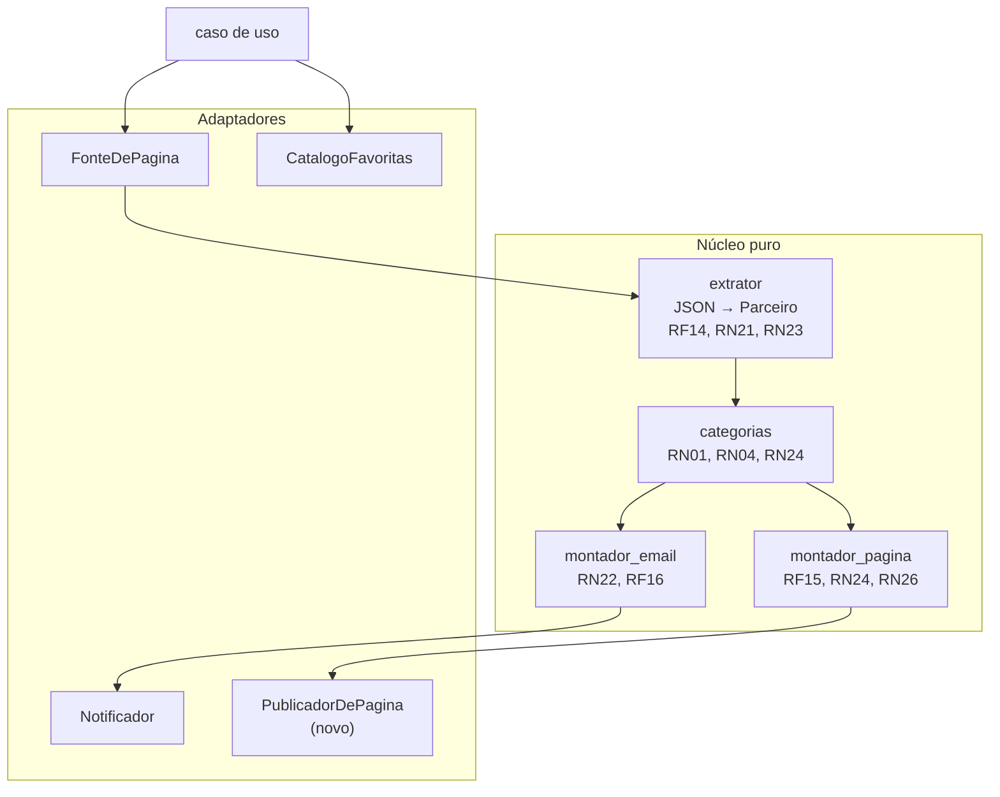

# PRD — Livelo V2 (validade, catálogo e preferências)

**Versão:** v2.x (documento vivo)
**Status vigente em 2026-09-04:** V2.0 a V2.3 implementadas no robô, Postgres, API autenticada e Flutter. O ciclo de catálogo completo e a migration `013` estão publicados; a primeira coleta gravou 252 parceiros. O smoke físico Android permanece pendente pelo responsável.

> A V2 define o catálogo persistido, campanhas, preferências e o cliente Flutter autenticado. O aplicativo consome a API; não consulta a Livelo nem o Postgres diretamente.

Este documento é o **delta sobre o [`PRD-LIVELO.md`](PRD-LIVELO.md)**, que segue valendo como fonte da verdade de tudo que não for redefinido aqui. Onde houver conflito, este documento vence — e cada conflito está marcado explicitamente.

---

## 1. Contexto

A coleta Livelo lê parceiros públicos, aplica a régua configurada e persiste o retrato completo para consumo da API e do aplicativo.

Três coisas apareceram depois:

**A validade da promoção estava ao alcance da mão.** A V1 excluiu esse dado acreditando que custaria ~40 requisições extras. Falso: a página embute um payload JSON com `dateStart` e `dateEnd` por parceiro. Na medição de 2026-08-09, **31 das 40 promoções terminavam naquele mesmo dia** — sem essa informação, o e-mail diz "Sam's Club com 84 pontos" e não diz se restam 6 horas ou 3 semanas.

O catálogo persistido permite consultar pontuação, campanha, validade e histórico sem abrir a página da Livelo.

## 2. Objetivos novos

| ID | Objetivo |
|---|---|
| **O5** | Responder "quanto essa loja dá hoje?" sem abrir o site da Livelo — completa O1, que a V1 só atendeu pela metade |
| **O6** | Saber quanto tempo resta para aproveitar uma promoção |

O4 (portfólio) ganha reforço: uma página pública funcionando é mais demonstrável que um repositório.

---

## 3. Escopo

### 3.1 Dentro

- Extração a partir do **payload JSON** da página, em vez do texto renderizado dos cards.
- Data de início e fim da promoção, com destaque para o que termina hoje.
- Distinção entre promoção de pontuação base e promoção exclusiva do Clube Livelo.
- **Aplicativo Flutter, API autenticada e Postgres**, onde as lojas acompanhadas e os limiares de alerta são consultados e editados.
- **Banco de dados Postgres** como fonte da configuração, substituindo o arquivo TOML.
- **Novo critério de alerta**: múltiplo da pontuação base com piso absoluto — ver Seção 6.1.

### 3.2 Fora

- Multiusuário, cadastro, recuperação de senha. O site tem um único dono.
- Gráfico de tendência. O histórico em lista das últimas 30 medições faz parte do catálogo Livelo; cada coleta grava todos os parceiros válidos.
- Hospedar logotipos ou imagens dos parceiros — ver 9.2.
- Compra, clique automático ou qualquer autenticação na Livelo.

### 3.3 O que este documento revoga do PRD V1

| Onde | O que muda |
|---|---|
| §1.4 "Fora do escopo: front-end" | **Revogado.** Passa a existir um site próprio. O canal de saída deixa de ser único |
| §1.4 "Fora do escopo: data de validade" | **Revogado.** A justificativa era falsa |
| §11.3 "Fora do roadmap: front-end" | **Revogado** pelo mesmo motivo |
| **RF10** (enviar sempre) | **Substituído** por RF16 — ver Seção 5 |
| **RN02** (piso de boost zero: qualquer aumento conta) | **Revogado e invertido** por RN27 — ver 6.1. Era o coração do filtro da V1 e passa a ser o oposto |
| **MS5** (sinal de vida pelo e-mail) | **Substituído** por MS6 — ver Seção 4 |
| §1.4 "sem banco de dados" e §11.3 | **Revogado.** A configuração passa a viver em Postgres, porque o site precisa escrevê-la |
| §5.3 (configuração em `lojas_favoritas.toml`) | **Substituído.** O TOML vira a carga inicial do banco, não a fonte da verdade |
| §9.4 "nunca escreve no repositório" | **Mantido e reforçado.** O robô continua com `contents: read`; agora nem para publicar página ele escreve |
| §2.2 RNF01 "custo zero" | **Mantido**, mas agora depende de free tier de terceiros — ver C08 |

---

## 4. Métricas

| ID | Métrica | Alvo | Fonte |
|---|---|---|---|
| **MS6** | Sinal de vida pela página | O carimbo de atualização da página nunca passa de 24h de atraso | A própria página |
| **MS7** | Utilidade da validade | Nenhuma promoção perdida por desconhecer o prazo | Autoavaliação |
| **MS8** | Redução de ruído | Menos de 1 e-mail por dia em média, em 30 dias | Caixa de entrada |

**MS5 é substituído por MS6.** O sinal de vida migra do e-mail para a página, que é atualizada em toda execução mesmo quando não há promoção.

> **Limitação honesta:** MS6 depende de você abrir a página. Se ficar semanas sem abrir e o cron morrer por C01, a descoberta demora. O e-mail diário garantia isso de forma passiva; a página exige um gesto. É o preço de O7, e está sendo pago conscientemente.

---

## 5. Requisitos novos

### 5.1 Funcionais

| ID | Requisito |
|---|---|
| **RF14** | Extrair os dados dos parceiros a partir do payload JSON embutido na página, incluindo `parity`, `parityClub`, `parityBau`, `dateStart`, `dateEnd`, `activeCampaign` e `legalTerms` |
| **RF15** | Servir um site com todas as lojas favoritas, suas pontuações atuais e as promoções em destaque |
| **RF16** | Enviar e-mail **somente quando ao menos uma favorita cruzar o próprio limiar de alerta**. **Substitui RF10** |
| **RF17** | Permitir, pelo site e sob autenticação, adicionar e remover lojas favoritas e editar multiplicador e piso, global e por loja. Uma tela por tarefa: `/avisos` para o padrão global e para editar o limiar de loja já cadastrada, `/lojas` para o cadastro — que também aceita, opcionalmente, o limiar próprio da loja no momento de criá-la (RN28: em branco usa o padrão global). **A tela usa linguagem comum** — "vezes acima do normal" e "mínimo de pontos" — e o termo técnico deste PRD aparece só no tooltip de ajuda |
| **RF18** | Exibir, em cada promoção, quanto tempo resta até o fim, com destaque para o que termina no mesmo dia |
| **RF19** | Registrar na página o instante da última atualização, em horário de Brasília |
| **RF20** | Persistir todos os parceiros válidos de cada coleta Livelo, com identidade por ID externo, categorias e pontuação, para formar o histórico completo do catálogo |
| **RF21** | Expor o catálogo pela API autenticada com busca, aba, categoria, ordenação e paginação; o cliente mobile V11 solicita 10 itens e cada resposta é limitada a 50 |
| **RF22** | Permitir que somente administrador acompanhe ou deixe de acompanhar um parceiro pelo ID externo, em operação idempotente e sem iniciar coleta |
| **RF23** | Aplicar o novo catálogo somente ao Android em largura compacta; Web, iOS e layout amplo mantêm a experiência anterior neste ciclo |
| **RF24** | No Android compacto, permitir abrir o histórico de qualquer loja do catálogo e consultar as últimas 30 pontuações persistidas, sem iniciar coleta |

### 5.2 Não-funcionais

| ID | Requisito | Alvo verificável |
|---|---|---|
| **RNF13** | A página não adiciona dependência de runtime | Nenhum pacote novo além do que a V1 já usa |
| **RNF14** | A página funciona sem JavaScript | Conteúdo legível com scripts desabilitados |
| **RNF15** | A página não carrega recurso de terceiros | Zero requisição a domínio externo ao abrir |
| **RNF16** | A página é legível no celular | Layout de coluna única abaixo de 600px |
| **RNF17** | O deploy não escreve no repositório | O workflow mantém `contents: read` |

### 5.3 Restrições novas

| ID | Restrição | Impacto |
|---|---|---|
| **C06** | O payload JSON é interno da Livelo e pode mudar de forma sem aviso — não é uma API pública com contrato | Mesma fragilidade de C04, agora concentrada em outro ponto. RN13 continua sendo a rede de proteção |
| **C07** | `parityBau` é preenchido pela Livelo e o alerta inteiro depende dele ser honesto | Se um dia vier igual ao valor promocional, todo mundo vira 1x e **nenhum alerta dispara, em silêncio**. Exige a checagem de RN29 |
| **C08** | O custo zero passa a depender de free tier de terceiros: Neon 0,5 GB e 100 CU-horas por mês, Vercel no plano gratuito | Medido: o projeto usa ~88 KB e ~290 consultas por mês. Folga de mais de 100x, mas os termos podem mudar |
| **C09** | O compute do Neon hiberna após 5 minutos ocioso | Acorda sozinho em milissegundos. Irrelevante para o robô 3x ao dia; a primeira tela do site após ociosidade carrega um pouco mais devagar |

---

## 6. Regras de negócio novas

| ID | Regra |
|---|---|
| **RN21** | Promoção com `dateEnd` já passado **não é promoção**. O payload pode conter campanha encerrada ainda não removida da página |
| **RN22** | Promoção que termina no mesmo dia da execução recebe destaque visual próprio, na página e no e-mail |
| **RN23** | `activeCampaign` distingue três casos: `PROMOTION` (a base subiu), `PROMOTION_CLUB` (a base subiu e o Clube subiu mais) e `CLUB` (só o Clube subiu). Quem não é assinante não deve ser alertado por promoção que não pode aproveitar — mas `PROMOTION_CLUB` ele aproveita, só não pelo número maior |
| **RN24** | A página exibe **todas** as favoritas, em promoção ou não. É o que permite consultar a pontuação base sem abrir a Livelo (O5) |
| **RN25** | A página nunca carrega imagem, fonte ou script de domínio externo. Logotipo de parceiro não é hospedado nem apontado por link direto — ver 9.2 |
| **RN26** | O carimbo de atualização é obrigatório e sempre visível. Sem ele a página não cumpre MS6 |
| **RN27** | **Uma loja marcada no sino gera alerta quando `pontos_atuais >= base × multiplicador` E `pontos_atuais >= piso`.** O sino é uma preferência independente do resultado histórico `pontuacao.alertou`; loja acompanhada sem sino não gera alerta. |
| **RN28** | Multiplicador e piso têm valor padrão global, sobrescrevível por loja. Loja sem sobrescrita usa o padrão |
| **RN29** | Silêncio de alerta acompanhado de página degenerada (quase todo parceiro com `parityBau` igual à pontuação atual) é registrado como suspeita — é o sintoma de C07. Ver 6.3 |
| **RN30** | O site exibe, ao lado de cada loja, a pontuação atual, a base e o valor que dispararia o alerta. Sem isso o limiar desregula em silêncio |
| **RN31** | Quando a Livelo publica letra miúda para a campanha (`legalTerms`), o Painel exibe o texto por extenso na loja. É o que permite decidir se a promoção vale para a compra pretendida sem abrir o app da Livelo (O5) |
| **RN32** | `loja` representa somente as acompanhadas; `parceiro_livelo` representa o catálogo completo; `pontuacao` guarda o retrato histórico de todos os parceiros por `parceiro_livelo_id` |
| **RN33** | ID externo ausente ou inválido e o mesmo ID com conteúdo conflitante invalidam a coleta. Repetição idêntica do mesmo ID é deduplicada |
| **RN34** | Zero lojas acompanhadas é estado válido. Banco vazio não aciona o TOML e a coleta seguinte não restaura automaticamente as 132 escolhas antigas |
| **RN35** | Execução, catálogo, vínculos e pontuações são publicados em uma única transação; contagem divergente causa rollback e falha ruidosa |
| **RN36** | No catálogo, Lojas contém todos os parceiros ativos; Acompanhadas contém as escolhidas; Alertas contém as acompanhadas que cruzaram a régua na última coleta |
| **RN37** | Busca e filtros consultam somente o Postgres. O Flutter nunca consulta a Livelo nem recebe o catálogo completo em uma resposta |
| **RN38** | Categorias conhecidas recebem rótulos em português; código desconhecido ou ausência de categoria aparece como “Outros” |
| **RN39** | Nome e categoria usados ao acompanhar vêm do catálogo no servidor. O cliente não escolhe nome, link nem categoria |
| **RN40** | No Android compacto Samsung, o Início consulta `/api/resumo` ao abrir, ao voltar para a tela, ao retomar o app e a cada 30 segundos enquanto estiver visível. Consultas não se sobrepõem; falha mantém o último resumo válido. Web, iOS e layout amplo não mudam neste ciclo. |
| **RN41** | O agendamento Livelo é calculado no servidor para 09h, 14h e 20h de Brasília. Antes da janela, informa a próxima previsão; depois dela e sem execução nova, informa o atraso real do GitHub. |
| **RN42** | `melhor_oferta` do catálogo Livelo significa a maior pontuação entre lojas acompanhadas no retrato atual. Sem acompanhadas, retorna vazio; não escolhe parceiro do catálogo geral. |
| **RN43** | A atividade do Início traz o último evento de Livelo, Cashback e Produtos, ordenado por momento real decrescente e com desempate estável por domínio. Navegar ou pesquisar não consulta Livelo/Inter; somente o botão administrativo idempotente solicita workflow. |
| **RN44** | O histórico Livelo é somente leitura, pertence ao parceiro identificado pelo ID externo e retorna no máximo 30 medições em ordem decrescente de execução. Acompanhamento não limita a série; ausência de medições é estado vazio válido; abrir a tela não dispara robô. |

### 6.1 O novo critério de alerta

A V1 alertava quando a Livelo pendurava a etiqueta "Promoção". Medido em 2026-08-09, esse critério **errava nos dois sentidos**:

| Erro | Exemplo real |
|---|---|
| Avisava sem haver aumento | `Eudora` 2 → 2 e `O Boticário` 3 → 3, ambos etiquetados como promoção |
| Não avisava havendo aumento | `Avon` com 6 pontos contra base 2, um salto de 3x, **sem etiqueta nenhuma** |

O critério passa a comparar com `parityBau`, a pontuação normal declarada pela própria Livelo. Dois botões:

- **Multiplicador** — quanto acima do normal daquela loja. Padrão **2,0**
- **Piso** — mínimo absoluto para valer um e-mail. Padrão **4 pontos**

**Por que múltiplo e não número fixo.** Um limiar absoluto ignora a escala de cada loja. Simulado no catálogo real, a regra "avise acima de 8" perderia `Crocs` (2→7), `Avon` (2→6), `Osklen` (2→6), `Fast Shop` (2→5) e `Magalu` (2→4) — todas oportunidades legítimas.

**Por que o piso existe.** Só o multiplicador deixaria passar `Mercado Livre` 1→2 e `Bibi` 1→2. Dobrou, mas são 2 pontos.

**Prova de que não vaza ruído.** `Claro`, `TIM` e `Decolar` dão 6 pontos com base 6, e `Natura` dá 4 com base 4. São pontuações altas permanentes, não oportunidades — nenhuma dispara. Um limiar absoluto de 5 mandaria `Claro` e `TIM` todo dia.

Com padrão 2,0 e piso 4, a medição de 2026-08-09 produziria **um e-mail com 12 lojas**, de 126 favoritas.

> **Vocabulário na tela:** este documento continua dizendo *multiplicador*, *piso* e *limiar*, porque são os nomes das colunas e dos campos no código. A interface não repete isso: ela diz "a pontuação precisa ficar N vezes acima do normal da loja" e "e valer no mínimo N pontos por real". Quem usa o site é uma pessoa só, e ela não deveria precisar do PRD aberto para ajustar um número.

> **Recomendação de uso:** subir com o padrão global e **nenhuma sobrescrita**. Configurar 132 limiares na largada é armadilha — você chuta todos, erra a maioria e nunca revisa. Depois de duas ou três semanas, sobrescrever apenas as poucas lojas que incomodarem. A capacidade existe desde o primeiro dia; o uso dela deve ser preguiçoso.

### 6.2 Sobre RN23 e o Clube

A V1 tratou como promoção qualquer parceiro com a etiqueta "Promoção", e isso produziu ruído real: `O Boticário` apareceu com base 3 → 3 pontos, ou seja, sem aumento nenhum na base — o boost estava só no tier Clube, de 3 para 10.

Os valores de `activeCampaign` foram confirmados contra a página real em 2026-08-11 (270 itens): `BAU` (221), `PROMOTION` (30), `CLUB` (5), `PROMOTION_CLUB` (3). São dois casos diferentes envolvendo o Clube, e tratá-los igual erraria:

| Campanha | O que acontece | Exemplo real de 2026-08-11 | No e-mail |
|---|---|---|---|
| `CLUB` | A base não se move; o ganho existe só para assinante | Aliexpress: base 1, Clube 3 | "exclusivo assinantes Clube" |
| `PROMOTION_CLUB` | A base sobe para todo mundo e o Clube sobe mais | Sephora: base 1 → 6, Clube 10 | "assinantes Clube ganham mais" |

A distinção importa porque o não assinante **aproveita** uma promoção `PROMOTION_CLUB` — o que ele não aproveita é o número maior que aparece ao lado. Marcá-la como exclusiva esconderia uma promoção boa; não marcá-la nada deixaria o número maior sem explicação.

Passa a existir a configuração `ASSINANTE_CLUBE`, padrão `false`:

- Não assinante: promoção `CLUB` **não** dispara e-mail, mas continua visível na página, marcada como Clube. `PROMOTION_CLUB` dispara normalmente, pela pontuação que vale para ele.
- Assinante: promoção do Clube conta normalmente, pelo valor do tier.

> A **marcação** no e-mail é da V2.0. A **supressão** do alerta por não ser assinante entrou na V2.2: `CLUB` não dispara para quem não assina, `PROMOTION_CLUB` dispara normalmente, e para quem assina a pontuação que vale é a do tier.

### 6.3 RN29 sem guardar estado

A redação original de RN29 falava em "muitos dias seguidos", o que exigiria histórico — e o robô é stateless por decisão (PRD §1.4). A regra foi implementada sem contador de dias, porque **o sintoma de C07 é visível numa execução só**: se a Livelo passar a preencher `parityBau` com o próprio valor promocional, isso não acontece numa loja, acontece na página inteira de uma vez.

A checagem dispara quando **nenhuma favorita cruzou o limiar** e ao menos 90% dos parceiros com base conhecida vieram com `pontos_atuais == pontos_base`. Uma loja parada é normal; a página parada não é. Há ainda o caso extremo do payload deixar de trazer `parityBau`: aí a suspeita é levantada sem conta nenhuma.

```
WARNING RN29: nenhuma favorita cruzou o limiar e 251 de 254 parceiros
vieram com base igual a pontuacao atual. Suspeita de parityBau
degenerado (C07), nao de "nao teve promocao hoje".
```

A versão com contagem de dias volta à mesa na V2.3, quando o robô passar a gravar cada execução no banco para alimentar o site — aí o histórico existe como subproduto, e não como estado criado só para esta regra.

### 6.4 Medição da régua contra a página real

Ensaio de 2026-08-11 com a página real, o catálogo do Neon e a régua padrão (2,0x, piso 4):

| Critério | Lojas no e-mail |
|---|---|
| V1 — etiqueta "Promoção" da Livelo | 18 |
| RN27 — múltiplo da base com piso | 15 |

As trocas mostram a regra funcionando nos dois sentidos que a V1 errava:

| Loja | Situação | Veredito |
|---|---|---|
| `Mercado Livre` 1 → 2, `Bibi` 1 → 2, `Electrolux` 1 → 2 | Dobrou, mas são 2 pontos | Saiu — é o piso trabalhando |
| `Booking.com` 4 → 6 | Subiu, mas não dobrou | Saiu — é o multiplicador trabalhando |
| `Avon` 2 → 6 | Triplicou **sem etiqueta nenhuma** | Entrou — é o falso negativo da V1 sendo corrigido |

Sensibilidade medida no mesmo dia, para calibrar depois de algumas semanas: `2,0x piso 4` → 15 lojas; `2,5x piso 4` → 14; `3,0x piso 4` → 11; `2,0x piso 6` → 7. O piso é o botão mais sensível dos dois.

---

## 7. Arquitetura

### 7.1 O que muda

A regra de ouro não muda: núcleo puro, mundo por contrato. A V2 acrescenta **uma porta e um módulo de núcleo**.

| Peça | Tipo | Papel |
|---|---|---|
| `extrator.py` | Núcleo, **reescrito** | Passa a ler o payload JSON em vez do texto dos cards |
| `alertas.py` | Núcleo, **novo** | Aplica RN27 e RN28: decide o que merece alerta. Função pura, sem I/O |
| `montador_email.py` | Núcleo, ajustado | Ganha validade e marcação de Clube |
| `CatalogoFavoritas` | **Porta existente, nova implementação** | Passa a ler do Postgres em vez do TOML. **O contrato não muda** — é o dividendo da arquitetura da V1 |
| `PreferenciasGlobais` | **Porta nova** (V2.2) | Entrega a régua de RN28. Separada do catálogo porque vem de outra tabela e responde outra pergunta |
| `RepositorioDeExecucao` | **Porta nova** (V2.3) | Guarda o retrato de cada rodada. É o que dá dado ao site: a pontuação atual só existe durante a execução |
| `retrato.py` | Núcleo, **novo** (V2.3) | Junta cada favorita com o que a página disse dela. RF15, RN24, RN30 |
| `principal.py` | Orquestração, ajustada | Decide envio por RF16 |
| Site | **Componente novo**, fora do robô | Next.js na Vercel: exibe e edita. Fala com o mesmo banco |

### 7.1.1 O que a arquitetura da V1 economiza aqui

Trocar arquivo TOML por Postgres **não toca uma linha do núcleo**. `CatalogoFavoritas.listar()` continua devolvendo `list[LojaFavorita]`, e quem chama não sabe de onde veio. Era exatamente para isto que a porta existia — e é a primeira vez que ela paga o próprio custo.

O TOML atual vira a **carga inicial** do banco, não some.



### 7.2 Por que reescrever o extrator é ganho, não risco

Ler o payload é **mais estável** que raspar o card renderizado:

| Hoje (V1) | V2 |
|---|---|
| Regex sobre texto: `"Até 4 pontos por R$ 1 Eram 1 ponto"` | Campos numéricos: `parity`, `parityBau`, `parityClub` |
| Promoção inferida da presença de uma etiqueta | Campo booleano `promotion` e `activeCampaign` |
| Validade indisponível | `dateStart` e `dateEnd` |
| Quebra se mudarem texto, classe ou estrutura visual | Quebra se mudarem o formato dos dados |

Isso ataca **C04**, que é o maior risco do projeto. A troca é protegida pelos testes existentes na largada da V2.0 (96, ao final dela): a assinatura pública muda em um ponto só, deliberado.

> **Exceção registrada:** a versão original desta seção dizia que `extrair_parceiros(html) -> list[Parceiro]` não mudaria. Isso deixou de ser exato. RN21 (promoção com `dateEnd` no passado não conta) e RN22 (destaque "termina hoje") precisam saber que dia é hoje — e o núcleo não pode ler o relógio por conta própria sem reintroduzir o não-determinismo escondido que a regra de ouro 1 do `CLAUDE.md` existe para evitar. A solução adotada: `agora: datetime` como parâmetro obrigatório e nomeado em `extrair_parceiros` e em `montador_email.montar`, resolvido uma única vez em `principal.py` (a única camada que já faz I/O) e propagado aos dois. O contrato `html -> list[Parceiro]` continua valendo — só ganhou um segundo parâmetro explícito, não um relógio implícito.

### 7.3 Infraestrutura

| Peça | Onde | Por quê |
|---|---|---|
| Robô | GitHub Actions, 3x ao dia | O agendamento, os testes e o gate já funcionam. A notificação nativa de falha sustenta O3 |
| Banco | **Neon** (Postgres) | Não expira e acorda sozinho. Escolhido também por ensinar Postgres, que é conhecimento transferível |
| Site | **Vercel** | Não tem o desligamento longo de outras hospedagens gratuitas |

**Alternativas descartadas, com o motivo:**

- **Render** — o Postgres gratuito **expira 30 dias após a criação e é apagado com os dados**. O web service dorme em 15 minutos e leva cerca de 1 minuto para voltar, o pior perfil possível para um site consultado esporadicamente.
- **Configuração continuar no git**, editada pelo site via API do GitHub — tecnicamente viável e mais simples, dispensando banco. Descartada por decisão explícita: aprender Postgres num projeto próprio é objetivo declarado, e isso pesa mais que a simplicidade aqui. **Registrado como escolha de aprendizado, não como necessidade técnica.**

O robô continua com `permissions: contents: read` (§9.4 do PRD V1) e nunca escreve no repositório.

---

## 8. Modelo de dados

`Parceiro` mantém os campos da V2 e ganha identidade e categorias da fonte:

| Campo | Tipo | Regra |
|---|---|---|
| `id_externo` | `str` | Identidade estável fornecida pela Livelo; base de RN06 e RN33 |
| `categorias` | `tuple[str, ...]` | Códigos fornecidos pela Livelo, sem o filtro técnico `todos` |
| `pontos_base` | `Decimal \| None` | `parityBau` — a pontuação normal, fora de promoção |
| `inicio_promocao` | `datetime \| None` | `dateStart` |
| `fim_promocao` | `datetime \| None` | `dateEnd`, base de RN21 e RN22 |
| `campanha` | `str \| None` | `activeCampaign`, base de RN23 |
| `descricao_campanha` | `str \| None` | `legalTerms`, só o texto (HTML removido); `<p><br></p>` (sem letra miúda) vira `None`, base de RN31 |

`LojaFavorita` ganha os campos de alerta:

| Campo | Tipo | Regra |
|---|---|---|
| `multiplicador` | `Decimal \| None` | `None` significa "usa o padrão global" (RN28) |
| `piso_pontos` | `Decimal \| None` | Idem |
| `alerta_ativo` | `bool` | Preferência de alerta da loja; `false` não remove o acompanhamento. O cartão mobile V11 não exibe o controle do sino |

### 8.1 Esquema do banco

```
loja        id, nome, categoria, multiplicador?, piso_pontos?, alerta_ativo, criada_em
apelido     id, loja_id, texto              -- RN04 continua exigindo grafia exata
preferencia chave, valor                    -- multiplicador e piso padrão, assinante_clube
execucao    id, momento, parceiros_lidos, alertas, versao          -- V2.3
pontuacao   id, execucao_id, loja_id?, nome, pontos_*, valor_de_disparo, ...  -- V2.3
parceiro_livelo id, id_externo, nome, categorias[], pontos_*, campanha,
                 validade, link, ativo, atualizado_execucao_id       -- migração 013
```

`execucao` e `pontuacao` entraram na V2.3 (`migracoes/002_execucao.sql`). `pontuacao` continua guardando somente as acompanhadas. `parceiro_livelo`, criado pela migração `013`, guarda a oferta atual de todos os parceiros válidos da última coleta, sem série histórica própria. A ligação opcional e única `loja.parceiro_livelo_id` separa seleção de catálogo.

**A reserva cobre indisponibilidade, não vontade.** Banco que responde com zero lojas devolve lista vazia, e isso chega ao caso de uso como resultado legítimo — não como falha. A distinção existe porque a primeira versão não a fazia: apagar o catálogo pelo site fazia o TOML ressuscitar as 132 lojas na execução seguinte, e o banco nunca era de fato a fonte da verdade. Catálogo vazio gera e-mail com assunto próprio ("nenhuma loja cadastrada"), que é diferente de "nenhuma promoção hoje" — dizer a mesma frase nos dois casos esconderia que o robô está rodando no vazio.

**Publicar é crítico.** Sem outro caminho para alimentar API e Flutter, falha ou contagem parcial na gravação encerra a execução com erro. A transação reverte execução, catálogo, vínculos e pontuações juntos; a última coleta válida continua disponível.

Três tabelas. Restrições que o banco garante, e não o código — a garantia mora na camada mais baixa possível:

- `nome` único
- `texto` do apelido único **entre todas as lojas**, porque RN04 proíbe ambiguidade
- `categoria` obrigatória, `multiplicador > 0`, `piso_pontos >= 0`

Configuração nova: `assinante_clube`, padrão `false`, agora na tabela de preferências.

---

## 9. Segurança, privacidade e legal

### 9.0 Autenticação da API e App Check

Toda rota de dados usa token Firebase no cabeçalho `Authorization: Bearer`.
App Check é uma segunda prova de integridade do aplicativo: **não substitui**
identidade, sessão, papel administrativo, rate limit ou auditoria da API.

#### Providers por plataforma

| Plataforma | Debug | Profile/release |
|---|---|---|
| Android | `AndroidDebugProvider` | `AndroidPlayIntegrityProvider` |
| iOS | `AppleDebugProvider` | `AppleAppAttestWithDeviceCheckFallbackProvider` |

Build sem `FirebaseOptions` não tenta inicializar Firebase ou App Check; o
Flutter apresenta o estado de configuração pendente. No Android e iOS, o
provider é ativado somente quando `ATIVAR_APP_CHECK=true` foi recebido por
`--dart-define`.

#### Controles independentes

| Camada | Controle | Efeito de `false`/ausente | Efeito de `true` |
|---|---|---|---|
| Flutter | `ATIVAR_APP_CHECK` | Não pede nem envia token App Check | Ativa o provider e acrescenta `x-firebase-appcheck` às requisições autenticadas |
| API | `EXIGIR_APP_CHECK` | Mantém App Check em rollout, mas Firebase Auth continua obrigatório | Exige e valida `x-firebase-appcheck` antes do token de identidade |

O SDK injeta token automaticamente apenas em serviços Firebase compatíveis. A
API deste projeto é HTTP própria; por isso o `ClienteApi` obtém `getToken()` e
envia o cabeçalho explicitamente. Token ausente ou inválido sob enforcement
retorna `401` com código estruturado `app-check` e é auditado como negação.

#### Segredos e fronteiras

`FIREBASE_PROJECT_ID` e `FIREBASE_SERVICE_ACCOUNT_JSON` (ou Application
Default Credentials) pertencem exclusivamente ao servidor. Nenhum desses
valores, token de debug ou credencial Firebase entra no Flutter, em arquivo
versionado ou em log. A API só carrega `firebase-admin/app-check` quando o
rollout exige a validação.

#### Desenvolvimento e rollout

1. Em Android local, usar `make dev-app-check API_URL=<api-de-teste>` em
   `app/`; aparelho físico requer uma URL acessível pelo aparelho.
2. Cadastrar no Firebase Console o token produzido pelo provider de debug,
   mantendo-o fora do repositório.
3. Distribuir builds com `ATIVAR_APP_CHECK=true` e manter
   `EXIGIR_APP_CHECK=false` enquanto são observadas requisições válidas.
4. Registrar Play Integrity para Android e App Attest, com fallback DeviceCheck,
   para iOS antes de distribuir esses builds.
5. Só então habilitar externamente `EXIGIR_APP_CHECK=true` e validar token
   válido, token inválido e ausência de token no ambiente alvo.

O enforcement de produtos Firebase no Console é independente do gate da API e
só pode ser ativado após o rollout de clientes válidos.

### 9.1 Privacidade do cliente

O Flutter acessa somente a API autenticada. Preferências de acompanhamento são
dados de produto protegidos por autorização; credenciais, tokens, URLs de banco
e detalhes internos de erro não são exibidos pelo aplicativo.

No aplicativo V11, a busca do catálogo usa `CampoBuscaRadar` em todos os
layouts, inclusive na Livelo. Filtros, seletores de categoria e detalhes abrem
pela `FolhaRadar`, com puxador, cabeçalho centralizado, voltar/fechar e fundo
bloqueado e desfocado. Essa padronização é visual; o catálogo continua
consultando apenas a API autenticada e paginada.

Nos cartões mobile de Livelo, cada consulta solicita **10 itens por página**.
`PaginacaoRadar` troca a página visível sem anexar resultados ao fim da
rolagem: com até 10 itens não há controle, e o controle para a página 2 só
aparece quando o total é 11 ou maior. A API continua sendo a fonte de total e
das páginas existentes; o Flutter não infere nem baixa o catálogo completo.
Depois da troca, a lista retorna ao início com uma animação suave.

### 9.2 Logotipos de parceiros

O payload traz a URL do logotipo de cada parceiro no CDN da Livelo. **Não serão usados**, por duas razões independentes:

1. Apontar direto para o CDN de terceiro consome banda alheia sem autorização e quebra RNF15.
2. Copiar os arquivos para o repositório significa redistribuir marca de terceiro, o que muda a análise da Seção 10.3 do PRD V1, hoje apoiada em "não redistribuo nada".

A página identifica cada loja por nome e cor de categoria, como o e-mail já faz.

### 9.3 Termos de uso

A Seção 10.1 do PRD V1 continua valendo integralmente, **com uma diferença que precisa ser dita**: a V1 consumia os dados em privado, no próprio e-mail. A V2 os **republica em página pública**.

Isso enfraquece o argumento de "uso exclusivamente pessoal" que sustenta a análise legal atual. Mitigações adotadas:

- O painel legado continua mostrando apenas acompanhadas. O catálogo completo é servido somente a usuários autenticados pela API e não inclui logotipos externos.
- Nenhum logotipo, nenhuma imagem, nenhum texto de regulamento copiado.
- Aviso de não afiliação e link para a Livelo em cada loja (RN08).
- Nenhuma monetização, nenhum anúncio.

**Se a Livelo se manifestar, a página sai do ar.** Mesma linha ética da Seção 10.1: nenhuma evasão, nenhuma insistência.

---

## 10. Testes

Novos casos, seguindo o bloco CT-080 em diante. A estratégia da Seção 8 do PRD V1 não muda: núcleo puro em unitário, orquestração com fakes, nenhum teste tocando rede.

| Regra | Caso |
|---|---|
| RF14 | Payload real da página vira `Parceiro` com todos os campos |
| RF14 | Payload sem `dateEnd`, ou com data malformada, não derruba a extração |
| RN21 | Promoção com `dateEnd` no passado não conta como promoção |
| RN22 | Promoção que termina hoje recebe a marcação de destaque |
| RN23 | Com `ASSINANTE_CLUBE=false`, promoção exclusiva do Clube não dispara e-mail mas aparece na página |
| RN23 | Com `ASSINANTE_CLUBE=true`, a mesma promoção dispara e-mail |
| RF16 | Sem promoção, o notificador **não** é chamado |
| RF16 | Sem promoção, a página **é** publicada mesmo assim |
| RN24 | A página lista as 132, não só as em promoção |
| RN25 | A página não contém nenhuma URL de domínio externo |
| RN26 | A página contém o carimbo de atualização |
| RNF14 | O conteúdo é legível sem executar JavaScript |
| RNF17 | O workflow do robô não declara `contents: write` |

A fixture ganha o payload JSON real, recortado, ao lado do HTML que já existe.

---

## 11. Fases

Cada fase entrega valor sozinha e pode parar ali sem deixar o projeto pela metade.

| Fase | Entrega | Por que nesta ordem |
|---|---|---|
| **V2.0** | Extrator lendo o payload: base, validade e campanha. E-mail mostra validade e marca o que é só do Clube | Base de tudo. Sozinha já melhora o e-mail de hoje, sem site e sem banco |
| **V2.1** | Banco no Neon, `CatalogoFavoritas` lendo de lá, TOML como carga inicial | O núcleo não muda — só a implementação da porta. Fase de menor risco de todas |
| **V2.2** | Regras de alerta RN27 e RN28, ainda com o e-mail diário | Permite calibrar multiplicador e piso **vendo o resultado** antes de depender deles |
| **V2.3** | Site na Vercel: consulta e edição, com senha | Precisa do banco da V2.1. Entrega O5 |
| **V2.4** | E-mail condicional (RF16) | **Só depois da V2.3 no ar e verificada.** Antes disso, cortar o e-mail diário reabre o buraco do O3 |
| **Catálogo Android** | Migração `013`, publicação completa, API autenticada e tela Android compacta | Migração e API publicadas; primeira coleta com 252 parceiros. Smoke físico Android pendente pelo responsável |

> Duas ordens não são negociáveis. **V2.4 depois da V2.3**, senão fica sem sinal de vida nenhum. E **V2.2 antes da V2.4**, porque calibrar limiar recebendo e-mail todo dia é fácil; calibrar limiar quando o e-mail só chega se o limiar estiver certo é adivinhação.

---

## 12. Riscos

| Risco | Mitigação |
|---|---|
| O formato do payload muda (C06) | RN13 continua: poucos parceiros extraídos derruba a execução com erro ruidoso |
| O e-mail perder relevância diante do site | **Não é risco, é o desenho.** Cada canal ganha um trabalho só: o site é consulta, o e-mail é alarme. O e-mail para de ser catálogo |
| `parityBau` deixar de ser confiável (C07) | RN29: silêncio de alerta acompanhado de página degenerada é tratado como suspeita, não como "não teve promoção" |
| Senha única vazar | 9.0: senha aleatória, limite de tentativas, sessão protegida. Estrago limitado a este projeto |
| Free tier de Neon ou Vercel mudar (C08) | Uso medido é ~1% do limite. Se mudar, a configuração volta para arquivo — o contrato `CatalogoFavoritas` torna a volta barata |
| Deixar de abrir a página e não perceber que o robô morreu | Limitação declarada em MS6. Se virar problema real, o candidato é um e-mail semanal de resumo, mesmo sem promoção |
| A exposição pública dos dados atrair atenção da Livelo | 9.3: a página sai do ar na primeira manifestação |
