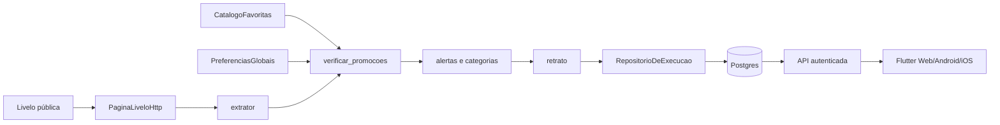

# PRD — Livelo (pontuação de lojas favoritas)

**Versão:** v1.2  
**Atualizado em:** 27 de agosto de 2026  
**Status:** coleta, régua de alertas e persistência implementadas. A interface é
Flutter e consome a API em `backend/api/`. As mudanças locais desta data ainda
dependem de envio da branch para chegar ao GitHub Actions e à Vercel.

Este documento é a fonte principal das regras Livelo atuais. O
[`PRD-LIVELO-V2.md`](../PRD-LIVELO-V2.md) preserva o histórico das decisões da
V2; se houver conflito, este documento mais recente prevalece.

## Decisão vigente: canal de e-mail retirado

Por decisão do responsável em 27 de agosto de 2026, o robô Livelo não monta nem
envia e-mail e não possui integração SMTP/Gmail. Foram retirados código,
credenciais, parâmetros de workflow, testes e guia específicos desse canal.

- **RF07, RF08, RF09, RF10 e RF16 estão aposentados.**
- **RN17 e RN18 estão aposentadas**, pois tratavam do destinatário do alerta.
- **C03 e C05 estão aposentadas**, pois tratavam de Gmail.
- O estado atual é gravado no Postgres e lido pela API/Flutter.
- Falha de coleta ou persistência deixa o workflow vermelho. Execução local sem
  `DATABASE_URL` continua possível como diagnóstico e não promete atualizar o app.
- E-mail de login, confirmação e recuperação do Firebase não faz parte desta
  integração e continua sendo responsabilidade da autenticação do aplicativo.

O histórico Git é o caminho para recuperar o antigo canal no futuro. Sua volta
exigirá uma nova decisão de produto, revisão de segurança e novos testes; não é
uma pendência atual.

---

## 1. Visão e escopo

### 1.1 Visão

Coletar a página pública de parceiros da Livelo três vezes ao dia, calcular quais
lojas favoritas cruzaram a régua de pontuação e guardar um retrato consistente no
Postgres para consulta pelo Flutter através da API.

### 1.2 Objetivos

| ID | Objetivo |
|---|---|
| **O1** | Consultar pontuação e oportunidades das lojas favoritas sem percorrer manualmente toda a página da Livelo |
| **O2** | Manter operação simples, em GitHub Actions, Neon e Vercel |
| **O3** | Distinguir coleta válida, coleta parcial, dado atrasado, ausência de dado, valor zero e falha |
| **O4** | Preservar código testável, auditável e sem segredo no cliente |
| **O5** | Expor à API todas as favoritas e o limiar calculado, não apenas as que alertaram |

### 1.3 Fora do escopo

- Login na Livelo, compra ou clique automático.
- Proxy rotativo, CAPTCHA, disfarce ou evasão de bloqueio.
- Acesso direto do Flutter à Livelo, ao Neon ou ao GitHub Actions.
- Notificação de promoção por e-mail, push, Telegram ou WhatsApp nesta entrega.
- Misturar Livelo com Inter Sites ou Inter Produtos em um mesmo coletor, tabela ou workflow.
- Usar histórico como entrada da decisão de alerta. O robô grava retratos, mas a
  regra atual decide apenas com os dados da execução presente.

---

## 2. Requisitos

### 2.1 Funcionais

| ID | Requisito atual |
|---|---|
| **RF01** | Buscar a página pública de parceiros da Livelo com uma requisição por tentativa |
| **RF02** | Extrair nome, pontuações, moeda, link, campanha, base e validade disponíveis |
| **RF03** | Reconhecer somente lojas do catálogo de favoritas |
| **RF04** | Separar as lojas que cruzaram a régua das que não cruzaram, sem perder estas do retrato |
| **RF05** | Agrupar alertas por categoria |
| **RF06** | Ordenar categorias por nome e alertas por pontuação decrescente |
| **RF07–RF10** | **Aposentados:** montagem e envio de e-mail |
| **RF11** | Repetir falha transitória de rede até o limite configurado |
| **RF12** | Falhar quando o total extraído ficar abaixo do limiar de segurança |
| **RF13** | Executar três vezes ao dia e aceitar disparo manual pelo workflow/API |
| **RF14** | Ler o payload JSON `__NEXT_DATA__`, sem depender do visual dos cards |
| **RF15** | Gravar no Postgres, de forma transacional, a execução e as pontuações de todas as favoritas |
| **RF16** | **Aposentado:** e-mail condicional |
| **RF17** | Permitir que a API autenticada administre catálogo, preferências e disparo manual |
| **RF18** | Disponibilizar a validade da promoção para apresentação pelo cliente |
| **RF19** | Registrar o instante da coleta em horário de Brasília |

### 2.2 Não funcionais

| ID | Regra | Alvo verificável |
|---|---|---|
| **RNF01** | Operação econômica | Usar os planos definidos para GitHub Actions, Neon e Vercel |
| **RNF02** | Cortesia de rede | Frequência controlada, timeout, repetição limitada e User-Agent honesto |
| **RNF03** | Limites explícitos | Timeout e resposta máxima de 5 MB |
| **RNF04** | Decisão sem memória | Nenhuma decisão de alerta consulta execução anterior |
| **RNF05** | Segredo fora do código e do log | Nenhum valor sensível no repositório, log, Web, APK ou IPA |
| **RNF06** | Falha visível | Erro de coleta ou persistência termina com código diferente de zero |
| **RNF07** | Portabilidade | Mesmo pacote roda localmente e no Actions; ambiente muda, regra não |
| **RNF08** | Teste isolado | Testes não acessam fonte real, Neon de produção ou serviço de notificação real |
| **RNF09** | Catálogo editável | Alterar favorita não exige mudar a lógica Python |
| **RNF10** | Quality gate | Ruff, Pytest e cobertura mínima de 90% no núcleo puro |
| **RNF11** | Idioma | Código, testes e documentação em português do Brasil |
| **RNF12** | Runtime | Python 3.11 ou superior |
| **RNF13–RNF17** | Clientes e deploy | Atendidos hoje pela API/Flutter e detalhados em `app/PLANO.md` |

### 2.3 Restrições

| ID | Restrição | Mitigação |
|---|---|---|
| **C01** | O GitHub pode desabilitar cron após inatividade | Observar workflows e o carimbo da última coleta |
| **C02** | O cron não garante minuto exato | Horários são aproximados |
| **C03** | **Aposentada:** dependência do Gmail | Canal removido |
| **C04** | A Livelo pode mudar ou bloquear a página | Limiar RF12; parar diante de bloqueio deliberado |
| **C05** | **Aposentada:** limite de corpo do Gmail | Canal removido |
| **C06** | `__NEXT_DATA__` é formato interno, sem contrato público | Fixture real, testes e RF12 |
| **C07** | A régua depende de `parityBau` confiável | Suspeita RN29 |
| **C08** | Limites e termos dos free tiers podem mudar | Medir antes de ampliar frequência ou volume |
| **C09** | Neon pode hibernar quando ocioso | Aceitar latência de despertar; não duplicar banco no cliente |

---

## 3. Regras de negócio

| ID | Regra vigente |
|---|---|
| **RN01** | A pontuação é da loja; cada favorita pertence a uma categoria |
| **RN02** | **Revogada por RN27:** qualquer aumento deixou de ser suficiente |
| **RN03** | Comparação normaliza acento, caixa e espaços externos |
| **RN04** | Reconhecimento é exato por nome canônico ou apelido; substring é proibida |
| **RN05** | Parceiro fora do catálogo é ignorado silenciosamente |
| **RN06** | Parceiro repetido conta uma vez |
| **RN07** | Texto externo é hostil: validar e escapar antes de exibir; nunca executar como HTML |
| **RN08** | Somente link HTTP(S) do domínio `livelo.com.br` pode ser persistido e exposto |
| **RN09** | Amazon não entra no catálogo enquanto não for parceira de acúmulo |
| **RN10** | Valor do Clube ausente permanece ausente; não inventar zero |
| **RN11** | Moeda é preservada como veio; não converter R$ e U$ |
| **RN12** | O sentido de “Até” é preservado separadamente do número |
| **RN13** | Ausência de promoção não é erro; ausência anormal de parceiros é |
| **RN14** | Categoria sem alerta não aparece no agrupamento de alertas |
| **RN15** | **Aposentada:** atributo `alt`; o extrator atual usa o payload JSON |
| **RN16** | Categoria nova só se justifica quando reúne pelo menos duas lojas |
| **RN17–RN18** | **Aposentadas:** destinatário e dado pessoal do antigo e-mail |
| **RN19** | Favorita não encontrada na página é registrada no log e no retrato como ausente |
| **RN20** | Persistir e exibir o nome canônico do catálogo, não a grafia instável da fonte |
| **RN21** | Campanha com `dateEnd` passado não conta como ativa |
| **RN22** | O cliente pode destacar campanha que termina no dia da coleta |
| **RN23** | `CLUB` só conta para assinante; `PROMOTION_CLUB` continua aproveitável por não assinante pela pontuação aberta |
| **RN24** | O retrato contém todas as favoritas, em alerta ou não |
| **RN25** | Nenhum cliente carrega imagem, fonte ou script de parceiro externo |
| **RN26** | O instante da última coleta válida deve permanecer visível ao usuário |
| **RN27** | Alerta quando `pontos >= base × multiplicador` **e** `pontos >= piso` |
| **RN28** | Multiplicador e piso têm padrão global e sobrescrita opcional por loja |
| **RN29** | Zero alertas com base degenerada em quase toda a página gera suspeita no log |
| **RN30** | A API entrega pontuação atual, base e valor de disparo calculado |
| **RN31** | `legalTerms` vira texto puro; marcação HTML da fonte nunca é armazenada como conteúdo executável |

Dinheiro, cashback e pontuação usam `Decimal` no Python e `NUMERIC` no banco.
Ausência, zero, falha, coleta parcial e dado atrasado são estados diferentes.

---

## 4. Arquitetura

### 4.1 Fronteiras obrigatórias

- `modelos.py`, `extrator.py`, `categorias.py`, `alertas.py` e `retrato.py` são
  núcleo puro: não fazem rede, disco, ambiente ou banco.
- `adaptadores.py` concentra HTTP, TOML e Postgres.
- `principal.py` é o composition root e resolve relógio e ambiente.
- O robô grava uma vez. API e Flutter não repetem a coleta.
- Livelo, Inter Sites e Inter Produtos mantêm portas, tabelas e workflows separados.

### 4.2 Portas atuais

| Porta | Responsabilidade | Implementações |
|---|---|---|
| `FonteDePagina` | Entregar HTML cru | HTTP com `requests` |
| `CatalogoFavoritas` | Entregar favoritas e apelidos | Postgres com TOML de reserva; TOML isolado localmente |
| `PreferenciasGlobais` | Entregar multiplicador, piso e tier Clube | Postgres com padrão de reserva |
| `RepositorioDeExecucao` | Persistir retrato | Postgres ou nulo somente para diagnóstico local |

Não existe porta `Notificador`, modelo `Mensagem`, adaptador SMTP ou montador de
e-mail no desenho atual.

---

## 5. Fluxo da coleta

1. Carregar catálogo e preferências.
2. Buscar a página com limite de tamanho, timeout e repetição controlada.
3. Extrair o payload usando um único `agora` em horário de Brasília.
4. Falhar se o total ficar abaixo do limiar RF12.
5. Registrar favoritas ausentes.
6. Aplicar RN23, RN27, RN28 e a suspeita RN29.
7. Montar o retrato com todas as favoritas (RN24).
8. Persistir execução e pontuações na mesma transação.
9. Registrar no log o total de alertas e categorias.

Se o repositório Postgres configurado falhar no passo 8, a execução falha. Sem
outro canal de saída, deixar o workflow verde com o app desatualizado violaria O3.

---

## 6. Segurança e privacidade

- Nunca há credencial Livelo: a fonte é pública.
- `DATABASE_URL` existe somente nos servidores que acessam o banco.
- O Flutter nunca recebe segredo, token administrativo ou catálogo completo.
- Links Livelo são validados antes da persistência; texto externo é tratado como
  dado, não como marcação executável.
- O workflow de coleta possui apenas `contents: read`.
- A lista de favoritas revela preferência de compra e fica restrita à API
  autenticada conforme os contratos atuais do app.
- Se a Livelo bloquear o acesso ou solicitar interrupção, o coletor para. Não há evasão.

---

## 7. Testes e conclusão

Os casos atuais estão em [`docs/TESTES.md`](../TESTES.md). A tarefa só fecha com:

- `ruff check` e `ruff format --check` verdes;
- Pytest verde e cobertura do núcleo de pelo menos 90%;
- TypeScript, ESLint, Vitest e build da API verdes quando o contrato de disparo mudar;
- nenhuma referência ativa a credencial ou parâmetro do canal SMTP retirado;
- nenhuma publicação, migração ou chamada à fonte real feita durante os testes.

O histórico detalhado da V1/V2 permanece no Git. O delta V2 documenta a evolução,
mas suas seções de e-mail são históricas e não autorizam reintroduzir o canal.
